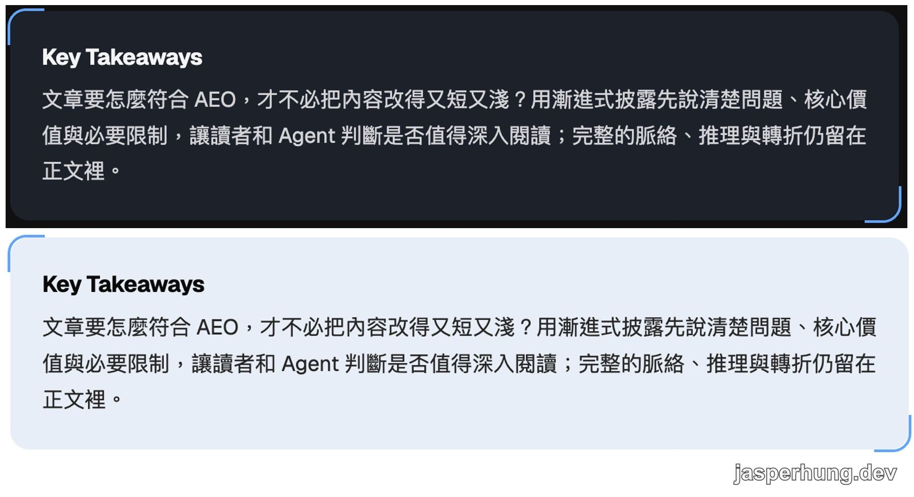

import KeyTakeaways from '../../../components/KeyTakeaways.astro';

<KeyTakeaways>
  <p>文章要怎麼符合 AEO，才不必把內容改得又短又淺？用漸進式披露先說清楚問題、核心價值與必要限制，讓讀者和 Agent 判斷是否值得深入閱讀；完整的脈絡、推理與轉折仍留在正文裡。</p>
</KeyTakeaways>

我一開始理解 AEO（Answer Engine Optimization）時，想得很直白：如果 Agent 看到的是乾淨的 Markdown，而不是一整頁 HTML，它應該比較容易讀到文章內容。這也是我在[之前寫過的 RSS、GSC、AEO](/posts/rss-gsc-aeo/)那篇文章裡，替 blog 加上 raw Markdown endpoint 的原因。

## 從 GitHub Raw 開始

GitHub 右上角的 `Raw` 按鈕，會把檔案切換成沒有樣式包裝的原始內容。對部落格來說，提供乾淨的 Markdown，也能減少 crawler 從 HTML、sidebar 和 script 裡找正文的成本。

但它只解決了「讀得到」的問題。Raw endpoint 不會自動讓 Agent 發現文章，也不保證文章最後會被選來回答；能不能被找到，還是和索引、連結、抓取權限及問題相關性有關。

## AEO 不是另一種文章格式

Raw Markdown 只解決了「讀得到」的問題，沒有替文章回答「這篇到底有沒有價值」。AEO 也不是要把原本的文章改寫成一種只給 Agent 看的新格式，更不是把內容壓成幾句沒有脈絡的結論。

後來讀到一些部落格和新聞稿，我注意到它們前面常常會先放一段 TL;DR。起初我覺得那像是重複正文，但我自己讀文章時也會先看這段，確認它是不是現在要找的內容，再決定要不要讀作者的脈絡。這讓我重新理解：摘要的任務，是把文章的價值提早揭露，不是把文章本身變淺。

## 這其實是漸進式披露

摘要讓讀者和 Agent 先判斷「這篇和我的問題有關嗎？」正文則交代作者遇到什麼問題、怎麼思考，以及哪裡改變了方向。這就是漸進式披露：先給足夠做判斷的資訊，再把完整脈絡留給想深入的人。

## 一句話裡的三層邏輯

摘要不可能每次都寫成三段，但又要放進問題、答案和限制條件。和 AI 討論時，我們先把這三層寫成一個邏輯格式：

```text
Question / Problem → Answer / Claim → Qualification / Caveat
```

這是分析摘要時的內部結構，不是要原樣放進每一篇文章。後來我才把它收斂成一個更適合自然閱讀的標點結構：

> 問題？答案；限制或補充。

例如：

> 提供 Markdown 版本，就能讓 Agent 更容易找到文章嗎？它最多只是降低讀取與解析成本，真正影響是否被選用的，還包括內容是否相關、清楚且可索引。

問號把問題和答案切開，分號把答案的適用條件收進同一句話。這不是只有 Agent 看得懂的特殊標籤，而是用人類本來就理解的標點，把資訊邊界寫清楚。

當文章沒有明確限制時，也不需要為了湊格式硬加一句。摘要的目標不是看起來完整，而是讓讀者和答案引擎快速判斷：這篇文章在回答什麼，以及答案在哪裡成立。

## 設計

所以我們決定，為文章設計一個 `KeyTakeaways` 元件。設計上不需要複雜，只用卡片、留白和一點 typography 差異，把第一層入口和正文分開就夠了。



<p class="image-caption">KeyTakeaways 在 dark mode（上）與 light mode（下）的呈現；設計只用卡片、留白與 typography 差異，把第一層入口和正文分開。</p>

---

我原本以為自己是在替 Agent 做一個更乾淨的入口，最後才發現，也是在替讀者做一個更好的閱讀入口。AEO 不是把文章交給機器之後就結束，而是先把價值說清楚，再讓讀者和 Agent 自己決定要不要走進完整的脈絡。
