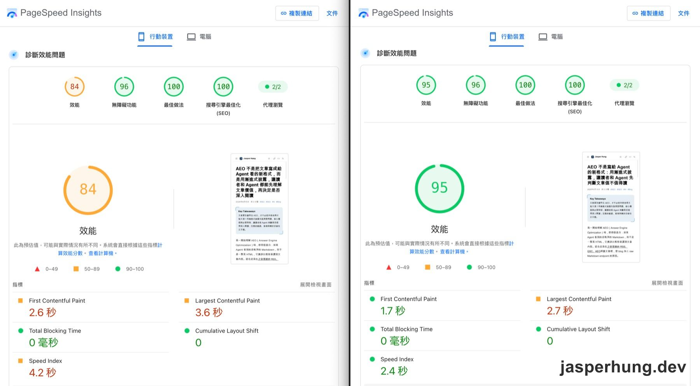
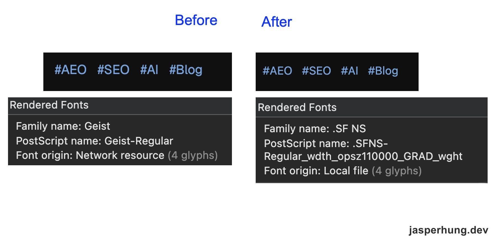
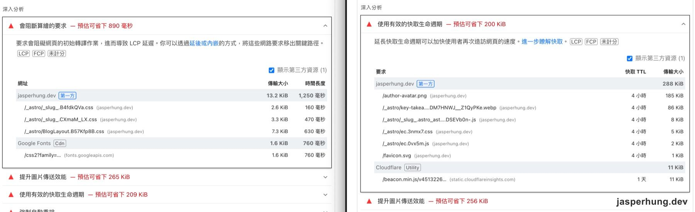

import KeyTakeaways from '../../../components/KeyTakeaways.astro';

<KeyTakeaways>
  <p>Google PageSpeed Insights 測試發現，這個 Astro Blog 的效能問題主要來自不必要的 Google Fonts 與 render-blocking CSS。移除字體請求並在 build 時把 CSS 寫進靜態 HTML 後，Performance 從 84 提升到 95，FCP 縮短約 35%，Speed Index 數值降低約 43%。</p>
</KeyTakeaways>

我一開始只是想用幾個工具確認 blog 的 AEO、SEO 和效能狀態。把文章丟進去測試後，第三方 AEO 報告列出一堆不適合這篇文章的警告，反而是 Google PageSpeed Insights 找到真正值得處理的效能問題。

## 從 AEO 警告轉向效能問題

我先用 [seoscore.tools](https://seoscore.tools/) 測試〈[AEO 不是寫給 Agent 的新格式](/posts/aeo-answer-first-summary/)〉。結果是 Overall 67 分、SEO 77、AEO 56、GEO 56，報告列出 24 個 SEO issues 和 20 個 AEO issues。

其中幾個警告很醒目：沒有 FAQ/Q&A、沒有 Organization schema、問句標題太少、沒有 step-by-step 內容，還說文章對 AI Overview 來說太薄。可是這篇是觀點與實作紀錄，不是 FAQ，也不是教學手冊；硬塞問答和編號步驟，反而會破壞原本的敘事。

這也是我第一次覺得：這個工具太機械式，不能照單全收。它可以提醒我「頁面上沒有某種形式」，卻不能判斷那種形式是否適合文章。Google 的 [AI features 文件](https://developers.google.com/search/docs/appearance/ai-features) 也沒有要求另一套特殊的 AEO schema。最後我的取捨很簡單：不為了 FAQ 分數改寫文章，也不捏造一個不存在的 Organization；Person schema 對個人 blog 更準確。

## 先用五個工具檢查基本功

和 AI 討論後，我把檢查方向拉回比較接近實際搜尋與部署狀態的工具。它們不會把所有事情濃縮成一個 AEO 分數，而是各自回答一個比較具體的問題：有沒有被索引、結構化資料能不能被理解、使用者載入快不快。

這張表留在文章裡，不是要再做一個總分，而是把不同問題拆開；後面真正動手修的，會是 PageSpeed 找到的效能項目。

| 工具 | 適合檢查什麼 |
| --- | --- |
| [Google Search Console](https://search.google.com/search-console) | URL Inspection、索引狀態、canonical 與實際搜尋成效 |
| [Google Rich Results Test](https://search.google.com/test/rich-results) | Google 支援的結構化資料與 rich result eligibility |
| [Schema.org Markup Validator](https://validator.schema.org/) | Schema.org JSON-LD 的格式與整體 graph |
| [PageSpeed Insights](https://pagespeed.web.dev/) | 效能、Core Web Vitals 與 render-blocking requests |
| [Bing Webmaster Tools](https://www.bing.com/webmasters/) | Bing 的 crawl、index 與網站診斷 |

所以 `seoscore.tools` 不是完全沒用，它適合當作 mechanical checklist；只是看到「沒有 FAQ」時，還是要回到文章目的判斷，而不是看到紅字就全部 Auto-Fix。這段經驗留在文章裡，是因為它解釋了我為什麼最後把注意力轉到效能，而不是繼續追 AEO 分數。

## 真正值得處理的問題出現在 PageSpeed

前面的 AEO、SEO 檢查沒有發現需要大改的問題，反而是很久以前測過的 PageSpeed 讓我重新注意到效能。這次修改前，行動裝置測試的 FCP（First Contentful Paint，首次內容出現時間）是 2.6 秒，LCP 是 3.6 秒，Speed Index 是 4.2 秒；TBT 和 CLS 都是 0。

深度分析裡最值得處理的是 render-blocking requests：三個第一方 CSS request 合計 13.2 KiB，另外 Google Fonts 的 stylesheet 也在關鍵路徑上等待約 760 毫秒。



<p class="image-caption">Google PageSpeed Insights 的效能測試 Before / After 畫面。</p>

| 指標 | Before | After | 變化 |
| --- | ---: | ---: | --- |
| Performance | 84 | 95 | +11 分 |
| FCP | 2.6 秒 | 1.7 秒 | -0.9 秒（約 35%） |
| LCP | 3.6 秒 | 2.7 秒 | -0.9 秒（25%） |
| Speed Index | 4.2 秒 | 2.4 秒 | -1.8 秒（約 43%） |
| TBT | 0 毫秒 | 0 毫秒 | 維持 0 |
| CLS | 0 | 0 | 維持 0 |

## 第一個修改：移除不需要的 Google Fonts

網站的基礎樣式原本指定了 Geist 和 JetBrains Mono。可是這篇主要是中文，Geist 並沒有對應的中文字形，瀏覽器仍然會回到系統 fallback；程式碼區塊也有 `ui-monospace` 可以接手。

因此我先移除 Google Fonts 的三個 `<link>`，保留原本的 fallback。結果很有趣：字體來源從 Network resource 變成 local file，但肉眼幾乎看不出差異；換來的是少掉一個會阻擋初始 render 的外部請求。



<p class="image-caption">移除 Google Fonts 後，Geist 改由本機 `.SF NS` fallback 取代；畫面幾乎看不出差異。</p>

## 第二個修改：讓 CSS 在 build 時進入靜態頁面

第二個改動是調整 Astro 的 build 設定，讓這個小型 blog 在產生靜態頁面時，把文章頁需要的 CSS 直接寫進 HTML。原本 CSS 會拆成幾個外部檔案載入，瀏覽器得先等待這些 request；設定後，就不必先發出這些 CSS request 才能開始繪製頁面。設定如下：

```js title="astro.config.mjs"
build: {
  inlineStylesheets: 'always',
},
```

這不是所有網站都該無條件套用的設定：inline CSS 會讓 HTML 變大，也少了共用 CSS 的快取效益。但這個 blog 是小型的 Astro SSG，CSS chunk 不大，拿掉初始 render 的等待比保留這幾個 request 更值得。Expressive Code 的共用 CSS 仍保留成外部檔案，讓它可以被快取重用。



<p class="image-caption">修改前後的 PageSpeed 深入分析：render-blocking CSS 與 Google Fonts 請求消失後，剩下的是快取 TTL 與圖片傳輸大小等次要建議。</p>

## 不是所有警告都值得清成 0

兩個改動部署後，Performance 從 84 到 95，FCP 從 2.6 秒降到 1.7 秒，縮短 0.9 秒（約 35%）；LCP 從 3.6 秒降到 2.7 秒，Speed Index 從 4.2 秒降到 2.4 秒，TBT 和 CLS 維持 0。這是一次 lab test，不能解讀成每位使用者都固定少 0.9 秒，但方向非常清楚：移除實際不需要的請求，比補一個不適合文章的 FAQ 更有價值。

PageSpeed 後來還列出「延長快取生命週期」的建議，TTL 是 4 小時。它主要改善再次造訪，不是這次初始 render 的瓶頸；在效能已經到 95 分的情況下，我決定先不為了清空警告而重構快取策略。

我原本只是想找出 AEO 還缺什麼，最後真正修掉的是一個多餘的字體請求和幾個 render-blocking CSS request。工具沒有錯，它只是按照自己的規則，把頁面拆成一項項檢查；真正重要的是知道哪個警告值得回到文章目的與使用者體驗重新驗證。
