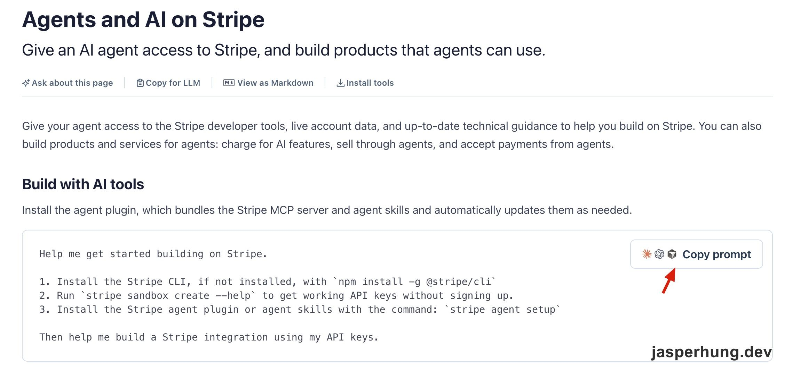
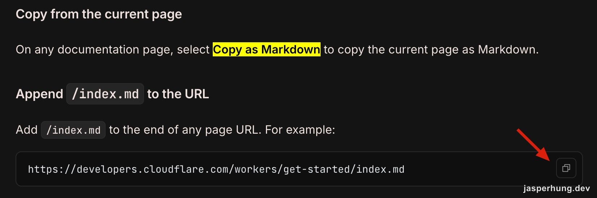
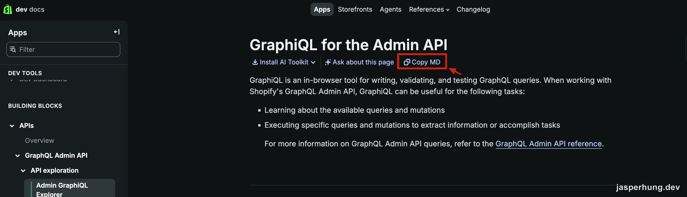

<KeyTakeaways>
  <p>想讓 agent 替一個既有的 web app 回答問題、幫使用者操作，一定要架 MCP 嗎？不一定；如果產品的規則本來就寫在前端，可以用 llms.txt 指路、SKILL.md 教 agent 操作、再加一顆 Copy to agent 按鈕，讓 agent 回到 web 上操作，由 web 自己把關限制。這是我在一個舊產品上的實作紀錄，不是系統性的測試，而且這幾個零件目前都沒有統一標準。</p>
</KeyTakeaways>

早上開會，主管轉述老闆的想法：我們剛改版的產品規格網站，應該可以接 MCP。老闆自己在玩 AI，希望使用者能直接問 AI，而不是在一堆選單裡慢慢點到正確的產品。

這個網站的用途是配置顯示設備：選型號、設定尺寸，最後下載一份產品規格書。選單多、限制多，確實不好上手。需求很清楚，但「接 MCP」這個手段，我想先拆開來看。

## 什麼是 Agent-friendly documentation

最後我沒有做 MCP，而是把網站做成 agent 讀得懂、用得了的樣子。這個做法目前沒有統一的名稱，我自己稱它為 Agent-friendly documentation（給 agent 讀的文件），這是描述性的說法，不是標準術語。

它由三個零件組成：

| 層 | 做什麼 | 對應的東西 |
|---|---|---|
| 指路 | 讓 agent 知道這個網站是什麼、東西在哪 | `llms.txt` |
| 教學 | 讓 agent 知道怎麼操作並完成任務 | `SKILL.md` 與它的模組 |
| 入口 | 使用者一鍵把以上交給自己的 agent | Copy to agent 按鈕 |

後面會依序說明，先從為什麼不選 MCP 開始。

## 為什麼我先不選 MCP

我的判斷主要是維護成本，和真相放在哪裡。

- **多一個要維護的服務。** MCP 得另外架一個 server，使用者還得正確安裝 connector 才能用。這是新增的一條連結，跟直接提供一個 API 沒有太大差別。
- **規則要寫兩次。** 這個產品原本是 PHP，但多數業務邏輯放在前端，包含警告與限制條件；後端只負責部分功能，例如透過 API 接收 PDF 要列印的資料。「某個設定行不行」主要是前端在判斷。要做 MCP，就得把這套限制在另一個地方再實作一次，或想辦法呼叫前端邏輯。

這是接手舊產品的現況，我不把它當缺點。重點是任何方案都需要一個唯一真相來源：做成 API，我一樣得寫很多規則告訴 agent 這樣設定不行、那樣也不行。既然真相已經在 web 上，我就讓 agent 回到 web 上操作。

老闆要的其實也不是 MCP 本身，而是「讓 agent 知道這個網站能做什麼，並且能操作它」。

## Copy to agent 按鈕：不用讀手冊，直接交給你的 AI

我當下其實就直覺要有一段 Prompt，讓 agent 讀完之後能解釋這個 web app 是什麼產品。

我印象中，常看到幾個知名產品的開發者文件，有一顆按鈕可以把一段文字或文件交給你的 agent，讓它幫你解釋你的需求。透過正確的文件提供之後，agent 可以在中間當代理：回答問題，也協助你安裝正確的功能。

它們做的事很單純：使用者不用自己讀長文件，把內容丟給自己的 agent，再用問答的方式拿到答案。比如說下面這三家。

### Stripe

Stripe 的 Agents and AI on Stripe 頁面，頁首有 Copy for LLM、View as Markdown，內文還有一顆 Copy prompt，按下去會複製一段寫好步驟的提示詞，交給你的 agent 照著做。



<p class="image-caption">圖：Stripe 的 Agents and AI on Stripe 頁面，Copy prompt 按鈕旁是一段寫好步驟的提示詞。</p>

### Cloudflare

Cloudflare 的 Docs for agents 頁面講得更直接：任何文件頁都能選 Copy as Markdown，或在網址後面加 `/index.md`，直接取得該頁的 Markdown 版本。



<p class="image-caption">圖：Cloudflare 的 Docs for agents 頁面，說明如何取得頁面的 Markdown 版本。</p>

### Shopify

Shopify 的開發者文件則在每頁標題下放了 Copy MD、Ask about this page 和 Install AI Toolkit。



<p class="image-caption">圖：Shopify 開發者文件的 GraphiQL for the Admin API 頁面，標題下方有 Copy MD 按鈕。</p>

這三家的按鈕名稱和作法各不相同，共通點是都把「頁面內容」或「一段提示詞」變成可以一鍵交給 agent 的東西。這些是我看到的畫面，不代表它們有統一的規格。

這個概念最早的原型，應該是 GitHub 上的 Raw 按鈕：去掉所有 HTML 結構，只留下純粹的文件。Markdown 剛好是 agent 最擅長讀的格式，少了標籤要解析，也少了讀錯的機會。

在 AEO 檢查項目裡，我也看到一條建議：加一顆內容只有一段 prompt 的按鈕，讓使用者拿去問自己的 AI。這顆按鈕的價值非常高，我確定它應該可以解決老闆提出的這個問題，所以我也做了一顆，叫 Connect to AI。

## SKILL.md：放在網站上，不是安裝在 agent 裡

這份 skill 放在網站的 `public/` 資料夾，跟網站一起部署，有一個公開網址，任何 agent 拿到網址就能讀。我沒有把它做成需要安裝的套件：使用者是業務和一般使用者，不該為了問一個產品問題先去設定什麼，這也是我不選 MCP 的原因之一。

格式上我用的是 Anthropic 提出、現在由 agentskills.io 維護的 Agent Skills，並按需載入：agent 一開始只看到名稱和描述，需要時才讀其他模組。這個格式常見的用法是安裝在 agent 的本機，我只是把同一個格式放到網站上。

文件裡有幾個部分：

1. **角色與語氣**：這個 agent 是誰、怎麼回答。
2. **探索流程**：必問的問題，加上「三輪對話內一定要提出三個方案」，讓使用者有足夠的線索決定要追問哪一個。
3. **產品詳盡規格文件**：每個可選型號的資料，獨立成一個模組，需要時才載入。
4. **操作對照表**：教 agent 怎麼回到 web 上操作，後面的 WebMCP 一節會說明。

## llms.txt：給 agent 看的 README

放好 skill 之後，AI 建議我在網站根目錄再放一個檔案：[llms.txt](https://llmstxt.org/)。

我第一眼覺得它跟 `robots.txt`、`sitemap.xml` 是同一類東西：

```text
robots.txt   → 告訴爬蟲哪些路徑可以爬
sitemap.xml  → 告訴搜尋引擎網站有哪些頁面
llms.txt     → 告訴 LLM 這個網站是什麼、重要資料在哪
```

前兩個原本是給搜尋引擎之類的爬蟲用的；`llms.txt` 是同一類放在網站根目錄的約定檔，只是讀者換成 LLM 和 agent。

`llms.txt` 是 2024 年 9 月由 Jeremy Howard 提出的社群提案，格式是一份 Markdown：一個標題、一段簡介、幾個連結清單。它比較像「給 agent 的 README 加目錄」：只放簡介和連結，細節在連到的檔案裡。

它的作用，就是讓 agent 自己找到 skill，使用者不需要複製 skill。流程是這樣：

1. 使用者按下 Connect to AI，複製的只是一小段提示詞，裡面帶有這個網站的入口網址。
2. 把提示詞貼給自己的 agent。
3. agent 讀入口網址上的 `llms.txt`，再依裡面的連結取得 `SKILL.md` 和其他模組。

所以使用者從頭到尾不用複製或安裝 skill。這個流程需要 agent 能讀取網址，我沒有逐一測過所有 agent。

整個網站的檔案配置，大概像這樣（示意）：

```text
https://your-app.example/
├── index.html            ← web app 本身，給人操作的介面
├── robots.txt            ← 原本就有的約定（爬蟲）
├── sitemap.xml           ← 原本就有的約定（搜尋引擎）
├── llms.txt              ← 入口：這個網站是什麼，並連到 skill
└── skill/
    ├── SKILL.md          ← 角色、語氣、什麼時候載入哪個模組
    ├── discovery.md      ← 探索流程：必問的問題、三個方案
    ├── product-data.md   ← 產品詳盡規格
    └── web-flow.md       ← 操作對照表
```

agent 從 `llms.txt` 進來，讀 `SKILL.md` 知道整體規則，再依需要載入其他模組；真正要操作時，回到 `index.html` 那個 web app。

:::caution
截至 2026 年 10 月我查到的資料，`llms.txt` 是社群提案，不是 IETF 或 W3C 的標準。有不少文件平台和產品採用，但「業界慣例」不等於「標準」。
:::

## WebMCP

我原本想用 [WebMCP](https://developer.chrome.com/docs/ai/webmcp) 讓 agent 操作網頁。Chrome 官方文件把它描述為「一個提議中的網頁標準，協助你為 AI agent 建立並公開結構化的工具」：網站把功能註冊成工具，agent 直接呼叫，不用在畫面上摸索。

它有兩種寫法：命令式（Imperative）用 JavaScript 註冊工具；宣告式（Declarative）則是在標準的 HTML 表單上加註解，就能變成工具。

評估之後我放棄了。官方文件自己寫明它還在討論階段，之後可能改變。Chrome 從 149 版起可以參加 origin trial，開發時也能用 `chrome://flags/#enable-webmcp-testing` 手動開啟，換句話說，使用者預設的瀏覽器並不會有這個功能，我也不知道使用者會用哪一種 agent。

研究它的過程中，我理解到它其實也只是一種表示法：描述這顆按鈕是什麼、這個輸入欄位要填什麼。這跟 e2e 測試裡宣告「怎麼選到某顆按鈕、某個 input」是同一個概念。

所以我參考 e2e 的做法，做了一個 WebMCP 精神上的折衷版本：不把功能註冊成工具，而是把同樣的描述寫進文件。具體來說，是一張操作對照表，列出每個控制項是做什麼的、怎麼唯一選到它（id、class 或 XPath 之類的選擇方式）、可以填什麼值，最後附上操作順序。下面是示意：

| 控制項 | 選擇方式 | 可設定的值 | 說明 |
|---|---|---|---|
| 寬度輸入框 | `#width-input` | 正整數 | 設定整體寬度 |
| 型號下拉選單 | `#model-select` | 型號清單中的一項 | 選定後才會出現尺寸選項 |
| 下載按鈕 | `.btn-download` | 點擊 | 產出規格書 PDF |

這跟 WebMCP 的機制不同：WebMCP 是網站註冊工具、agent 直接呼叫；我的做法是 agent 讀文件之後，自己在畫面上操作。不過這張表日後要轉成 WebMCP 的工具清單，會很順手。

## 規則放在 web，文件就不用寫很長

這個做法帶來一個好處：因為所有限制本來就在 web 上，agent 在實際設定時會遇到真實的狀態，能不能選、某個組合行不行，由網站擋下來。

所以我不用把公司資訊寫得很完整，也不用把限制寫得很多。文件只需要做兩件事：讓 agent 回到 web 上操作，並用瀏覽器下載正確的規格書。

這個設計有一個限制，我也直說：文件沒有辦法強制 agent 照著做，agent 仍然可能走偏。我靠的是 web 本身會擋下不可行的設定。

## 回頭看一下用到的技術規格文件：多數是初期草案

做完之後我回頭查了一遍所有用到的技術，文件正式名稱是什麼？整理成這張表：

| 零件 | 正式名稱 | 現況（2026 年 10 月我查到的） |
|---|---|---|
| llms.txt | llms.txt | 社群提案，非標準 |
| SKILL.md | Agent Skills | 開放規格，非國際標準組織認證 |
| MCP | Model Context Protocol | Anthropic 提出的開放協定 |
| WebMCP | WebMCP | 提議中的網頁標準（W3C 社群草案）；Chrome 149 起可參加 origin trial |
| Copy to agent 按鈕 | 無統一名稱 | 各家叫法不同：Copy prompt、Copy as Markdown、Copy MD |
| 整體做法 | 無統一名稱 | 我自己稱為 Agent-friendly documentation，是描述性說法 |

整體來看，這些都還在早期階段：有的是社群提案，有的是草案，也有的已經是公開規格但還沒有被國際標準組織認證。名稱和做法之後都有可能再變。

## 心得

我覺得這就是 web app 接下來的樣子：產品除了服務人，同時也要服務 agent。這不是我發明的，我只是看到別人已經在做，剛好我手上有一個適合的產品，就試著套上去了。

最有趣的是它的工程量：在既有的產品上，只加了一個很小的功能和幾份文件，下午就能 demo。不用改前端邏輯，也不用多架一個服務。

另一個發現是，這些概念其實是同一套。把 skill 的概念套到 agent 身上，再加上 llms.txt，它的角色很像 `CLAUDE.md` 或 `AGENTS.md`：告訴 agent 這是什麼樣的專案；只是現在套到網站上，也能形成同樣的概念。

所以 agent 的世界裡，邏輯是相通的。這些做法不是憑空冒出來的，而是同一套邏輯，被套用在不同的地方而已。
