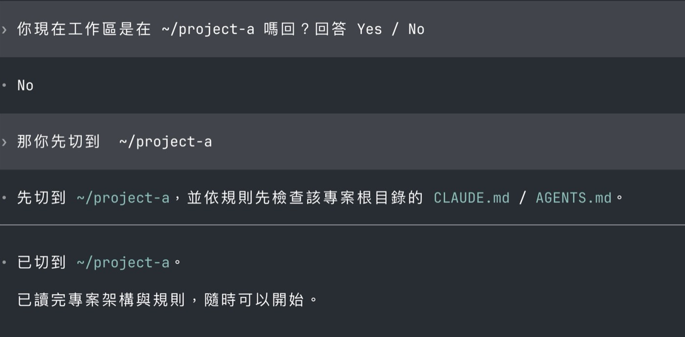

我常常在同一個 Agent session 裡做完一件事，打個 `/clear`，接著叫它去另一個 repo 處理下一件事。

直覺上，既然都叫它去那個專案了，它應該會先讀那邊的 `CLAUDE.md` 或 `AGENTS.md` 吧？後來我才發現，事情沒有這麼直覺。

## 全域規則和專案規則，分別放在哪裡？

```text
~/
├── .claude/
│   └── CLAUDE.md          ← Claude Code 的全域規則
├── .codex/
│   └── AGENTS.md          ← Codex 的全域規則
│
└── git/
    └── project-a/
        ├── CLAUDE.md      ← project-a 的專案規則，給 Claude Code
        └── AGENTS.md      ← project-a 的專案規則，給 Codex
```

:::note
- **全域規則**：放這個人的工作習慣與偏好。例如回覆語言、常用工具、換專案時先讀規則。
- **專案規則**：放這個專案特有的規則。例如技術架構、資料夾用途、命名方式、測試要求，以及哪些檔案不能隨便改。

如果你的電腦裡沒有這些檔案，不是設定壞掉；它們是可選的個人設定，需要自己建立。

建立後，下一次啟動 Agent 時才會讀到這些全域規則。

官方說明：[Claude Code](https://code.claude.com/docs/en/claude-directory)｜[Codex](https://learn.chatgpt.com/docs/agent-configuration/agents-md)
:::

## Agent 會去做事，但不一定會讀規則

假設我是從 `~/` 啟動 Agent，做完事情或討論完之後下了 `/clear`，想讓它去另一個專案改 bug，於是對它說：去 `~/git/project-a` 幫我改東西。

Agent 通常做得到。它會找到檔案、搜尋程式碼、修改內容，甚至跑測試；因為我已經明確告訴它要去哪裡做事。

但這不代表它已經讀過 `project-a` 根目錄的 `CLAUDE.md` 或 `AGENTS.md`，也不代表它會按照這個專案的規則執行。

這是最容易讓人誤會的地方：**Agent 有在那個專案工作，不等於它有套用那個專案的規則。**

如果光看文字還是不太好想像，可以把它想成這張圖：使用者只說「幫我洗羊毛大衣」，Agent Bon Bon 很快就洗完了；但牆上的 `CLAUDE.md` 明明寫著「只能乾洗」。問題不是它沒有做事，而是它沒有先讀規則。


<p class="image-caption">圖：Agent Bon Bon 很認真完成任務，但沒先讀專案規則，結果把高級羊毛大衣水洗了。</p>

## 為什麼會這樣？

關鍵在這裡：以我目前用到的 Claude Code 和 Codex 來說，`沒有切換工作區域的明確指令`。Agent 從哪裡啟動，就以那裡作為這次 session 的起點。

中途叫它去另一個資料夾做事，很多時候只是把那個資料夾當成下一個任務的目標，不是重新開一個以新專案為起點的 Agent。所以它能去工作，卻不一定會自動讀取 B 專案的規則。

所以 `/clear` 也解決不了這件事。它只是把對話清乾淨，不會重新啟動 Agent，更不會自動替你讀另一個專案的規則。

從目標專案重新啟動 Agent 當然最乾淨，但我不會每次從 A repo 跳到 B repo 都重開一次。有些 repo 本來就有相依關係，剛處理完 A 接著去 B 是很正常的工作流程。

比較實際的做法，是要求 Agent 在跨專案工作前先做一件事：讀規則。

## 解決方法：把「先讀規則」寫成全域規則

我最後在最頂層的 system prompt 加了一條很短的規則：只要這次要處理的專案不是 session 一開始所在的位置，就先讀目標專案根目錄的 `CLAUDE.md` 或 `AGENTS.md`，再開始搜尋、修改或跑測試。

### 全域規則 prompt

```md
## Entering A Project

When starting work in a project directory different from the session's initial cwd, first check for and read that project's root `CLAUDE.md` or `AGENTS.md` before any code search, edits, or task execution.
```

### 實測結果

當我叫 Agent 切到 `~/project-a` 時，它會先讀取該專案根目錄的規則，才回覆已經可以開始。



<p class="image-caption">圖：全域規則觸發後，Agent 先確認目標專案，再主動讀取根目錄規則。</p>

這條規則不是魔法，它還是要靠 Agent 遵守。但它至少把原本「要不要讀規則」的猜測，變成一個明確的工作步驟。

對我來說，這就夠了。以後我只要叫 Agent 去另一個 repo 工作，不用再另外補一句「先讀 `CLAUDE.md`」；這件事已經是它進場前該做的事。
