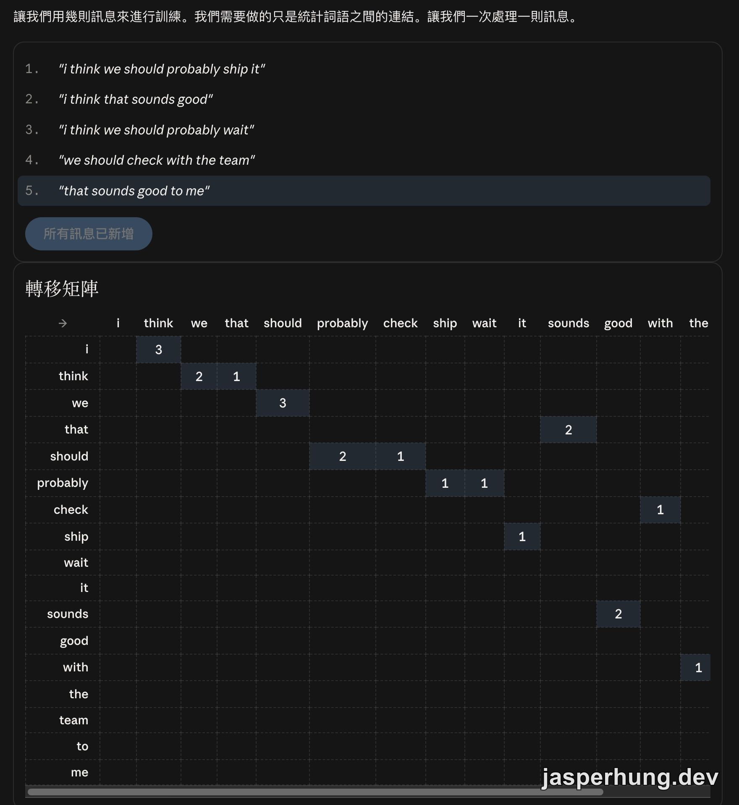
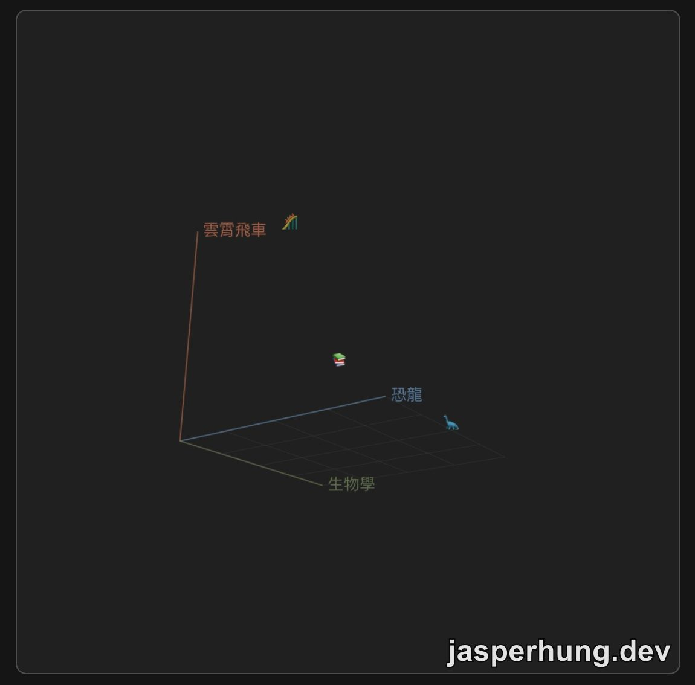
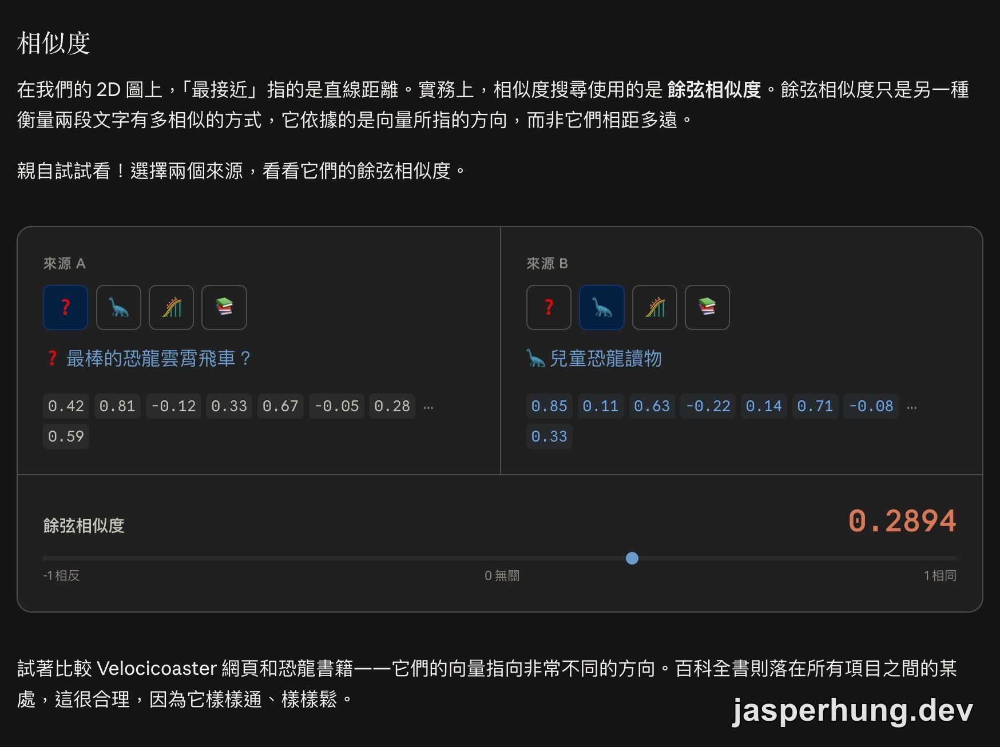

import KeyTakeaways from '../../../components/KeyTakeaways.astro';

<KeyTakeaways>
  

    生成式 AI 為什麼能快速產生流暢內容，卻也會自信地捏造引用、提供過時資訊？<a href="https://academy.claude.com/zh-TW/courses/ai-capabilities-and-limitations">AI Capabilities and Limitations</a> 從四個機器特性出發，整理下一個詞元預測、知識截止與 embeddings 嵌入的能力邊界；本文涵蓋前七堂，互動模擬器仍待實際操作。
  

</KeyTakeaways>

前一天的 AI Fluency 課程才把 4D 框架整理完：委派、描述、辨別、審慎。這一次打開 [Claude Academy](https://academy.claude.com/zh-TW/courses) 的 AI Capabilities and Limitations，視角剛好轉到另一邊：人要怎麼和 AI 協作，取決於我們是否理解這個合作對象的能力與限制。

我很喜歡這門課的開場方式。它從一個比較根本的問題開始：AI 的答案從哪裡來？它到底知道什麼？這兩個問題一路牽出幻覺、過時資訊、偏見，以及為什麼回答看起來越具體，越需要查核。

## 課程資訊一覽

| 項目 | 內容 |
|---|---|
| 堂數 | 13 堂課（本篇涵蓋前 7 堂） |
| 總時長 | 3.5 小時 |
| 測驗 | 1 個（課程測驗，在後半段課程範圍） |
| 完成 | 有完成徽章 |
| 先決條件 | **無**。官方明寫「假設您沒有技術背景，也沒有使用 AI 工具的先前經驗」 |
| 適合對象 | 任何在工作或學習中使用、或即將使用生成式 AI，並想了解它為何會這樣行為的人 |

這門課是 *AI Fluency: Framework & Foundations* 的姊妹課程。4D 框架教人類需要培養的能力，這門課整理的是那些能力所回應的機器特性；兩邊合起來，才會得到比較完整的人機協作圖像。

## 四個特性都是一條連續體

課程第二堂先給了一張參考卡，把生成式 AI 的四個核心特性放在同一張表裡。每個特性同時帶來能力和限制，關鍵在於目前的任務落在哪一段。

| 特性 | 它在回答什麼問題 | 能力端（可以放心） | 限制端（需要驗證） |
|---|---|---|---|
| **Next Token Prediction 下一個詞元預測** | AI 的答案從何而來？ | 熟悉的路徑：總結、重新格式化、解釋常見概念 | 新穎領域、稀疏模式、「真實 vs 聽起來真實」 |
| **Knowledge 知識** | AI 實際上知道什麼？ | 頻繁出現、訓練中較新近、一致的：主流話題、熱門語言 | 罕見、截止日之後、小眾、地方性或有爭議的話題 |
| **Working Memory 工作記憶** | AI 現在正在關注什麼？ | 材料恰好放得下、對話是當前的、你提供了相關上下文 | 非常長的文件／對話、期望跨 session 的連續性（斷崖） |
| **Steerability 可操控性** | 我能掌控多少？ | 簡短、具體、可驗證的指示（「以表格形式回應」「100 字以內」） | 長推理鏈、抽象要求、原生精確度 |

這張表最重要的地方，是同一個底層機制會同時製造優點和缺口。AI 能寫出流暢內容，因為它很擅長沿著熟悉的文字路徑往下生成；它也可能沿著一條「看起來像答案」的路徑走到底。課程把這種理解稱為 **calibrated trust 校準信任**：既不全盤交出去，也不把所有輸出都當成可疑訊息。

## Getting started（開始使用）

### 1. Intro to AI Capabilities and Limitations（AI 能力與限制簡介）

課程先把 4D 框架和 AI 的機器特性接起來。理解 AI 是預測引擎，會改變我們描述任務的方式；理解上下文視窗，會改變我們委派長任務的方式。

官方也提醒，大多數現實世界的 AI 失敗都是兩個特性交會所致：幻覺式引用是下一個詞元預測乘上知識缺口，長對話中的漂移是工作記憶乘上可操控性。後面的課程因此有一條主線：先了解每個特性，再辨認它們互相碰撞時的失敗模式。

第一堂安排了一份會貫穿後續課程的任務清單：列出過去兩週實際用 AI 完成的 4–6 項工作，記下輸出是否一次就能使用，再把清單交給 Claude，請它指出可能的失敗方式。官方特別要求這些工作要具體——「起草一封向客戶說明專案延遲的電子郵件」有資訊，「寫作」沒有。這份清單要留著，每學完一個特性就回頭看同一批任務，每次看到的東西都不一樣。

### 2. What We Mean by AI（我們所說的 AI 是什麼意思）

這門課把範圍放在 **generative AI 生成式 AI**：它產生新的文字、圖像、程式碼、音訊或影片。推薦引擎、垃圾郵件過濾、信用卡詐欺偵測與客服路由，同樣使用 AI 技術，但主要工作是排序、分級、分類或預測。

生成式 AI 通常經過兩個階段：**pre-training 預訓練**先從大量資料學習模式，**fine-tuning 微調**再把模型調整成比較能回應請求、遵循安全規範的助手。課程想讓學習者帶走的判準有三個：

- 目前的任務在四項特性的連續光譜上落在哪裡？
- 這是被充分探索過的領域，還是正好位在資料稀疏的邊緣？
- 如果判斷錯誤，風險會是什麼？

### 3. How AI Gets Its Character（AI 如何形成其特質）

接著課程回答一個問題：AI 為什麼一開始就想幫忙？答案和訓練流程有關。

| 階段 | 做了什麼 | 產出 |
|---|---|---|
| **階段 1：預訓練（pre-training）** | 看大量資料，反覆練習根據目前內容猜測接下來會出現什麼 | 一個文件補全器 |
| **階段 2：微調（fine-tuning）** | 用有幫助的行為範例與人類偏好塑造的獎勵訊號再次訓練 | 一個能把輸入當成請求、回應問題並拒絕有害要求的助手 |

課程用一個思想實驗說明：如果只和完成預訓練、尚未微調的模型對話，問「法國的首都是哪裡？」它可能接著補寫一串國家與首都的問答。模型在延續文字模式，還沒有建立「有人正在向我提問」的工作角色。

微調之後仍會留下四個容易看見的指紋，課程稱為模型的陰暗面（dark side）：

| 指紋 | 成因 | 你會看到什麼 |
|---|---|---|
| **諂媚 Sycophancy** | 人們偏好順從的回應 | 輕易認同你，遭到輕微反駁就退讓，即使它一開始是對的 |
| **冗長 Verbosity** | 訓練時「詳盡」獲得較高評分 | 預設給長答案，即使簡潔對你更有幫助 |
| **過度謹慎 Overcaution** | 安全訓練傾向保守 | 對實際上安全的請求過度迴避或加以拒絕 |
| **信心校準鬆散 Loose confidence calibration** | 信心本身很難訓練 | 表達的信心程度與實際可靠性關聯相當鬆散 |

因此，遇到「我反駁你就立刻讓步」的回應，可以把它當成諂媚訊號；想要一句話卻收到長文，代表冗長可能是預設行為；遇到無害問題卻被大量拒絕，則要注意過度謹慎。課程也提到 Anthropic 公開了 Claude 的完整憲章（constitution），可以從另一個角度理解這些行為如何被刻意塑造。

## Next Token Prediction（下一個詞元預測）

### 4. Next Token Prediction（下一個詞元預測）

這堂是整門課的核心。生成式 AI 的輸出，是根據目前已經出現的內容，預測下一個詞元（token），一次產生一小段，再把新內容放回上下文繼續往下預測。它更接近極其精密的自動完成功能，和搜尋引擎的工作方式不同。

這個差異會直接影響我們怎麼看待引用。看起來像真的引用，和指向真實論文的引用，都可能符合模型學過的文字形狀。流暢度和正確性因此是兩個獨立變數。

課程用兩個 demo 對比這條邊界：整理知名文章的論點時，Claude 走的是一條被重複走過很多次的路徑，通常能快速產生連貫摘要；要求它列出小眾子領域中階研究人員的三篇論文和出版年份時，文字仍然流暢，路徑卻可能很薄，部分內容也可能是捏造的。

| 能力這一面 | 失敗這一面 |
|---|---|
| 任何語域中的流暢文字 | 幻覺 |
| 跨領域的快速綜合 | 不一致 |
| 在任何類似先前見過的事物上表現強勁 | 錯置的自信 |
| 對任何主題的連貫延續 | |

課程把這一堂收成三句要牢記的話：自信的語氣並不代表準確性；具體性正是捏造集中出現的地方——姓名、日期、統計數據、引用、引述、網址，主張越精確就越需要查核；把輸出視為需要驗證的草稿，尤其在風險高或你不熟悉該領域時。

前沿 AI 產品會用幾種方式補這個缺口：

- **引用與來源依據（grounding）**：讓人追蹤哪些內容有外部根據。
- **不確定性訊號**：讓模型表達「我對此不太確定」這類狀態。
- **受限生成（constrained generation）與 Skills**：縮小捏造可以潛入的範圍。
- **生成器—驗證器代理迴圈（generator-verifier agent loop）**：要求輸出通過外部來源檢查。

這也接回 4D：理解輸出是依照文字形狀生成，會影響 **Discernment 辨別力**；知道哪些任務落在模型熟悉的能力區，則會影響 **Delegation 委派**。

### 5. Try It Out: Next Token Prediction（試試看：下一個詞元預測）

這堂沒有影片，改用互動模擬器親手建立一個馬可夫鏈（Markov chain）文字預測器。課程從手機的自動完成開始，讓人先用小規模的頻率表感受模型如何依照目前內容取樣下一個詞，再把這個直覺接到 LLM。

圖：模擬器從手機的自動完成玩起，訊息打到一半時，下面三個候選詞就是依照目前內容給出的下一個詞。

| 步驟 | 在做什麼 |
|---|---|
| **「訓練」您的模型** | 用 5 則訊息統計詞與詞之間的連結，建立頻率表；每列正規化後得到下一個詞的機率分佈 |
| **來做一些取樣** | 根據目前內容挑下一個詞；課程也用 sampling 描述現代語言模型的這個過程 |
| **擴大規模** | 從 5 則訊息增加到 169 則，觀察不重複詞語、上下文和轉移數如何成長 |
| **旋鈕（knobs）** | 自己選挑詞規則：總是挑最高機率、半隨機、提升最可能選項的權重、忽略門檻以下、只看前 N 個、哥布林模式純隨機。這就是 temperature、top-k、top-p 的直覺版 |
| **橋樑** | 把馬可夫鏈和 LLM 的步驟並排比較 |

圖：用五則訊息統計詞與詞之間的連結，就得到一張轉移矩陣；`i` 後面接 `think` 出現 3 次，整列正規化後就是下一個詞的機率分佈。

| 步驟 | 馬可夫鏈 | LLM |
|---|---|---|
| 1. 讀取上下文 | 最後一個詞：`think` | 到目前為止的整個對話 |
| 2. 計算分佈 | 在表格中查詢一列 | 經過數十億個參數的前向傳播，包含注意力機制、嵌入、前饋層、殘差連接與層正規化 |
| 3. 取樣下一個詞元 | `we 32% / the 16% / i 11%` | 同樣從一個機率分佈取樣 |

這張橋樑把 LLM 的來歷接起來：取樣這件事可以追溯到馬可夫在 1906 年提出的想法，後來一路經過手機的 n-gram 預測、RNN，最後到 2017 年的 transformer。一路改變的是計算分佈的方法；取樣這個動作本身仍然存在。

## Knowledge（知識）

### 6. Knowledge（知識）

模型怎麼知道事情？它讀過大量文字，透過數十億輪「接下來會是什麼」的練習，建立對概念、關係和事實的內部表徵。這是模型吸收知識的方式，也構成它的硬邊界：

1. 模型沒有親身經歷。
2. 產品沒有提供搜尋工具時，模型不會即時瀏覽網路。
3. 訓練會在某個時間點結束，之後就形成 knowledge cutoff 知識截止日。

因此，解釋光合作用這類在資料中被大量且一致描述的主題，通常比較容易；詢問某個職位目前由誰擔任，則可能得到一個曾經正確、現在已經過時的答案。課程希望我們換一個問題：與其問「AI 知道這件事嗎？」，不如問「這件事在它讀過的內容裡，被呈現得多充分？」

模型的優勢來自廣泛的一般知識、充分呈現的主流領域，以及跨領域建立連結的能力。**Embeddings 嵌入**可以幫助理解這件事：詞語和概念會被映射到一個數學空間裡，相近的意義容易聚在一起，所以模型能把生物學問題和化學、歷史或經濟學連起來。

知識常見的五種失敗模式如下：

| 失敗模式 | 內容 |
|---|---|
| **知識截止** | 訓練之後發生的事，模型沒有讀過 |
| **過時** | 訓練時為真的資訊後來改變，模型缺少機制知道這件事 |
| **覆蓋不均** | 常見主題通常較完整，罕見主題、少數語言、小眾領域和近期發展容易較薄弱 |
| **繼承的偏見** | 對「正常」或「預設」的理解會反映訓練資料的盲點 |
| **來源失憶** | 模型通常無法指出某項知識來自哪裡；「我在某處讀過」不能取代引用 |

現在的 AI 產品會把幾種工具接進執行時環境：網路搜尋補上最新資訊，MCP（Model Context Protocol）把模型接到訓練資料之外的文件，其他 tools 則可以呼叫計算器或資料庫。這些功能都在執行時擴展模型能取得的資訊；關掉它們時，回答就會更依賴訓練期間吸收的內容。

課程列出知識缺口最容易出現的五種情境：

- 主題具有時效性，例如時事、近期研究、現任職位或價格。
- 領域小眾、地方性強，或使用較少被呈現的語言。
- 問題涉及知識截止日之後的時間點。
- 答案依賴模型對「典型」或「正常」的預設理解。
- 網路搜尋或其他外部工具沒有啟用。

這一堂的 4D 連結落在委派與辨別力。委派時，要先判斷任務屬於模型熟悉的領域，還是應該由我提供文件、上下文或搜尋結果；辨別時，則要找出哪些說法需要獨立驗證。模型在一個領域表現很好，並不會自動把同樣可靠度帶到旁邊的領域。

### 7. Try It Out: Knowledge（實際操作：知識）

這堂互動 Explorer 用一張 2D／3D 語意地圖解釋 embeddings。開場的問題設定是：搜尋 `car`，會找到包含 `car` 的文件；若另一份文件只寫 `automobile`、`vehicle` 或「我的 Civic 需要換煞車」，傳統字串比對就可能錯過它。

傳統搜尋可以靠同義詞字典、詞幹提取和點擊模式逐步補足這些關聯。Embeddings 則把意義表示成空間中的位置：文件和問題各自被轉成固定長度的數字列表，最接近的項目就是較相關的候選結果。

| 步驟 | 在做什麼 |
|---|---|
| **編碼** | 只用「跟恐龍多相關」和「跟雲霄飛車多相關」兩個軸，把三份文件（恐龍兒童讀物、Velocicoaster 網頁、一整本百科全書）放到 2D 圖上 |
| **檢索** | 用同一組軸把問題（「最棒的恐龍主題雲霄飛車是哪一個？」）也畫上去，最接近的 k 個項目就是最相關的；滑桿控制 k |
| **更多維度** | 加入第三軸「生物學」，變成 3D 可旋轉；每份文件的座標從 (0.50, 0.90) 變成 (0.50, 0.90, 0.05) |
| **未標記的軸線** | 真正的嵌入模型用大約 1,024 個維度，而且沒有人決定這些軸是什麼 |
| **文字即座標** | 嵌入模型可以把三個字或三個段落轉成相同長度的數字列表；課程示範使用 VoyageAI 模型 |
| **相似度** | 實務上常用 cosine similarity 餘弦相似度，看的主要是向量方向；-1 代表相反、0 代表無關、1 代表相同 |

圖：加入第三軸「生物學」之後，語意地圖變成可旋轉的 3D 空間；恐龍讀物靠向恐龍軸，百科全書落在三個軸之間。

圖：拿問題「最棒的恐龍雲霄飛車？」和兒童恐龍讀物對比，餘弦相似度是 0.2894，落在刻度上「0 無關」和「1 相同」之間。

這堂課留下兩個直覺。第一，維度超過 3D 之後，人眼看不懂圖，數學運算仍然可以繼續找最近鄰。第二，軸線本身是黑盒子：我們無法直接指出第 847 維就是「恐龍軸」，也就難以單靠座標解釋兩段文字為什麼靠近。

這正是 embeddings 的實用與難解釋之處。檢索系統可以有效找出語意相近的內容，但沒辦法用人類容易理解的方式說明每個距離是怎麼形成的。對 RAG 的 chunking 也有提醒：前面那本百科全書在圖上落在所有項目之間，官方的說法是「樣樣通、樣樣鬆」——它和每個主題都沾到一點，卻不在任何一個窄問題上最相關。

## 下一段：Working Memory 與 Steerability

課程在第 6 堂結尾就先把下一個特性的邊界講明了：

> 知識涵蓋了模型在訓練期間吸收的內容。工作記憶涵蓋了它**現在正在關注**的內容：您的提示、您的文件、您的對話。這項特性在四者之中擁有**最鮮明的邊界**。

「最鮮明的邊界」這個說法值得留著對照：知識的邊界要靠「這在訓練資料裡被呈現得多充分」去推測，工作記憶的邊界卻是一個可以數的數字。剩下的 6 堂接著進入 **Steerability 可操控性**，看指令遵循在哪些地方精準、在哪些地方會發生推理漂移或拘泥字面，最後收在「當屬性相互衝突時」。

這也是前七堂留下的問題：知道模型如何生成內容、知道它的知識從哪裡來之後，模型目前能記住多少，又能被我們帶到哪裡？

## 小結

我覺得這門課最有用的地方，是把「AI 為什麼會答錯」拆成可以觀察的機制：文字生成會沿著機率路徑往下走，知識會被截止日和訓練資料覆蓋範圍限制，搜尋、MCP 和 tools 則能在執行時補進新的材料。

看完這七堂，我下一次看到一段流暢回答時，大概會先問一件事：它是在熟悉的路徑上整理內容，還是在小眾領域裡補出一個看似合理的形狀？這個問題比單純問「它會不會做」更接近真正的使用方式。
