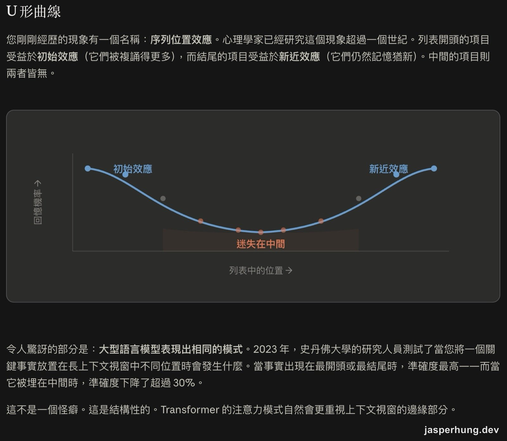
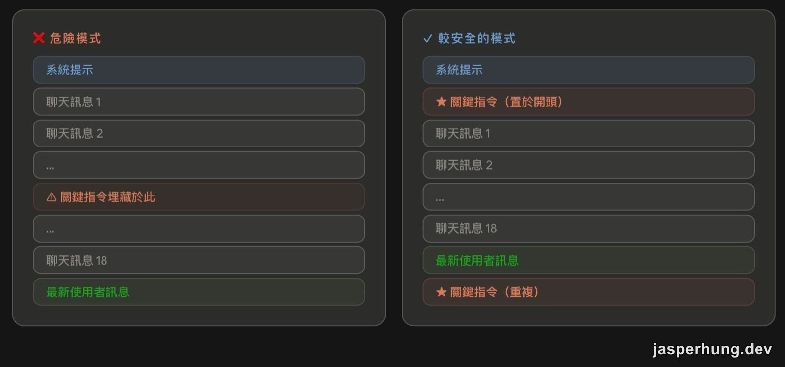
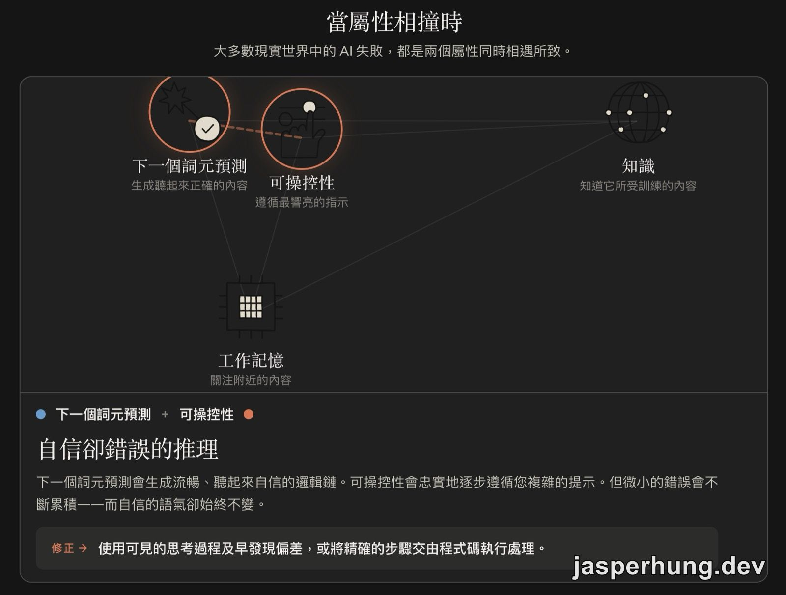
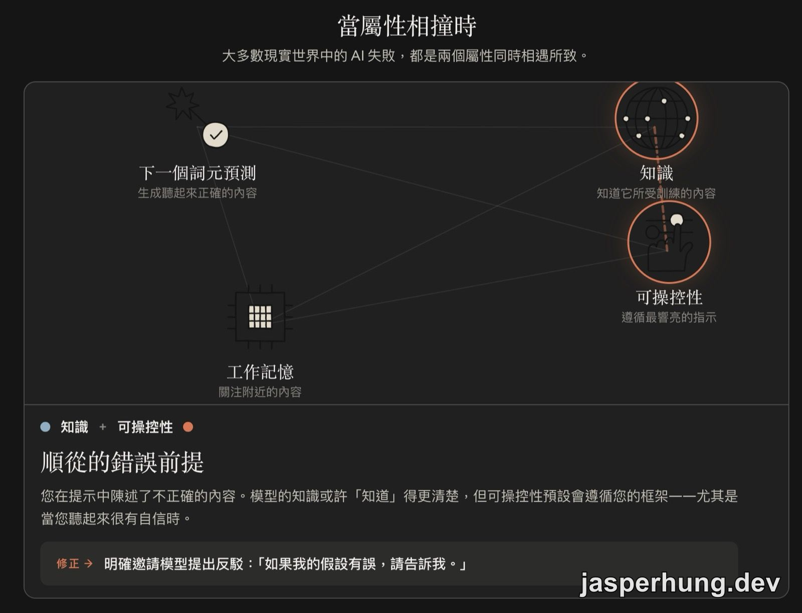
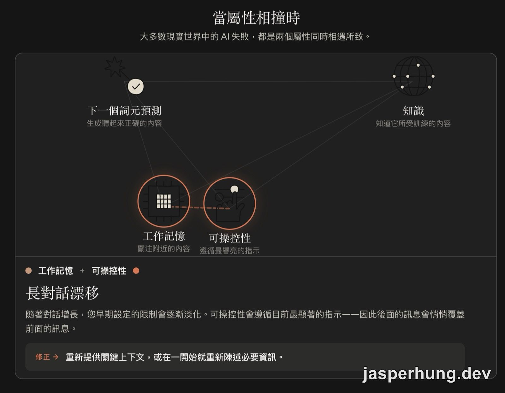
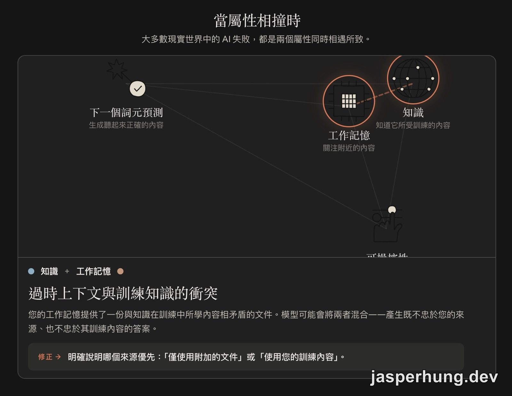
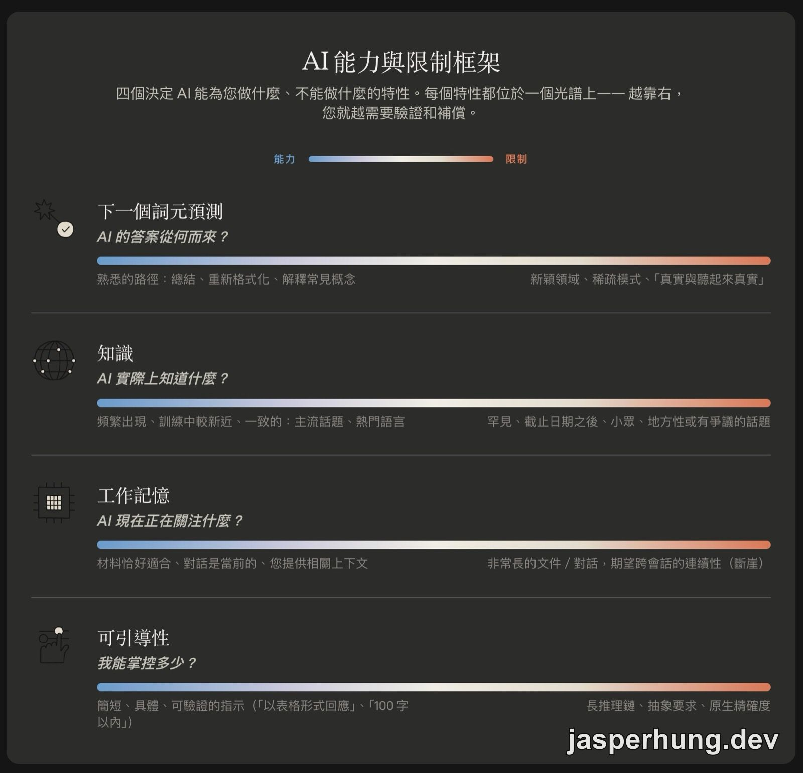

import KeyTakeaways from '../../../components/KeyTakeaways.astro';

<KeyTakeaways>
  

    AI 為什麼會在長對話裡漏掉重要資訊，或把「簡短一點」做成刪掉關鍵內容？<a href="https://academy.claude.com/zh-TW/courses/ai-capabilities-and-limitations">AI Capabilities and Limitations</a> 從工作記憶與可操控性說明上下文和指令的能力邊界，再用屬性碰撞建立一套診斷方法；本文整理第 8–14 堂，實際行為仍會隨任務與產品功能而變化。
  

</KeyTakeaways>

這半段課程雖然分成三節，讀完後我覺得它們都繞著同一件事：AI 能記住什麼、現在正在注意什麼，以及新的指令如何覆蓋舊的上下文。對 LLM Agent 來說，記憶幾乎是能不能把工作延續下去的底座。

所以問題從「它會不會做」往前移了一步：它什麼時候會產生幻覺？什麼時候只是把重要資訊丟掉？當 agent 開始偏掉時，我要怎麼判斷該補上下文、查證來源，還是改寫目標？這半段從工作記憶進入可操控性，最後把四個特性放在一起診斷。課程原文：[AI Capabilities and Limitations](https://academy.claude.com/zh-TW/courses/ai-capabilities-and-limitations)，前半段整理在 [Day 17：下一個詞元預測與知識邊界](/posts/ai-capabilities-and-limitations-part1/)。

## Working Memory（工作記憶）

### 8. Working Memory（工作記憶）

如果把 AI 的上下文視窗想成工作桌面，桌上會放著你的指示、AI 先前的回應、上傳的檔案，以及整段來回對話。模型當下能注意到的內容，就受這張桌子的大小限制。

這裡有兩個容易被忽略的硬性條件。第一，上下文有固定容量，超出之後會有舊內容被擠出去，而且通常不會跳出通知。第二，新的對話預設從空白開始；昨天教過的寫作風格，今天開新對話時不會自動跟著過來，除非產品提供記憶功能，或你把規則放進 `CLAUDE.md` 這類可延續的設定。

工作記憶和其他三個特性的差別，可以用「懸崖」來形容。下一個詞元預測和知識會逐步變弱；工作記憶可能一路運作正常，直到某個關鍵內容突然離開視窗，而且過程中未必會收到警告。

即使內容還沒超過上限，注意力也不會平均分配。很長的輸入中，埋在中間的材料往往比開頭或結尾更容易被忽略，這就是常說的 **lost-in-the-middle 迷失在中間**。

課程把幾種可以緩和邊界效應的產品功能整理成一張實用清單：

| 功能 | 解決什麼 |
|---|---|
| **記憶功能（Memory）** | 跨工作階段保存選定的事實 |
| **壓縮／摘要（compaction）** | 對話過長時濃縮歷史，騰出空間 |
| **專案與工作區（Projects）** | 把常用檔案保留在固定的工作脈絡裡 |
| **Skills 技能** | 讓任務指示按需載入，維持上下文精簡 |
| **多代理工作流程（multi-agent）** | 讓不同 agent 各自處理專長與上下文 |
| **更大的上下文視窗** | 把工作記憶的懸崖推得更遠 |

接近邊界時，常見的訊號包括：對話很長而品質開始下滑；長檔案的中段細節沒有出現在回答裡；沒有啟用記憶功能，卻期待模型回想起上一次工作階段。

對應的做法也很直接：把重要內容放在前面，長檔案分段處理，使用能保留上下文的 Projects 或 Skills；如果長對話品質開始下滑，帶著簡短進度摘要重新開一段，通常比硬撐更有效。這條線接回 4D 裡的 **Description 描述**：你提供的指示、限制和範例，都必須出現在模型目前看得到的視窗裡，才有機會產生作用。

### 9. Try It Out: Working Memory（實際試試看：工作記憶）

這堂互動練習先測人的記憶，再把結果畫成一條 U 形曲線。列表開頭的項目受益於 **primacy effect 初始效應**，結尾的項目受益於 **recency effect 新近效應**，中間的項目則同時失去這兩個優勢。

圖：序列位置效應讓列表開頭和結尾較容易被記住，中間內容則落在「迷失在中間」的低點。

課程接著把這個現象連到 LLM。筆記引用的 2023 年 Stanford 研究指出，把關鍵事實放在長上下文的開頭或結尾時，準確度最高；埋在中間時，準確度下降超過 30%。這提供了一個很具體的提示撰寫策略：重要限制條件不要只出現一次，也不要埋在一大段背景的正中央。

圖：左邊把關鍵指令埋在中間，右邊則在開頭與結尾各放一次。

| ❌ 危險模式 | ✓ 較安全的模式 |
|---|---|
| 系統提示 | 系統提示 |
| 聊天訊息 1、2… | **關鍵指令（置於開頭）** |
| **關鍵指令埋藏於此** | 聊天訊息 1、2… |
| 聊天訊息 18 | 聊天訊息 18 |
| 最新使用者訊息 | 最新使用者訊息 |
| | **關鍵指令（重複）** |

這裡要看的，是上下文怎麼配置。每增加一段內容，就有其他內容更靠近中間的注意力死角。上下文工程需要同時決定要放什麼、放在哪裡，以及哪些內容可以省略。

## Steerability（可操控性）

### 10. Steerability（可操控性）

可操控性描述的是模型遵循指示的能力。說「用表格回答」，通常會得到表格；指定角色、語氣、格式或字數，往往也能在第一次回應就看到效果。

這項能力的另一面，是遵循指示和理解本意之間存在落差。請 Claude「用不到 100 字總結一份報告，還要寫得有力」，它可能精準交出 100 字，也讓語氣聽起來很有力；被刪掉的，卻可能正好是那個帶有條件限定、最需要留下來的發現。

可以把這項特性整理成兩面：

| 能力這一面 | 失敗這一面 |
|---|---|
| 對格式和風格的嚴密控制 | **推理漂移（reasoning drift）**：早期的小錯誤一路延續到後面的步驟 |
| 設定人設並維持一致 | **字面意思凌駕本意**：指令照做了，結果仍然沒有用 |
| 按照流程逐步執行多步驟任務 | **提示注入（prompt injection）**：文件或網頁裡的惡意指示也可能被遵循 |
| 以「更短一點」「更正式一點」迭代修改 | 抽象要求必須由模型自行猜測，例如「要有洞察力」 |

課程給的實作建議很值得留在日常 prompt 習慣裡：

1. 把目標和步驟一起說明。「我要說服一群持懷疑態度的聽眾」比只交代輸出格式多給了一層方向。
2. 用檢查點打斷長推理鏈，要求模型先交出一個可以驗證的中間結果。
3. 指令被逐字完成卻沒有幫助時，重新陳述目標；把「簡潔一點」重複幾次，無法補上原本沒說出口的意圖。
4. 把具體、可驗證的指示放在任務附近，讓模型容易找到，也讓人容易檢查。

系統提示、自訂指示、結構化輸出、JSON schema 和 function calling，都能縮小話語與意圖之間的落差。長推理鏈或原生數值精確度很重要的任務，則需要更密集的人工檢查點，或改用更適合的工具。

### 11. Try It Out: Steerability（實際試試看：可操控性）

互動練習用三個工作情境拆開「字面意思」和「真正用意」：

| 你說的指令 | 你真正需要的結果 |
|---|---|
| 「讓它更簡短」 | 為快速瀏覽的人點出請求 |
| 「讓它更專業」 | 依不同受眾與管道重新調整 |
| 「加入更多細節」 | 只擴展能推動決策的部分 |

第三個情境特別容易在工作裡遇到：利害關係人需要決定是否升級處理風險，真正需要的是具體細節、嚴重程度、數字和建議。每個段落都加長，確實完成了「加入更多細節」這句話，卻可能讓訊號被更多文字稀釋。

這三個例子最後都指向同一個改寫方式：先說明目標，再交代格式。與其只說「把這份狀態報告寫得更詳細」，不如補上「讓利害關係人能決定哪些風險需要升級」，模型才有機會把篇幅用在推動決策的地方。

## Putting it all together and next steps（整合所學與後續步驟）

### 12. When Properties Collide（當屬性相互衝突時）

走到這裡，課程開始收網。現實世界的 AI 失敗往往同時碰到兩個特性；只問「哪裡出錯」太寬，先找出碰撞的兩個屬性，修正方向就會清楚許多。

課程示範的第一組是 **Next Token Prediction 下一個詞元預測 × Knowledge 知識**：模型沿著看起來合理的文字形狀生成一個論文標題、作者姓名和期刊，知識缺口卻讓這些具體細節變成不存在的引用。這時要做獨立查證，或使用帶有來源依據（source grounding）的工具，讓模型檢索真實文件。

互動模擬器再把這個診斷方式延伸到其他組合。下面幾張圖的共同讀法是：先看碰撞的兩個特性，再讀它們交會後形成的失敗模式，最後採用對應的修正。

我很喜歡這種互動學習方式：把原本抽象的 AI 限制畫成節點，再親自把兩個屬性拉到一起，看它們碰撞後出現什麼失敗模式。比起只讀一張結論表，這種操作更容易留下印象，也會讓人開始對不同組合產生興趣。

圖：下一個詞元預測加上可操控性，可能讓錯誤沿著流暢的推理鏈持續累積。

圖：當提示裡帶著不正確前提時，模型可能先順著框架回答；可以明確邀請它提出反駁。

圖：長對話讓早期限制逐漸淡出，後面的訊息就可能覆蓋原先的指示。

圖：外加的上下文與模型訓練內容互相矛盾時，要明確指定哪個來源優先。

互動模擬器上的畫面很適合拿來做快速診斷：先辨認是哪兩個屬性相撞，再看它們會產生什麼結果。課程示範與互動畫面可以整理出幾組：

| 相撞的兩個屬性 | 會產生的結果 |
|---|---|
| **Next Token Prediction × Knowledge** | **幻覺出的具體細節**：生成不存在的論文、作者或引用 |
| **Next Token Prediction × Steerability** | **自信卻錯誤的推理**：錯誤沿著流暢的步驟一路延續 |
| **Knowledge × Steerability** | **順從錯誤前提**：模型沿著提示提供的框架回答 |
| **Working Memory × Steerability** | **長對話漂移**：後面的訊息逐漸覆蓋早期限制 |
| **Knowledge × Working Memory** | **過時上下文與訓練知識衝突**：需要明確指定優先來源 |

所以，下一次 AI 輸出讓人困惑時，可以先走三步：

1. 判斷這項任務正在測試哪些特性。
2. 把任務放到每項特性的能力／限制連續體上。
3. 依診斷選擇查證、補充上下文、加入檢查點或改用工具，不要只泛泛地要求「再試一次」。

這個順序很重要。知識問題和工作記憶問題可能產生相似的錯誤表面，修法卻完全不同；先改 prompt，等於還沒診斷就開始猜。

### 13. Next Steps（後續步驟）

最後一堂把整門課收成三層：預訓練與微調留下兩階段的行為指紋；四個特性各自位在能力到限制的連續體；真實失敗經常來自兩個特性互相碰撞。

課程也把這些機器特性接回前幾天的 4D 框架。4D 是人採取的行動，四個特性則是人與 AI 協作時需要回應的對象：

| 理解這個特性 | 讓你在這個 D 上更好 | 為什麼 |
|---|---|---|
| 下一個詞元預測 | **辨別（Discernment）** | 知道流暢度和準確度是兩個變數 |
| 工作記憶 | **描述（Description）** | 知道上下文就是槓桿 |
| 可操控性 | **委派（Delegation）** | 知道哪些地方控制力強、哪些地方較不精確 |

圖：四個特性都位於能力到限制的光譜上；任務越靠近右側，就越需要驗證與補償。

這裡最值得留下的概念是 **calibrated trust 校準信任**。它可以變成交辦前的四個問題：

1. 這是熟悉的領域，還是資料稀疏的領域？
2. 這個主題是近期的，還是相對穩定的？
3. 我的上下文視窗是否還在舒服的範圍內？
4. 我的指示夠具體嗎？話語和真正目的之間有沒有落差？

回答完，再決定要不要查證細節、提供更多上下文、插入檢查點，或找能擴展模型能力的功能。這套做法的價值，在於它不依賴某個模型版本的單一數字；模型會持續變強，這幾種邊界仍然值得拿來定位任務。

## Course Quiz（課程測驗）

有 10 題。官方頁面本身是繁中，以下保留實際題目與正確答案。

### 1. 當生成式 AI 撰寫答案時，它基本上在做什麼？

答案：**一次一個片段地預測接下來的文字**

### 2. 幻覺傾向於集中在哪裡？

答案：**在具體細節中，例如姓名、日期、引用和網址**

### 3. Claude 以自信、流暢的語氣回答您的問題。這對於答案是否正確能告訴您什麼？

答案：**幾乎沒什麼：它在答錯時也可能聽起來一樣篤定。**

### 4. Claude 給了您一篇論文的引用，但您到處都找不到這篇論文。您應該怎麼做？

答案：**自己查證，或使用會顯示來源的工具。**

### 5. 「知識截止日期」是什麼意思？

答案：**模型的訓練資料有固定的結束日期——除非它連接到其他來源，否則它對此之後的事情一無所知**

### 6. 您在關閉網路搜尋的情況下，向 Claude 詢問上週發生的事情。您應該預期什麼？

答案：**它可能不知道：它的訓練有知識截止日期。**

### 7. 您反駁某個答案，Claude 立刻就同意您的說法。最可能的解釋是什麼？

答案：**它在被反駁時傾向於同意，因為它被訓練成要有幫助。**

### 8. 昨天您在一段對話中教了 Claude 您團隊的寫作風格。今天您開啟新的對話，且沒有開啟記憶功能。會發生什麼事？

答案：**它從頭開始，完全不保留昨天的任何內容。**

### 9. 您把一份 40 頁的報告貼進對話，並詢問中段的某個細節。Claude 漏掉了它。最好的修正方式是什麼？

答案：**把那個部分放到靠近開頭處，或分段逐一處理。**

### 10. 您請 Claude 縮短一封電子郵件，它卻刪掉了您需要保留的那個重點。最好的修正方式是什麼？

答案：**說明這封電子郵件需要達成什麼目的，然後再試一次。**

## 小結

這半段雖然分成三節，我最後留下的感覺卻都跟記憶有關。對 LLM Agent 來說，記憶是能不能把工作延續下去的底座：哪些內容還在上下文裡、哪一段被推進中間、哪個新指示正在覆蓋舊的限制，都會直接改變最後的結果。

這門課把原理拆成幾個可以觀察的問題：什麼時候模型會沿著文字形狀產生幻覺，什麼時候是重要資訊離開或失去注意力；再把四種屬性兩兩放在一起，透過圖和互動模擬器看碰撞後的結果。這個過程蠻有趣，因為它讓「AI 怎麼了」變成可以定位的問題。

往後在使用工具、Skill、MCP 記憶工具，甚至和 agent 討論一個工作問題時，我會多一個檢查習慣：先判斷它撞到的是哪兩個屬性，再決定要補上下文、查證來源、加檢查點，或改寫目標。真的在工作裡遇到 agent 開始產生幻覺時，至少比較知道要從哪裡下手，不會只是不斷重問。
