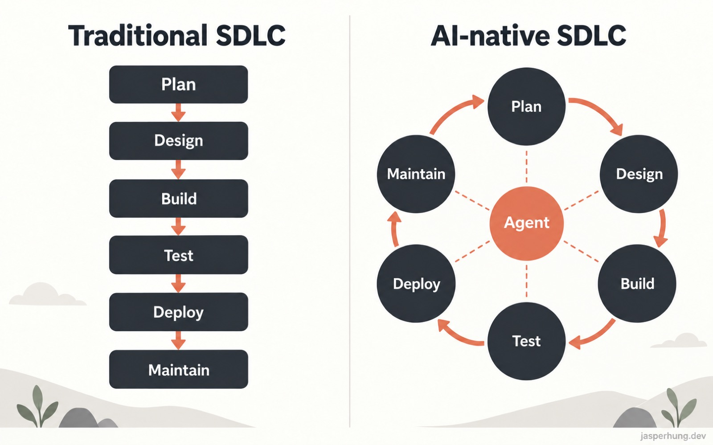

<KeyTakeaways>
  

    AI-native SDLC 要解決什麼？當 agent 加快 code 產出後，真正的瓶頸會移到規劃、審查、測試與部署；這堂課用 intent.md → spec.md → plan.md → diff/test → PR/review → incident 的 committed artifact 鏈，搭配 Skills、continuous evals、AI review 與 hooks，把線性流程改成有人守 gate 的治理迴圈。課程視角偏 engineering、platform、security lead，實作細節仍依版本、平台與組織設定而異。
  

</KeyTakeaways>

前一篇 [Subagents 入門](/posts/introduction-to-subagents/) 還在討論怎麼把探索工作交給獨立的 context，這次的 [The AI-Native SDLC Playbook](https://academy.claude.com/zh-TW/courses/ai-native-sdlc-playbook) 把視角拉到整個組織：當 agent 已經能快速產生大量 code，需求、設計、審查、測試和部署要怎麼跟上？

這堂課比較像 engineering、platform、security lead 的組織治理指南，讀者不會拿到一串照著貼就能完成的單人操作步驟。以下依照官方 `Course outline` 整理；官方頁面目前以英文顯示，中文是口語化筆記，功能標示和可用性仍可能隨版本、平台與帳號方案變動。

## 課程資訊一覽

| 項目 | 內容 |
|---|---|
| 堂數 | 14 堂課 |
| 總時長 | 1 小時 |
| 測驗 | 無 |
| 完成 | 有「課程完成」頁 |
| 先決條件 | 能日常使用 Claude Code；有權修改的 Git repository 與 CI pipeline。每個 play 會另外列出前置條件，有些完全不需要 |
| 適合對象 | 已經在用 Claude Code，但核准關卡、審查與交接仍以人的速度運作的 engineering、platform、security lead；課程以大型企業，尤其受監管產業為主要情境 |

## Introduction

### 1. Introduction

Software Development Lifecycle（SDLC，軟體開發生命週期）通常被切成 Plan、Design、Build、Test、Deploy、Maintain 六個階段。每個階段由不同角色負責，靠需求文件、ticket、簽核和交接維持共識。這套設計很適合「寫 code 要花幾週到幾季」的時代。

當 agent 開始大量產生 code，瓶頸會移到 code 的前後：plan、review、test 和 deploy 還是照人的速度走；人可以逐行審少量手寫 diff，卻很難用同樣方式審查 agent 產生的大量變更；資安與合規的例外也仍然等待每週或每月一次的會議。

AI-native SDLC 保留原本的控制目標，改變它們的執行方式。流程從線性階段變成迴圈，AI 嵌在每個節點，上一階段提交的產物觸發下一階段，人則站在 gate 上負責發起、指揮和治理。

圖：Traditional SDLC 的線性流程與 AI-native SDLC 的治理迴圈，依本課程概念重新繪製。

| 階段 | 傳統 SDLC | AI-native SDLC |
|---|---|---|
| Plan | 委員會蒐集需求、工作坊、簽核、手寫 | Claude 從來源整理痛點，寫進人和機器都能讀的 `intent.md` |
| Design | 分析師寫 spec，設計師再解讀 | 需求與設計在一次 agent 工作階段產出，用 Skills 編碼的標準把關並提交到 Git |
| Build | 手寫 code 與測試，文件事後補 | AI 產生 code 與測試，組織知識維護成版控的 `CLAUDE.md` 與 Skills |
| Test | QA 在階段邊界做 gate | continuous evals 織進實作流程 |
| Deploy | 人逐行審，治理靠審查週期 | 分層 agentic review，人工審查留給受監管或關鍵 code，hooks 負責核准關卡 |
| Maintain | 人盯 production 找 bug | agent 監控線上部署，超出 control band 就診斷並寫回新的 `intent.md` |

串起整條鏈的是 **committed artifact**。每個階段都把產物寫進版控，從 `intent.md`、`spec.md`、`plan.md`，一路到 diff 與測試、PR 與 review findings、incident 紀錄。下一個階段從上一份產物開始，commit 鏈也就成為稽核軌跡：誰要求什麼、agent 產出什麼、誰核准了什麼。需要判斷的決策仍由人負責。

課程裡的 plays 是六個可以模組化組合的 stage，不要求每個組織一次完成全部自動化。最初可以手動下 prompt，成熟後再讓「接受 `intent.md`」觸發 requirements/design、「核准 `spec.md`」觸發 plan mode、「merge PR」觸發 pipeline，production 超出 control band 時則產生下一份 `intent.md`。人的注意力會集中在 gate，而非每個階段都從零開始。

## Stage 1: Plan

### 2. Capture as intent.md

傳統需求會經過 backlog、user story、story point 和 refinement 會議，每次交接都可能離發起人的原意更遠。這個 play 把入口改成 `intent.md`：發起人用自己的話說明要什麼、為什麼要做，以及有哪些限制，再和 Claude 一起把內容整理成可以進版控的 proto-spec。

Getting started 不需要工程技能。團隊先準備 `intent.md` 模板和一個共同的版控位置：單一產品可以放在 repo 的 `intent/` 資料夾，跨多個 repo 才考慮獨立的 intent repo，monorepo 則可以放在既有目錄。沒有 Git 經驗的發起人，也可以透過 GitHub 這類版控 connector 讓 Claude 代為提交 Markdown。

執行流程可以濃縮成五步：

1. 發起人用自己的話描述目前做不到什麼、誰受影響、更好的結果長什麼樣，以及明確不做什麼。
2. 和 Claude 腦力激盪，把範圍、使用者、限制和成功條件問清楚。
3. 依組織模板寫成 `intent.md`；模板也可以做成由技術人員維護的 Skill。
4. 發起人修正 Claude 的誤解。
5. Commit 到共同位置，留下作者與時間戳，交給 PO 接手。

官方範例是 claims status self-service：

| 區塊 | 範例內容 |
|---|---|
| Problem | 客戶打客服問理賠進度，處理人員約三分之一通話時間花在只回答狀態 |
| Proposed outcome | 客戶在 portal 看到理賠狀態、下一步與預計日期 |
| Affected users and systems | 理賠處理人員、portal 團隊、claims-core API |
| Constraints | portal session 不新增 PII，只使用既有驗證 |
| Open questions | 第三方理賠公估人需要存取嗎？ |

治理證據是已提交的 `intent.md`、作者、時間戳和完整修訂史；PO 的接受或拒絕，則記錄成 merge 或關閉 review。可以觀察的指標包括從第一次對話到 `intent.md` commit 的時間、進入 Design 的比例，以及第一份 `spec.md` commit 之後 `intent.md` 被修改的次數。

這一 stage 的核心理解很簡單：先讓想法成為一份保留原意、可以被後續流程讀取的產物，需求就不必在多次交接後才第一次被看見。

## Stage 2: Design

### 3. Requirements and design

傳統流程把 requirements 和 design 分給不同團隊，分析師先正式化需求，設計師再重新解讀。這樣可以分工，卻也會增加等待與資訊損耗。AI-native 的做法是讓 Claude 讀取 `intent.md`，在一次 prompt 工作階段內產出 requirements 與 design spec，並把疑慮區（flagged concerns）一起標出來。

前置條件是已有 `intent.md`，以及把品牌、資安、合規和 UX 政策寫成 Skills。PO 開啟載入組織 Skills 的 session，附上 `intent.md`，要求 Claude 指向原始 intent、套用限制、產出完整的 `spec.md`，並特別標示互相衝突、無法同時滿足的政策。

一開始可以手動執行，之後再做成組織層級的 slash command。更進一步，當 `intent.md` 在 intent home 被 merge，就由非互動 job 載入 Skills，產生 `spec.md` 並以 PR 提交；PO 的第一次介入變成 review，而不是從頭撰寫文件。

PO 仍然要逐項對照：spec 有沒有解決原本的問題？open questions 有得到回答或被明確延續嗎？flagged concerns 要先交給政策負責人處理，`spec.md` 與 `intent.md` 一起 commit，最後是否進入 Build 永遠由人決定，高風險變更再交給 technical lead。

前端工作可以套用同樣的想法：intent 被接受後，PO 用 [Claude Design](https://claude.ai/) 依 `intent.md` 做 mock、迭代，再 export 給 Claude Code 實作。這類 beta 功能的可用性仍以實際帳號與平台狀態為準。

這一 stage 的治理重點是把政策套用時機往前移。spec、產生它的 prompt 和當時生效的 Skill 版本都進版控，PO 負責簽核，疑慮交給指定的政策負責人。衡量方式則是比較 `intent.md` 到 `spec.md` 的時間，以及第一次 `plan.md` commit 之後是否仍頻繁修改 spec。

## Stage 3: Build

### 4. Claude Code plan mode as the default starting point

工程師讀完設計就開始寫 code 時，「哪些檔案要改、工作順序和怎麼證明可行」通常只存在腦中。reviewer 第一次看到的是完整 diff，方向錯了才發現，rework 會變得昂貴。

這個 play 把 plan mode 設成預設起點：Claude 可以讀取 codebase，但在計畫被接受前不能改檔。工程師先提供 `intent.md`、`spec.md`，要求 Claude 產出包含以下內容的書面計畫：

- 哪些檔案要改。
- 工作順序。
- 可能弄壞什麼，以及風險最高的步驟。
- 能證明結果可行的測試或截圖。
- Claude 沒有選擇的替代方案。

計畫要迭代到「沒有看過對話的工程師，只看 `plan.md` 就能開始實作」。核准後把它 commit 成 `plan.md`，再交給 Claude 執行；如果實作偏離計畫，就在同一個 commit 更新 `plan.md`，也可以用 hook 強制兩者同步。官方範例的區塊是 Files that change、Order of work、Risks 和 Proof，例如 API 有 50 rps 限流時，panel 必須加入 cache，測試要涵蓋四種 claim state。

當 `CLAUDE.md`、編碼政策 Skills、阻擋不安全動作的 hooks 和可執行測試都成熟後，auto mode 才適合用在例行工作。工程師的工作會從逐次觀看 agent 修改，轉成讓它長時間工作，再審查最後的 artifact；worktree 則提供個人或團隊平行工作的隔離空間。

既有系統的 artifact 也要先指定 source of truth。工程主導的團隊可以讓 repo 為真；舊系統不可移除時，可以讓舊系統為真、Markdown 作為工作副本，透過 MCP connector 讀寫；至少也要讓兩邊互相記錄 record ID 與 commit SHA，作為過渡方案。

plan mode 的價值在於把方向審查移到 code 產生之前。這時改方向只需要改文件，工程師核准計畫後才讓 agent 進入實作。

### 5. The CLAUDE.md

課程把 `CLAUDE.md` 比喻成給 Claude 的新人 onboarding 資訊：專案慣例、指令、架構，以及團隊最常犯的錯。它原本散落在人腦與 wiki 裡，現在變成 agent 每個 session 開頭會讀取、全隊共同維護的檔案。

建立方式是先在 repo 執行 `/init`，再把內容砍到只剩新成員第一天需要知道的資訊：build、test、lint 指令，重要慣例，以及 Claude 一再做錯的事。檔案放在 repo root 並提交到 Git，變更像 code 一樣經過 review。

官方 Payments service 範例分成四區：

- **Commands**：`make build`、`make test`、`make itest`、`make lint`。
- **Conventions**：Java 21、Money 一律用 `BigDecimal`、每個 endpoint 都要有 integration test。
- **Architecture**：`api/`、`core/`、`adapters/`，Kafka schema 不改 generated classes。
- **Things Claude gets wrong**：不要升級依賴版本，legacy `v1/` 已經凍結。

一條實用的維護規則是：Claude 同一個錯犯兩次，修正就補進 `CLAUDE.md`。檔案也要保持在一頁以內；每個 session 都會讀它，過時的內容只會占用 context。可以觀察 Claude 重複犯錯的頻率，以及新成員到第一個 merged PR 的時間。

### 6. Skills as institutional knowledge

需要一致套用的組織知識適合寫成 Skill，單次 prompt 或每個 session 都必須知道的短規則則留在 `CLAUDE.md`。例如資安標準、API 設計慣例和品牌規則，都可以由政策負責人提供 source of truth，再由工程師寫成 Skill。

一個 Skill 通常放在 repo 的 `.claude/skills/<name>/`，隨 code 一起出貨；也可以用 plugin 做組織層級分發。`SKILL.md` 的 frontmatter 說明何時觸發，內文說明具體工作。建立後要用不同說法測試觸發，政策改變時也由政策負責人核准新版。

官方的 `secure-api-review` 範例會在建立或修改對外 endpoint、review API code、產生 OpenAPI spec 時觸發，並要求檢查 gateway JWT、輸入驗證、稽核事件與資料分級，最後執行 `scripts/check-endpoints.sh`。

Skill 是 advisory control，能讓違規變少，卻沒有東西強迫 session 一定遵守。永遠成立的政策需要確定性的控制：阻擋動作的 hook，或在 PR 重新執行的 review pass。可以把它記成一句話：Skill 讓違規變罕見，hook 讓違規幾乎不可能。

Build 階段的 hooks 可以擋受保護路徑的編輯、編輯後執行 formatter/linter、避免憑證進 diff，或支撐必須零例外的 Skill。這些 hooks 應該快速且只檢查有變動的檔案；完整測試留給 commit 或 PR。需要人核准的 hook 則放到 Deploy 階段的 gate，避免每個平行 session 都卡在相同的互動提示。

### 7. Parallel sessions and subagents

| 概念 | 說明 |
|---|---|
| Parallel session 平行 session | 另一個完整的 Claude Code 實例，在自己的 Git worktree 做獨立任務；彼此不知道對方的 context，共同點只有操控它們的工程師 |
| Subagent 子代理 | 單一 session 內受限縮的 helper，有自己的 context window 與工具限制，適合反覆出現的工作，例如驗證 app 是否照預期運作 |

平行 session 提升同時進行的任務數，subagent 則讓單一 session 保持專注。拆任務時先依照 plan 分出會碰不同檔案的工作，共用檔案的任務留在同一個 session 依序處理；每個平行任務使用自己的 worktree，例如 `claude --worktree feature-auth` 或 `claude --worktree fix-rate-limit`。

實務上可以從 2–3 個 session 起步，上限取決於一個人能好好 review 幾條線。重複出現的工作則定義成 `.claude/agents/` 裡的 Markdown，例如 code simplifier、verifier 或 researcher，連同工具限制與輸出格式一起提交到 Git。

官方 verifier 範例只給 `Bash` 和 `Read`，用 `make run` 啟動 app，測試改動的行為與最近兩個相鄰流程，回報執行內容、觀察結果和與 `plan.md` 不符之處，不能自行修改任何東西。

session 越多，產出也越多，控制必須來自 repo 設定的 hooks 與權限。衡量方式可以看在 review 品質不下降的前提下，每位工程師能維持多少並行 session，以及每週 merge 的變更數和 rework rate。

## Stage 4: Test

### 8. Give Claude a feedback loop

agent 寫完 code 後，最好能在工程師看到之前先自我驗證。測試、build 和截圖比對都可以成為 feedback loop，讓 session 依輸出自行修正，而不是把所有問題延後到 CI、測試人員或 production。

最基本的 Infrastructure 是一個能用單一指令執行的測試或 build，例如 `make test` 或 `npm test`，失敗時回傳 non-zero。接著在 `CLAUDE.md` 的 Commands 區列出指令，並說明健康輸出長什麼樣；完成條件也要寫成可量化的目標，例如 `test_status.py` 全部通過、截圖符合核准的 mock，或 endpoint 回傳 200 且包含新欄位。

修 bug 時，課程建議先寫失敗測試：重現 bug、確認測試因預期原因失敗、commit，再要求 Claude 在不修改測試的前提下讓它通過。可以用 hook 在 fix 任務期間阻擋測試檔編輯，或在 review 時只要發現測試被修改就拒收。

UI 工作則形成另一種閉環：實作 → 截圖 → 比對 → 調整，跑 2–3 輪很正常。核心規則是把驗證列為「完成」的一部分，回報任務完成前先跑測試並貼出原始輸出；agent 可以修 code，不能弱化驗收標準。

### 9. Continuous evals in CI

Evals 可以想成 AI-native 版的 stage-gate QA：當模型、prompt、`CLAUDE.md`、Skills 或 hooks 改變時，透過真實任務檢查 agent 是否仍然達到同樣水準。它是一套會持續更新的 suite；模型變強後，舊案例可能失去鑑別力，就需要補進新的案例。

Platform engineer 可以從近期工作蒐集 20–50 個真實任務，每個任務附上預期結果和可接受結果的檢查方式，例如測試通過、lint 乾淨、行為不變或遵守政策。Suite 在 CI 以非互動方式執行，排程跑，也在 `CLAUDE.md`、Skills 或 hooks 變更時跑回歸測試。

官方範例 `.github/workflows/agent-evals.yml` 會在 `CLAUDE.md` 和 `.claude/**` 變更時觸發，也有每日 cron。每個 `evals/*.json` 透過 `claude -p` 執行，限制可用工具，再以 `./evals/check.sh` 檢查結果。每個 production incident 也應該產生一個 eval，留在 suite 裡成為回歸測試。

治理上，eval 通過率可以成為 merge check；設定變更如果讓通過率下降，就要先 review 才能 merge。可以觀察通過率趨勢、incident 變成永久 eval 的時間，以及 regression 是在 CI 還是 production 才被發現。

## Stage 5: Deploy

### 10. AI in the PR review loop

AI-native review 的目標是讓所有 PR 都先得到同一組 review pass，findings 依嚴重度排序，工程師把注意力放在變更是否符合 plan 的意圖、風險是否可接受。Claude 可以 review 進來的 PR，也可以處理自己 PR 上的 review 意見，但它不能核准自己寫的 code。

Tech lead 在 repo root 建立 `REVIEW.md`，把 review policy 分成多個 pass，例如 Bugs、Security 和 Compliance。文件還要定義 Important 與 Nit 的差別，以及哪些項目應該略過。官方範例把會破壞行為、洩漏資料或違反政策的問題列為 Important；style 與命名列為 Nit，每次最多回報 5 個 Nit，其餘只做計數摘要，也不檢查 `src/gen/` 或 CI 已經強制的項目。

起步可以使用由 admin 啟用的託管 Code Review；需要控制 pipeline 或使用自家雲端合約時，再在 CI 跑 `claude-code-action`，模型呼叫可以經 Amazon Bedrock、Google Cloud Vertex AI 或 Microsoft Foundry。無論採用哪種方式，branch protection 仍要求 code owner 核准。

Reviewer 或作者可以在 review comment 標記 `@claude`，讓 Claude 處理意見並 push 修正。Claude 開的 PR 也可以透過自訂 slash command 持續掃描未解決的 comment 與失敗的 check，修完再 push，直到 PR 全綠、只等待 code owner 核准。

Review findings 還要回饋到 `CLAUDE.md`：同一錯誤被標第二次，修正就寫進專案規則；review 也可以標出變更讓 `CLAUDE.md` 過時的地方。每月由 tech lead 評分 findings、調整 Nit 數量、排除已由 CI 強制的檢查。

### 11. Hooks as approval gates

Build 階段的 hook 通常是無需人參與的 allow 或 block；到了 Deploy，hook 也可以 ask，暫停動作直到指定的人核准。Hooks 不只用在 deploy，Claude 的動作到哪裡就可以跑到哪裡，例如 Build 沒有 change ticket 就阻擋 migration，Test 的 fix 任務不允許編輯測試檔。

第一步是由工程領導、change management 和 compliance 列出必須保留的人工核准 gate，例如 change management sign-off、release authorization 和受保護路徑編輯。接著 platform engineer 把每個 gate 寫成 Claude 動作前執行的 script，明確定義 allow、ask 和 block。

團隊 hooks 可以放在 `.claude/settings.json` 並進 Git；不可協商的 hooks 則放到由 platform 或 IT admin 管理的 managed settings，工程師無法關閉。Block 時要把原因與取得核准的路徑回傳給 Claude，讓被擋下來的動作仍然有可追蹤的下一步。

官方的 `production-gate.sh` 範例使用 `PreToolUse`、`Bash` matcher 和 `jq` 讀取 `.tool_input.command`：如果指令同時包含 `deploy` 與 `production`，又沒有 `RELEASE_APPROVAL` 環境變數，就把說明寫到 stderr 並以 `exit 2` 阻擋動作；符合條件則 `exit 0` 繼續。

Managed settings 的範例則把控制分成幾層：

| 設定 | 控制目的 |
|---|---|
| `permissions.deny`（`Read(.env*)`、`Read(./secrets/**)`、`WebFetch`、`Bash(curl *)`、`Bash(wget *)`） | 把 secrets 擋在 agent context 之外，阻擋透過工具任意連到外部網路 |
| `permissions.allow`（`Bash(git *)`、`make build/test/lint`） | 預先核准安全的內圈作業，減少提示疲勞 |
| `disableBypassPermissionsMode` ＋ `allowManagedPermissionRulesOnly` | 不讓工程師、專案檔或命令列 flag 放寬規則 |
| `sandbox`（`enabled`、`failIfUnavailable`、`allowUnsandboxedCommands: false`、`network.allowedDomains`） | 以 OS 層的檔案與網路隔離補足工具層限制，必要時讓 sandbox 失效就拒絕啟動 |
| `sandbox.credentials` | 阻擋 sandbox 讀取 `~/.ssh`、`~/.aws/credentials`，並從指令環境移除 `GITHUB_TOKEN` |
| `allowManagedHooksOnly` | 只執行 managed settings 定義的 hooks，包含不了獨立的 project-level hook 範例 |
| `disableSideloadFlags` ＋ `strictKnownMarketplaces` | 只允許組織核准的 plugin marketplace 提供 Skill、agent、hook 和 MCP server |
| `allowManagedMcpServersOnly` | 把 agent 的工具表面收斂成 platform 團隊擁有的 allowlist |
| `requiredMinimumVersion` | 拒絕低於組織核准下限的版本啟動 |

這些設定只是起點，需要依資料分級客製；每一條 deny 都會拿走一些能力。衡量方式包括每個 gate 的等待時間，以及 hooks 前後違反 gate 而進入 production 的次數。

### 12. CI/CD integration and deployment

把 Claude 放進 CI/CD 前，先把 review 與 approval gate 建好。部署相關的 agent job 要在 sandbox 中非互動執行，使用短效且限縮範圍的 token，不帶常駐 production 憑證；deploy、status 和 rollback 則透過 MCP 暴露成 per-environment 的工具。

課程建議循序漸進：

1. 先用 `claude -p` 做唯讀判斷，例如分流失敗 build、摘要 flaky test、草擬 changelog。
2. 在既有 gate 後加入寫入步驟，例如修 lint、更新產生的文件或處理 review comment；agent 寫出的內容一律走 PR，沒有推到 main 的路。
3. 把 agent job 放進有 network policy 的 container，使用短效 token，預設不帶 production 憑證。
4. 把 deployment 工具透過 MCP 暴露，權力採 allowlist，不把帶憑證的 shell script 直接交給 agent。
5. 依環境分級自主度：development 可以讓 agent 自由部署，staging 介於中間，production 由 agent 準備 release、release manager 授權，hook 強制 gate。
6. 把 rollback 做成單一指令，定期在 staging 演練；Stage 6 的 control band 被突破時，才有一條已證明可行的回復路徑可呼叫。

官方範例是 CI job 在 `failure()` 時執行 `claude -p`，讀取 `out/build.log`，判斷失敗看起來是 flaky 還是真實問題，再把三行摘要寫進 PR thread。這種唯讀判斷很適合成為自動化的第一步。

核心治理原則是：agent 可以一路動作到 production gate，但不能越過它。branch protection 把 agent 寫的東西變成 PR，production deploy hook 等待具名 release manager 授權，pipeline log 也要區分觸發它的工程師與實際執行的 agent。

## Stage 6: Maintain

### 13. Closing the loop on metrics

前面每個 stage 都還需要人來啟動。Stage 6 把維護工作改成可以自主運行的閉環：確定性的 detection script 監看 production，只有指標突破 control band 時才叫醒 Claude；agent 診斷、透過有 gate 的路徑行動，再把發現寫成 `intent.md`，重新流過前面的 stages。

這裡的關鍵不是讓模型一直盯著 production，而是把偵測和判斷分開。偵測完全由 script 負責，不涉及模型；模型只在符合條件的事件發生時被呼叫。可監看的指標包括 CI 測試失敗率、部署後的 5xx rate 和 PR cycle time。

執行流程如下：

1. 選一個有穩定滾動基線的指標。
2. 寫進版控的 detection script，搭配單元測試，用 rolling window、平均值、標準差和 Western Electric 等規則抓慢慢飄移或突然尖峰。
3. 在 `bands.yaml` 定義分級回應：1σ 只記錄，2σ 以唯讀工具叫 Claude 診斷，3σ 才能開 PR 或觸發預先核准的 runbook。
4. 用 GitHub/GitLab 排程 workflow、監控系統 webhook 或 cron 觸發非互動的 Claude Code，讓它 stateless 地在 CI runner 或 sandbox container 中執行。
5. 讓 agent 用 Stage 1 的格式寫出 `intent.md`，包含異常與證據、建議結果、受影響系統和 open questions。
6. 由 service owner 或 on-call 分流：立刻修、排程，或駁回；駁回結果可以拿來調整 control band、降低噪音。
7. 修復上線後，替該 incident 補一個 eval，讓相同問題進入未來的回歸測試。

官方範例把 `ci_test_failure_rate` 對到 `rolling_30d` baseline：1σ 只 log，2σ 用 `Read`、`Grep` 和 `Bash(gh run view *)` 做診斷，3σ 才能提出 `pull_request` 或 `runbook:rollback-deploy`。

課程列出三個例子：CI 測試失敗率突破 3σ 時隔離 flaky test 或開 revert PR；部署後 5xx rate 突破 3σ 且附近有部署時觸發既有 rollback pipeline；PR cycle time 出現 drift 時寫報告給工程領導層。這表示同一套 harness 也能處理流程指標，不只 production 指標。

另一個例子是 **Claude on call with Claude Tag**。incident 可能從 Slack 或 Teams 進來，Claude Tag 讓 Claude 以自己的身分成為頻道成員，透過 MCP 驗證指標是否回到基線，並把 post-mortem 寫入版控的 lessons file。小而明確的修復走 PR，大型變更寫成 `intent.md` 回到 Stage 1，讓 loop 自己餵回自己。課程中這些產品標示屬於當時課程內容，實際可用性仍要以目前服務狀態為準。

## Closing

### 14. Closing thoughts and resources

模型和 harness 持續進步後，組織可以重新設計的範圍不只包含產生 code，還包括整個 SDLC。這份 playbook 建議從組織管理者的決策地圖開始，再依序理解 settings precedence、server-managed settings、permissions、sandboxing、hooks、Skills、plugins、managed MCP、enterprise deployment、OpenTelemetry monitoring、analytics dashboard、Compliance API 和 security model。

整堂課仍然把人的判斷放在核心位置：agent 可以整理需求、產生計畫、修正 code、分流事件和準備 release，但 intent 是否被接受、風險是否可接受、production 是否允許繼續，都要由明確的 gate 和具名的人負責。

## 從 artifact 到治理 gate

把 14 堂課放在同一張表裡，可以看出每個 play 產生什麼、由誰負責，以及控制強度落在哪裡：

| Play | 核心 artifact | 主要角色 | 控制強度 |
|---|---|---|---|
| Capture as intent.md | `intent.md` | 發起人／PO | 版控紀錄＋PO 接受 |
| Requirements and design | `spec.md` | PO | Skills（建議性）＋人簽核 |
| plan mode | `plan.md` | 工程師 | plan mode 本身不能改檔＋人核准 |
| CLAUDE.md | `CLAUDE.md` | 全隊／code owner | 建議性，PR review |
| Skills | `SKILL.md` | 政策負責人＋工程師 | **建議性**，需要 hook 補強 |
| Parallel sessions/subagents | `.claude/agents/*.md` | 工程師 | repo 設定（hooks／權限） |
| Feedback loop | 測試輸出 | 工程師 | hook 可強制（不准改測試） |
| Continuous evals | `evals/` | Platform engineer | merge check（通過率門檻） |
| PR review loop | `REVIEW.md` | Tech lead | 職責分離＋branch protection |
| Hooks as approval gates | hooks／managed settings | Platform／IT admin | **確定性**，managed 不可覆寫 |
| CI/CD | pipeline／MCP 部署工具 | Platform engineer | production gate＋rollback |
| Closing the loop | `bands.yaml` | Service owner | 分級 σ 邊界 |

## 小結

這堂課最關鍵的地方，在於它選擇的視角。它把 agent 放進團隊與企業的 SDLC 裡，討論規劃、審查、測試、部署和維護各階段要怎麼治理。雲端的 Claude、CI 裡的 `claude -p`、本機的 Claude Code 和 Agent SDK 都只是執行節點，真正讓流程能被治理的是它們之間留下的 artifact、權限和 gate。

它的定位是 playbook，重點放在原理、流程和角色分工。課程沒有附一組內建 Skill、starter kit 或公開的 Skill 套件，讓人照著理論直接實作並產出 `intent.md`、`spec.md`、`plan.md` 等文件；看到內容裡沒有一串可以照貼的指令，其實符合這堂課原本的定位。這是一門偏概念與理念的課，但裡面包含非常多 agent 在團隊和企業裡落地時會遇到的治理概念模型。

在我接觸過的 SDD（Specification-Driven Development）討論裡，重點通常集中在規格、需求、設計和實作之間的關係。這堂課讓我覺得比較不一樣的地方，是它把視線延伸到後面的 Deploy 和 Maintain：流程不在 code merge 後結束，部署後的指標、incident 和 control band 也會重新餵回 `intent.md`，讓整條 SDLC 形成閉環。這也是我讀完後最想帶走的理解；接下來看到 Skills 課程時，應該會更容易理解它在這條治理鏈裡負責哪一層。
