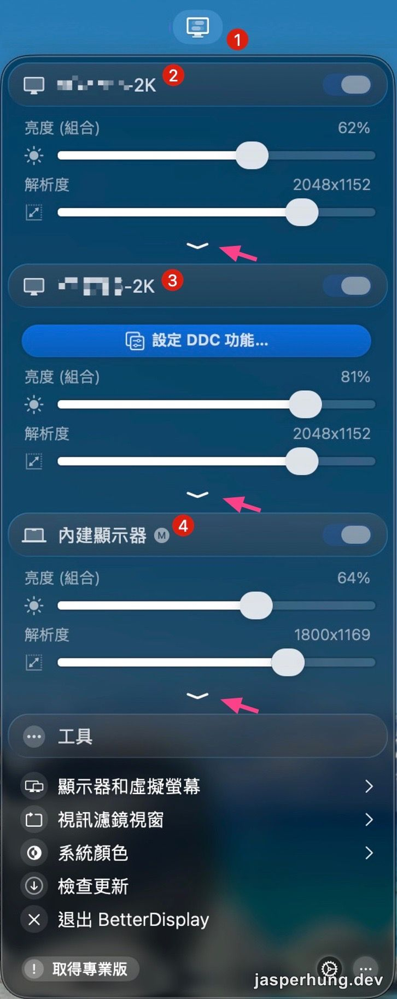
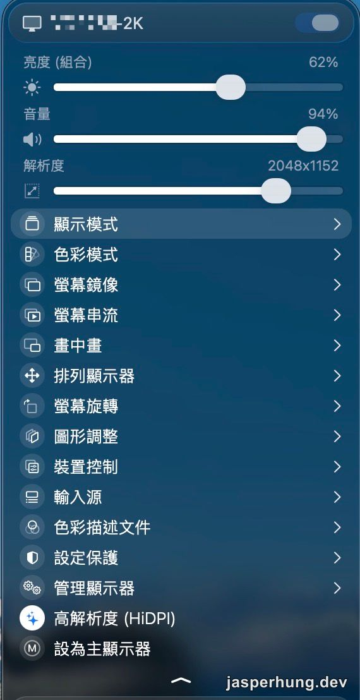
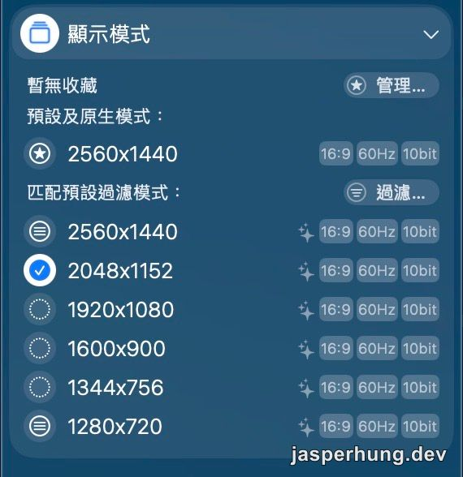

<KeyTakeaways>
  
2K 外接螢幕想放大文字又不想變模糊，該怎麼設定？用 BetterDisplay 開啟 HiDPI 縮放，在顯示模式裡選有 ✦ 符號的解析度即可，同時能用鍵盤亮度鍵控制外接螢幕；但這個做法需要螢幕與連接方式支援 DDC，部分 dock 或轉接器可能無法使用。

</KeyTakeaways>

外接 2K 螢幕時，macOS 的預設字體大小常常有點尷尬：畫面很清楚，但字太小；把解析度調低後，字是變大了，邊緣卻開始發糊。看久了，總覺得兩邊都不太對。

我把這個問題拿去跟 AI 討論，請它一起找可能的設定方式和現成工具。後來才認識 BetterDisplay。它不只是多一個調解析度的工具，而是讓 2K 外接螢幕也能用上更舒服的 HiDPI 縮放。

## BetterDisplay 是什麼工具？

BetterDisplay 是 macOS 的顯示器控制工具，能調整解析度、亮度、色彩模式，也能建立虛擬螢幕。對我最有用的是它的 flexible HiDPI scaling：讓 2K 外接螢幕上的文字、圖示和圖片變大，同時保留面板原本的清楚程度。它的 [官方網站](https://betterdisplay.pro/) 和 GitHub 文件都把 flexible HiDPI scaling 列為核心功能。

這個專案由核心開發者 @waydabber 長期維護，在 GitHub 上已有 3 萬多顆 stars。AI 先把它從眾多可能方案中找出來，我再看專案文件、GitHub 和實際顯示效果，確認它正好對應這個問題。

| 專案                                                                  | GitHub stars |
| --------------------------------------------------------------------- | -----------: |
| [waydabber/BetterDisplay](https://github.com/waydabber/BetterDisplay) |      32.8k ⭐ |

## 鍵盤亮度鍵會跟著滑鼠走

另一個我裝了之後才發現很好用的功能，是外接螢幕的亮度控制。原本 Mac 鍵盤上的亮度鍵，主要只能調整筆電自己的螢幕；外接螢幕想改亮度，通常得安裝各家廠商的軟體，或直接摸到螢幕背後，按著不太直覺的按鈕一層一層選到亮度。

裝了 BetterDisplay 後，把滑鼠移到哪一台支援的外接螢幕上，再按亮度鍵，調整的就是那台螢幕。寫程式時想把左邊螢幕調暗一點，游標移過去按一下就好；回到筆電螢幕時，亮度鍵又會調整筆電本身。這種方便的程度真是不言而喻，反而比設定解析度更快感受到它的價值。

它是透過 DDC 直接控制外接螢幕的背光，因此螢幕和連接方式必須支援 DDC；某些 dock 或轉接器可能沒有這個能力。BetterDisplay 也需要啟用原生亮度鍵的控制。 [BetterDisplay 功能列表](https://github.com/waydabber/BetterDisplay)

## HiDPI 是什麼？

HiDPI 指的是讓介面以較高像素密度繪製的顯示方式。面板仍然以原生 2560×1440 像素輸出，但 macOS 可以用較低的「邏輯解析度」安排介面大小。結果是文字、圖示和圖片都變大，最後仍由完整的 2K 像素呈現，所以邊緣維持銳利。

這不是只有 Apple 自家螢幕才能用的專利功能，也不是 BetterDisplay 把每台螢幕偽裝成 Apple 顯示器。macOS 本來就會依照連接的顯示器提供可用解析度；只是許多 Apple Silicon Mac 搭配 sub-4K 外接螢幕時，系統不會預設提供足夠的 HiDPI 縮放選項。BetterDisplay 的做法是調整這台螢幕的系統設定，讓它能使用 flexible scaling。 [BetterDisplay 的 HiDPI 文件](https://github.com/waydabber/BetterDisplay/wiki/Fully-scalable-HiDPI-desktop), [Apple 的顯示器設定說明](https://support.apple.com/en-euro/guide/mac-help/-mh40768/mac)

## 直接降解析度，和 HiDPI 放大不是同一件事

直接把 2560×1440 改成較低解析度，螢幕確實會讓整個畫面變大，但也是真的用較少像素顯示。文字、圖示和圖片都得經過放大，邊緣自然容易不夠銳利。

BetterDisplay 的 HiDPI 模式走的是另一條路：變大的是介面的邏輯尺寸，不是面板的實體解析度。它比較像把同一張清楚的畫布放大來看，而不是換成一張像素比較少的畫布。

這正是它解決 2K 螢幕尷尬之處的原因：不用在「字很小」和「畫面很糊」之間選一個。

## 從選單列，找到要調整的外接螢幕

BetterDisplay 裝好後，先從 macOS 選單列打開它。畫面會列出每一台已連接的顯示器；點開自己要調整的那台外接螢幕，就能看到目前的亮度、音量與解析度。

從選單列打開 BetterDisplay，再展開要調整的外接螢幕。

展開後，選擇「顯示模式」。不用急著碰其他選項；這一頁才是把文字變大、又不讓它變糊的關鍵。

展開目標螢幕後，進入「顯示模式」。

## 在 BetterDisplay 裡，要選有 ✦ 的模式

設定時，我在 BetterDisplay 的選單列選擇外接螢幕，再從「顯示模式」裡找有 `✦` 符號的解析度。

- 有 `✦`：HiDPI 模式，會保留原生面板的銳利度。
- 沒有 `✦`：直接以較低解析度顯示，畫面雖然變大，卻比較容易模糊。

我的 2K 螢幕用 `2048×1152 ✦` 很剛好。它讓畫面大約像放大 125%，程式碼和網頁文字都更好讀，但可用空間沒有縮到像真的把螢幕降成低解析度那樣侷促。

`2048×1152 ✦`：同一列旁的星芒符號，才是 HiDPI 模式的辨識點。

同一個數字有時會同時出現有星號和沒星號的版本，乍看幾乎一樣；這裡其實是整個設定最重要的分岔點。記法很簡單：想要「放大但不糊」，就選有 `✦` 的。

## 結語：放大畫面，不必犧牲清晰度

2K 螢幕不是只能在「字很小」和「畫面很糊」之間選一個。HiDPI 模式把介面的尺寸交給 macOS 調整，卻讓面板繼續做它最擅長的事：用原生像素把畫面顯示清楚。

再加上亮度鍵會跟著游標所在的螢幕走，BetterDisplay 解決的不只是一次性的解析度設定，而是每天都會遇到的小麻煩。事後回看，真正需要記住的只有一件事：在「顯示模式」裡，選有 `✦` 的那個版本。
