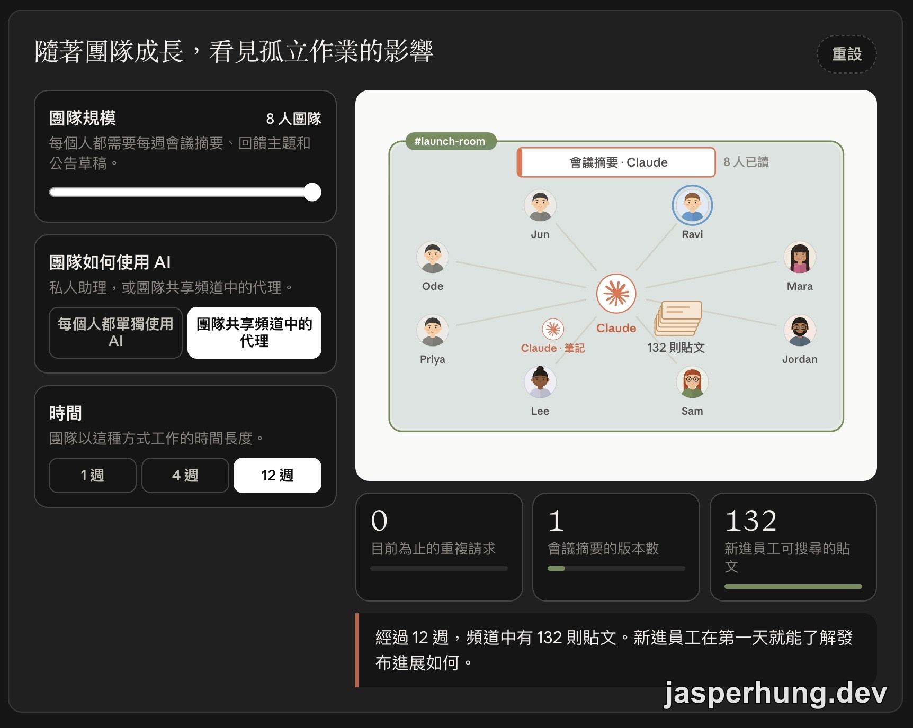
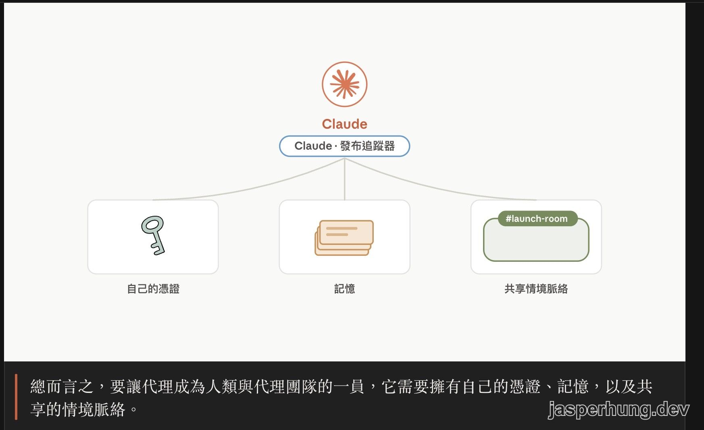
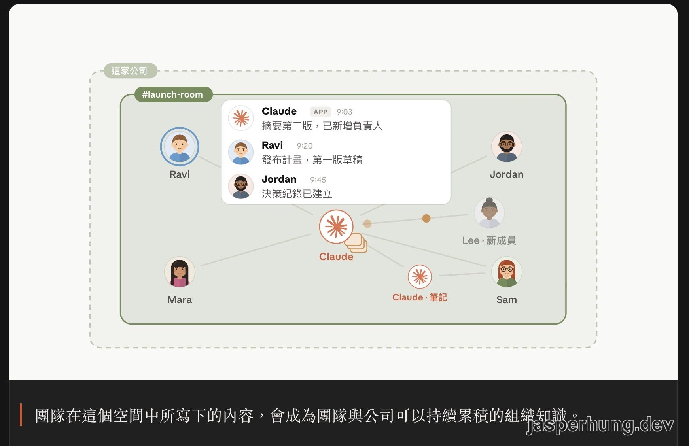
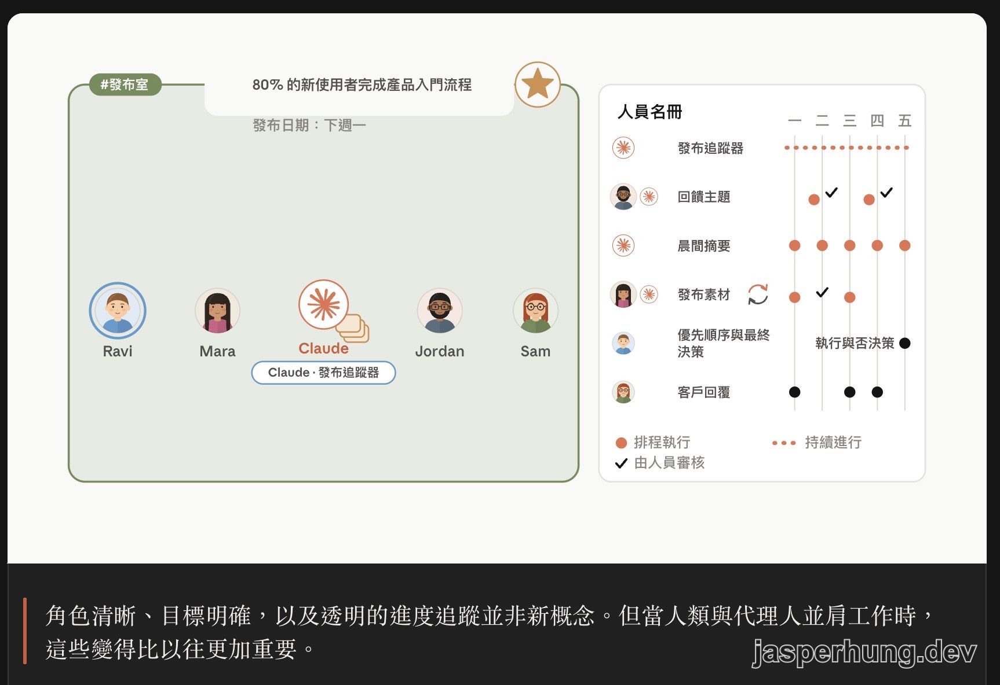

<KeyTakeaways>
  

    AI 隊友和每個人各自使用的 AI 助理差在哪裡？<a href="https://academy.claude.com/zh-TW/courses/building-effective-human-agent-teams">Building effective human-agent teams (beta)</a> 用 single-player AI 與 multiplayer AI 對照，整理 shared memory、shared context、明確角色、書面北極星目標與逐步建立信任；本課聚焦團隊規範與導入準備，實際產品功能和方案價格仍以當下文件為準。
  

</KeyTakeaways>

原本看到 Day 19 的課名，我以為會進入某個 Claude team 功能的產品教學。結果第一個互動模擬器就把問題換了個角度：如果八個人各自問自己的 AI 摘要同一場會議，團隊拿到的會是幾個版本？

這堂 [Building effective human-agent teams (beta)](https://academy.claude.com/zh-TW/courses/building-effective-human-agent-teams) 談的，是 AI 從個人工作助手走進團隊共享空間後，工作方式會怎麼改變。它把重點從「再多開幾個對話視窗」移到另一個問題：代理人要具備哪些條件，才有機會像一位真的隊友一樣持續工作？

## 課程資訊一覽

| 項目 | 內容 |
|---|---|
| 堂數 | 5 堂課 |
| 總時長 | 45 分鐘（課程 metadata 標 39 分鐘） |
| 測驗 | 1 個（5 題，約 4 分鐘，通過門檻 80%＝答對 4 題） |
| 完成 | 有完成徽章 |
| 先決條件 | 無，不需技術背景 |
| 適合對象 | 團隊負責人與創新者，組織已在單人模式用 AI、想躍進到多人模式 AI |
| 狀態 | beta 課程 |

官方把這堂課的學習目標整理成四件事：理解團隊從 single-player AI 轉向 multiplayer AI 時，工作會如何改變；分辨多人協作代理和傳統聊天機器人的差異；找出能讓代理支援團隊的規範；以及運用健康人類-代理人團隊的四項原則——明確角色、書面北極星目標、漸進式釋放和適當的資訊存取權限。

每堂課的形式也很有意思：一段動畫、互動模擬器、一個可以直接丟給 Claude 的練習 Prompt，以及幾個課程反思問題。文字量不算大，但互動內容很多，重點放在讓你自己調整團隊規模、AI 使用方式和授權範圍，再看結果怎麼變。

## The shift to multiplayer（轉向多人模式）

### 1. Why multiplayer AI matters（為什麼多人協作 AI 很重要）

課程先用一個很容易想像的對照開場：單人 AI 讓每個人工作變快，但團隊的資訊也可能各自留在私人對話裡。當人類和代理人一起待在共享空間，會議決定、日曆更新和工作進度就能留在所有人都看得到的地方。

互動模擬器讓我印象最深。它有三個旋鈕：團隊規模從 4 人調到 8 人、每個人單獨使用 AI 或改用團隊共享頻道中的代理，以及觀察 1 週、4 週或 12 週後的結果。課程用三個數字呈現孤立作業的代價：重複請求、會議摘要的版本數，以及新進員工可以搜尋到的貼文。

| 指標 | 單人模式下的結果 |
|---|---|
| 目前為止的重複請求 | 8 人團隊各自詢問同一件事，數字會累積到 36 |
| 會議摘要的版本數 | 4 個版本，行動項目數量和負責人彼此不一致 |
| 新進員工可搜尋的貼文 | 0 |

圖：把團隊切換到共享頻道中的代理後，模擬器能直接比較重複請求、摘要版本和可搜尋貼文。

這個案例的痛點很具體：四個人各自問私人助理「昨天的會議結論是什麼」，拿回來的行動項目和負責人都可能不同，而且沒有人能把這些答案當成團隊共同的記錄。單人 AI 的速度確實存在，但重複詢問和版本不一致也會一起累積。

## What makes an agent a teammate（是什麼讓代理人成為隊友）

### 2. How is a multiplayer agent different from traditional AI tools?（多人協作代理與傳統 AI 工具有何不同？）

下一堂課把「隊友」拆成三個能力。傳統聊天機器人通常跟著某個使用者的身分和對話走；多人協作代理則需要一組能在團隊層級運作的條件。

| 能力 | 作用 |
|---|---|
| 自己的身分與憑證（identity and credentials） | 代理人用自己的名義和登入方式工作，權限由團隊決定，操作紀錄也能對回它自己的身分 |
| 共享記憶（shared memory） | 跨過不同對話，保留從團隊成員身上學到的內容 |
| 共享上下文（shared context） | 讀取團隊共享空間裡的訊息與決策，不必每次都等某個人重新貼上背景 |

圖：課程把多人協作代理拆成自己的憑證、共享記憶和共享情境脈絡三個部分。

這三項能力裡，最容易被低估的是「自己的身分與憑證」。這裡指的是代理人對外部系統的存取身分；模型呼叫使用的 API key 屬於另一層。課程模擬器安排了一個很好的例子：代理人試著讀取帳務資料夾，但它只有上線追蹤器的金鑰，所以最後被擋下來。對這個代理來說，被擋下來才是權限設計成功的結果。

課程的另一個模擬器會逐一關掉這三個開關，看 Lantern 團隊在一週裡哪一天開始出問題。全開時的情境如下：

| 日 | 事件 | 全開時的結果 |
|---|---|---|
| 週一 | Ravi 要求上線檢查清單 | 兩分鐘草擬完成，這是一般聊天機器人也能做到的事 |
| 週二 | Mara 要求更新檢查清單 | 記得 14 號和凍結規則，一則訊息就完成（共享記憶） |
| 週三 | Jordan 在 `#launch-room` 寫下推薦橫幅被砍掉 | 代理讀到決定，下一天的計畫自動移除推薦相關任務（共享上下文） |
| 週四 | 代理人試圖存取帳務資料夾 | 因為沒有帳務金鑰而停止（自己的身分與憑證） |
| 週五 | 每週摘要發送給整個團隊 | 日期和凍結規則都正確，不需要重新解釋背景 |

:::tip
課程裡的「共享記憶」不只是把同一段對話轉貼給所有人。它要能在不同對話之間延續團隊教過的規則；「共享上下文」則是代理人能直接讀到團隊空間裡的新決定。兩者都存在時，代理人才比較有機會跟上團隊的工作節奏。
:::

### 3. What a strong human-agent team looks like（強大的人類-代理團隊是什麼樣子）

有了身分、記憶和共享上下文，代理人仍然需要知道團隊要往哪裡走。課程用 Lantern 團隊的發布週來示範：北極星目標是「80% 的新使用者完成產品入門流程」，Claude 在發布空間裡有自己的工作項目，人類則保留優先順序、最終決策和客戶回覆。

這裡的重點很像一份寫給新成員的團隊說明：誰負責什麼、工作成果放在哪裡、什麼事情需要人做判斷，都必須公開且可查。當代理人理解北極星目標，它就能從「等人下指令」往前走一步，主動提出可能有助於目標的工作。

圖：共享空間裡留下的決策、摘要和工作進度，會成為團隊與新成員可以搜尋的組織知識。

我很喜歡這個設定帶來的延伸效果：新成員加入時，不必只靠口頭問「之前發生了什麼」，也能直接從團隊過去留下的文件與訊息理解脈絡。截圖裡的模擬器在 12 週後累積了 132 則貼文，新成員可以從共享空間開始熟悉發布進度。這和每個人各自擁有一位私人助理，工作感受差很多。

課程把健康人類-代理團隊的原則整理成四項：

| 原則 | 說明 |
|---|---|
| 公開工作並提供廣泛背景資訊 | 對代理人來說，沒有寫下來或無法存取的資訊，就等於不存在 |
| 明確定義每位人類與代理人的角色 | 每個角色都要有適合工作的工具、成果物與工作空間，重要判斷由人類負責 |
| 設定書面的北極星目標 | 北極星由人類設定；代理人理解目標後，才能主動帶來相關工作 |
| 依可靠程度逐步建立信任 | 先給小範圍自主權，確認表現穩定後再有計畫地擴大 |

圖：課程用名冊、北極星目標和發布追蹤器，示範人類與代理人如何在同一套工作脈絡裡分工。

我覺得這裡最重要的轉折，是「代理人變主動」的前提落在團隊設計，不只在模型能力。目標、角色和工作項目被寫下來，代理人才有可以依循的方向；信任則要從可檢查的小任務開始累積。

## Getting your organization ready（讓您的組織做好準備）

### 4. Organizational checklist（組織檢查清單）

在導入多人協作 AI 前，課程請團隊先回答五個問題。它們看起來像準備度評分，但真正的用途更接近開啟一場團隊對話：哪一題最容易出現分歧，哪裡就可能是第一個要改善的地方。

| # | 準備度檢查項 | 為什麼重要 |
|---|---|---|
| 1 | 公開且可搜尋 | 如果工作都放在私人文件和私訊裡，代理人很難保持最新狀態 |
| 2 | 明確的負責人，包括代理人在內 | 角色不清楚，工作就容易重複 |
| 3 | 每位團隊成員擁有合適的工具 | 沒有必要存取權限的代理人，只能猜測或做出粗淺結果 |
| 4 | 在有人查看前先進行檢查 | rubric、測試或第二個代理人的審查，可以先攔住問題 |
| 5 | 大家都能參照的北極星目標 | 沒有共同目標，人類和代理人都難以預判下一步 |

互動練習會讓團隊對這五項陳述各給 1–5 分，從「非常不同意」到「非常同意」。頁面也明確說明，這個選擇不會被儲存，也沒有一個代表團隊成熟度的總分；它最後會產生一段 Prompt，請 Claude 從最低分的領域開始，一次問兩個關於團隊現況的問題，再整理成一份兩週計畫。

這種設計讓我想到一件事：準備度最低的地方，未必是某個工具還沒開通，也可能是團隊習慣把決定留在私訊裡，或大家都以為「那件事應該有人負責」。多人協作 AI 只是把這些模糊處放大得更快。

### 5. Some practical ways to get started（一些實用的入門方法）

最後一堂課把前面的原則濃縮成前兩週的入門檢查清單，方向很簡單：盡快開始，但從小處著手。

| # | 項目 | 做法重點 |
|---|---|---|
| 1 | 選擇一個協作空間、三到五個人，以及一個代理 | 從有共同專案的小團隊開始；高信任度的團隊最適合初步實驗 |
| 2 | 設定一個多人協作代理 | 常見路徑包括 [Claude Tag](https://claude.com/docs/claude-tag/users/getting-started) 或 [Claude Managed Agents API](https://platform.claude.com/docs/en/managed-agents/quickstart) |
| 3 | 預設將團隊工作方式公開並共享 | 會議或私訊做出的決策，當天就要有人發佈到共享空間 |
| 4 | 撰寫包含代理人的名冊 | 列出經常性工作與負責人，代理可以提出建議，人員做最後決定 |
| 5 | 寫下北極星目標並釘選在代理讀得到的地方 | 北極星是有雄心且可衡量的目標，由人員設定 |
| 6 | 先給代理一項可見的工作 | 共享給整個團隊的晨間簡報是適合的起始任務，最初幾天由一個人審閱並回饋 |
| 7 | 建立代理可以使用的檢查機制 | 每項任務都要說明「通過」長什麼樣，這是擴展信任的快速方法 |
| 8 | 依任務類型逐步擴展信任 | 同一類任務連續多次處理妥當後，再擴大它在這類任務上的範圍 |
| 9 | 教導代理你的工作方式 | 重複解釋同一件事兩次，就把它寫成給代理的書面指示 |
| 10 | 用每週回顧改善流程 | 每週檢查什麼有效、什麼要調整，再把結果保存給其他代理使用 |

官方列出的兩條實作路徑，一條是裝在協作空間裡的 Claude Tag，另一條是建立在 [Claude Platform](https://platform.claude.com/) 上的 Managed Agents API。這裡先把它們當成兩種架構方向即可：前者比較接近團隊直接使用的共享代理，後者則讓開發者用 API 建立自己的 agent、session 和 memory store。

課程也列了幾個延伸閱讀：

| 類型 | 連結 |
|---|---|
| 本課依據的文章 | [建立有效的人類-代理團隊](https://claude.com/blog/building-effective-human-agent-teams) |
| 實際案例 | [將對話轉化為知識：Slack 如何建立人類-代理團隊](https://claude.com/blog/turning-conversation-into-knowledge-how-slack-builds-human-agent-teams) |
| 教學課程 | [使用技能教導 Claude 您的工作方式](https://academy.claude.com/zh-TW/tutorials/teach-claude-your-way-of-working-using-skills)、[什麼是 Claude Managed Agents？](https://academy.claude.com/zh-TW/tutorials/what-is-claude-managed-agents) |
| 文件 | [Slack 中的 Claude Code](https://code.claude.com/docs/en/slack)、[代理技能概覽](https://platform.claude.com/docs/en/agents-and-tools/agent-skills/overview) |

## Course Quiz（課程測驗）

有 5 題。官方頁面本身是繁中，以下保留實際題目與正確答案。

### 1. 團隊中的四個人各自向自己的私人 AI 助理詢問昨天會議的摘要。最可能的結果是什麼？

答案：**四份略有不同的摘要，沒有人拿到相同的版本**

### 2. 哪一組能力將多人協作代理與傳統聊天機器人區分開來？

答案：**擁有自己的身分與憑證、共享記憶，以及共享上下文**

### 3. 某團隊的代理持續在規劃一項週三已被取消的功能的工作。該取消決定是在兩人之間的私訊中達成共識的。最可能的原因是什麼？

答案：**該決定從未被寫在代理能夠讀取的地方**

### 4. 某團隊交給其代理一項新類型的任務：為客戶草擬回覆。依照本課程對信任的處理方式，第一週應該是什麼樣子？

答案：**由一個人審查每一份草稿，並記錄哪些需要人員做出判斷**

### 5. 以下哪一項最適合作為團隊及其代理的書面北極星（指導方針）？

答案：**80% 的新使用者完成產品入門流程**

## 小結

這堂課原本讓我以為會教 Claude team 功能，聽到後面才發現，真正的主題是「一位住在團隊裡的 AI 隊友」要怎麼持續工作。

原本以為會學到一個新功能，最後帶走的卻是一整套團隊工作方式：資訊要放在共享空間、代理要有自己的身分、目標要寫下來，信任則從可以檢查的小任務慢慢累積。新成員能不能直接讀懂團隊過去留下的文件，也成了我重新理解「共享記憶」價值的關鍵。

文中的模擬器數字是課程案例和我保留下來的畫面，沒有涵蓋所有組合的完整 benchmark。這個界線反而讓課程的主張更合理：先讓代理在小範圍工作，等可靠度真的累積，再慢慢把它當成團隊裡一位會記得事情、看得到脈絡、也知道自己權限邊界的隊友。

## 課後理解：AI 自己的身分與計費方式？

住在 Slack 裡的 Claude AI 隊友，要怎麼計費？

我後來花了不少時間把 Team 方案、API key、共享記憶和額外用量拆開看。以 [Claude Tag](https://support.claude.com/en/articles/15594475-what-is-claude-tag) 這條路徑來說，我查到它需要 Team 或 Enterprise 的組織方案，頻道工作的用量還會從組織的 usage balance 扣除；這和一般訂閱裡的單人使用情境，以及用 API key 走 Claude Platform API，都是不同的計費和存取方式。另一條 Managed Agents API 路徑則是 API key 加上 token 與 session runtime 的用量計費，跨 session 的延續要另外使用 [memory store](https://platform.claude.com/docs/en/managed-agents/memory)。

| 路徑 | 需要的東西 | 記憶與計費方向 |
|---|---|---|
| Claude Tag | Team／Enterprise 組織、管理員設定 | 頻道共享記憶，工作用量從組織 usage balance 扣除 |
| Managed Agents API | Claude Platform 帳號與 API key | token＋session runtime；跨 session 記憶由 memory store 管理 |

我一開始以為「需要訂閱」和「綁 API key」是同一件事，後來才拆開：沒有持久的共享記憶，每個 session 都得重新交代背景，很難有一位隊友持續接著工作的感覺。這個計費方式真的很不好懂，光是理清產品方案和記憶的關係，就花了比預期多的時間 XD。
