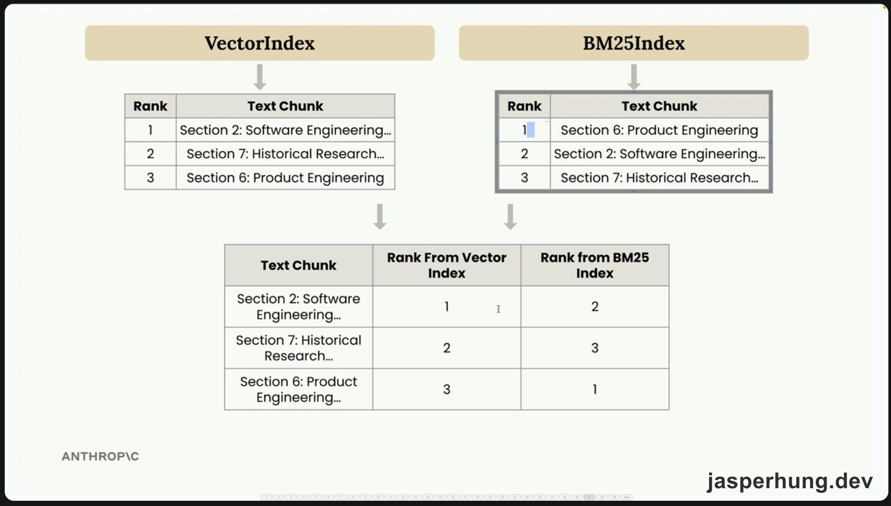

<KeyTakeaways>
  <p>
    RAG 要怎麼把大型文件變成 Claude 可以使用的相關內容？這一篇從文字分塊與 embeddings 走過向量搜尋，再用 BM25 補上精確詞彙命中，最後以 RRF 融合不同排行榜；範圍是 Building with the Claude API 第 32–38 堂的 RAG and Agentic Search。
  </p>
</KeyTakeaways>

[上一篇〈Building with the Claude API：工具使用與代理迴圈〉](/posts/building-with-the-claude-api-part3/) 把 Claude 如何呼叫外部工具拆開來看。這一次，問題換成了另一種很常見的限制：手上的文件太大，不能每次都整份塞進 Prompt。

我一直很期待 [Claude Academy 的 Building with the Claude API](https://academy.claude.com/zh-TW/courses/building-with-the-claude-api) 這一段。本篇涵蓋官方 **RAG and Agentic Search（RAG 與代理式搜尋）** 的第 32–38 堂，共 7 堂課，從文字分塊、embeddings、向量搜尋一路走到 BM25 與 RRF 混合檢索。

## 32. Introducing Retrieval Augmented Generation（介紹檢索增強生成）

假設手上有一份 800 頁的財務文件，現在想問：「這家公司有哪些風險因素？」把整份文件放進提示裡，會同時遇到內容長度、處理速度、成本和回答品質的壓力。

RAG（Retrieval Augmented Generation，檢索增強生成）的做法，是先把文件切成許多區塊。使用者提問時，再找出最相關的幾塊，連同問題一起交給 Claude。Claude 看到的內容少了很多，卻更集中在這一次回答需要的地方。

| RAG 的優點 | RAG 的挑戰 |
|---|---|
| Claude 只專注最相關內容 | 需要預處理步驟做分塊 |
| 可擴展到非常大型的文件 | 需要搜尋機制找出相關區塊 |
| 可處理多份文件 | 找到的區塊可能缺少上下文 |
| 提示較小，成本與速度較容易控制 | 分塊方法很多，需要自行評估 |

這堂課先把 RAG 放回正確的位置：它適合大型文件、多份文件，或需要控制成本與效能的場景。文件本身不大時，直接把內容放進提示，可能還是比較省事。RAG 帶來的是可擴展性，同時也帶來一條需要維護的檢索管線。

## 33. Text chunking strategies（文字分塊策略）

分塊是整條管線的第一個決定。課程用一個很直觀的失敗案例開始：同一份文件裡有醫學研究和軟體工程兩章，使用者問「今年工程師修復了多少個 bug」，搜尋結果卻拿到醫學章節，只因為醫學內容裡也出現了 `bug`。

同一個詞可以出現在不同主題裡。切在哪裡、每塊保留多少上下文，會直接影響後面搜尋拿到什麼。

課程用四個範例比較分塊方式：

| 方法 | 做法 | 取捨 |
|---|---|---|
| 基於大小 | 切成固定長度的字串，通常加入 overlap | 最可靠，但可能切斷句子或分離標題 |
| 基於結構 | 依標題、段落或章節切分 | 語意清楚，但需要文件本身有穩定結構 |
| 基於語意 | 依連續句子的相關程度組成區塊 | 理解最細，但計算成本與實作難度較高 |
| 基於句子 | 以固定句數分組，也保留句子 overlap | 實用折衷，適合一般文字文件 |

最簡單的固定大小分塊，大概會長這樣：

```python
def chunk_by_char(text, chunk_size=150, chunk_overlap=20):
    """等長切，相鄰兩塊重疊 chunk_overlap 個字元，避免上下文在切點斷掉。"""
    chunks = []
    start_idx = 0
    while start_idx < len(text):
        end_idx = min(start_idx + chunk_size, len(text))
        chunks.append(text[start_idx:end_idx])
        start_idx = end_idx - chunk_overlap if end_idx < len(text) else len(text)
    return chunks
```

`overlap` 的作用，是讓前一塊結尾和下一塊開頭有一小段重疊。它不能保證每個切點都完美，卻能降低句子剛好被切開後，上下文完全斷掉的機率。

如果文件是 Markdown，基於結構的方式可能更自然；如果文件格式不可控，課程給的生產環境預設則很務實：帶重疊的基於大小分塊通常最不容易讓整條管線出問題。

## 34. Text embeddings（文字嵌入）

分塊完成後，下一個問題是：哪些區塊和使用者的問題相關？

關鍵字搜尋找的是字面上的相同詞彙；embeddings 則把一段文字轉成一串數字，讓系統可以用向量之間的距離比較語意。每個數字都在一個數值範圍裡，但人很難直接解讀「第 127 個數字」究竟代表什麼。它比較像模型把文字意義壓縮成一個可計算的座標。

Anthropic 目前不提供 embedding generation，課程使用 Voyage AI。這也讓這一堂和前面的 API 呼叫有一個很實際的差異：需要另外準備 `VOYAGE_API_KEY`。

```bash
VOYAGE_API_KEY="your_key_here"
```

這次實作裡，`generate_embedding` 同時支援單一字串和字串列表：

```python
def generate_embedding(text, model="voyage-4", input_type="query"):
    """把一段文字或文字列表轉成向量。文件用 input_type="document"，查詢用 "query"。"""
    texts = [text] if isinstance(text, str) else text
    result = client.embed(texts, model=model, input_type=input_type)
    return result.embeddings[0] if isinstance(text, str) else result.embeddings
```

這個小改動在實作時很有感。沒有綁付款方式的 Voyage 帳號，這次遇到的限制是每分鐘 3 個請求；一段文字一個 request，很快就會撞上。把多個文件一次以列表送出，文件批次只需要一次請求，也讓第 36、38 堂的範例可以順利跑完。

:::tip
`input_type="document"` 和 `input_type="query"` 要分清楚。前者用來建立文件索引，後者用來處理使用者查詢；兩邊仍要使用同一個 embedding model，距離比較才有意義。
:::

### Voyage AI 是什麼？

Voyage AI 可以先理解成專門提供 retrieval 模型的服務商：embedding model 把文字轉成向量，reranking model 則可以替候選結果重新排序。MongoDB 在 2025 年 2 月宣布收購 Voyage AI；這次課程仍然直接使用 Voyage API，不需要另外接 MongoDB Atlas。[MongoDB 的公告](https://www.mongodb.com/company/newsroom/press-releases/mongodb-announces-acquisition-of-voyage-ai) 也把它定位在 embedding 與 reranking models。

這次使用的 `voyage-4` 是通用型 embedding model。依照 [Voyage AI 官方定價](https://docs.voyageai.com/docs/pricing)，同系列幾個模型的價格如下：

| 模型 | 每百萬 token | 免費額度 |
|---|---:|---:|
| `voyage-4-large` | $0.12 | 前 2 億 token |
| `voyage-4` | $0.06 | 前 2 億 token |
| `voyage-4-lite` | $0.02 | 前 2 億 token |

所以這堂課需要的準備是兩把 key：Anthropic API key 負責讓 Claude 生成答案，Voyage API key 負責把文件與查詢轉成 embedding。這也是我在實作時第一次清楚感覺到，RAG 的搜尋層和生成層可以由不同供應商提供。

## 35. The full RAG flow（完整 RAG 流程）

到了這堂，課程先暫停使用真正的 embedding API，改用一個只有兩個維度的假模型，把完整流程走一次。這個安排很漂亮：先把資料如何流動看懂，再把假的向量換成真的 API 結果。

```text
文件
  ↓
分塊 → 生成 embeddings → 存進向量資料庫
                              ↓
使用者問題 → 生成 query embedding → 比較相似度
                                      ↓
                         相關區塊 + 使用者問題
                                      ↓
                                  Claude
```

完整流程可以拆成六步：

1. 把來源文件切成區塊。
2. 為每個區塊生成 embedding。
3. 把 embedding 和原文存進向量資料庫。
4. 使用者提問時，為查詢生成另一個 embedding。
5. 用 cosine similarity 找出最接近的區塊。
6. 把使用者問題和相關區塊組成提示，送給 Claude。

向量資料庫實際比較的是向量之間的角度。cosine similarity 越接近 1，代表方向越接近；cosine distance 則是 `1 - cosine similarity`，因此距離越小越相關。

| Cosine similarity | 意義 |
|---:|---|
| 接近 1 | 高相似 |
| 0 | 垂直，通常代表無關 |
| 接近 -1 | 非常不同 |

這堂的二維向量只是教學用的地圖。真實 embedding 通常有上千個維度，人看不懂每一個維度代表什麼，但搜尋的流程相同：把文字轉成數字，計算相似度，再把最相關的原文找回來。

## 36. Implementing the RAG flow（實作 RAG 流程）

第 36 堂把上一堂的假向量換成真正的 Voyage embedding，其餘流程維持原來的順序：

```python
# 1. 分塊
with open("./report.md", "r") as f:
    text = f.read()
chunks = chunk_by_section(text)

# 2. 生成嵌入（函式已更新，可同時吃單一字串或字串列表，批次更有效率）
embeddings = generate_embedding(chunks)

# 3. 存進向量儲存——注意：嵌入和原文一起存
store = VectorIndex()
for embedding, chunk in zip(embeddings, chunks):
    store.add_vector(embedding, {"content": chunk})

# 4. 使用者查詢也要嵌入
user_embedding = generate_embedding("What did the software engineering dept do last year?")

# 5. 搜尋
results = store.search(user_embedding, 2)
for doc, distance in results:
    print(distance, "\n", doc["content"][0:200], "\n")
```

這裡最值得留下來的細節，是向量和原文要一起存。查詢回來只有一串數字，後面沒有文字可以放進 Prompt，RAG 也就少了最後一段用途。實作上也可以只存文件 ID，再回到另一個資料庫取原文；這是儲存設計的取捨，核心需求仍然是搜尋後要找得回內容。

課程示範使用 `VectorIndex` 與 `report.md`。這次 repo 裡的程式則以本機替代實作對齊相同功能，文件內容也放進範例程式的 `SAMPLE`。實際跑出的結果裡，軟體工程區塊距離約 **0.71**，方法論區塊約 **0.72**；距離越低代表排序越前面。這是這次範例資料的觀察，不能直接當成所有文件都會得到的固定數字。

## 37. BM25 lexical search（BM25 詞彙搜尋）

向量搜尋會理解「這段文字大概在談什麼」，但遇到事件編號、錯誤碼、產品代號時，精確的字面比對仍然重要。

課程用 `INC-2023-Q4-011` 當例子。語意搜尋可能找回網路安全章節，也找回一段概念上接近、卻完全沒有這個代號的財務分析；BM25 則會把精確出現這個罕見詞彙的文件排到前面。

BM25（Best Match 25）大致做四件事：

1. 把查詢切成 tokens。
2. 計算每個詞在文件中的出現頻率。
3. 讓少見詞彙取得更高的重要性分數。
4. 依照每份文件的總分排序。

| 搜尋方式 | 擅長內容 | 是否需要 embedding API |
|---|---|---:|
| 向量搜尋 | 意義相近、不同說法、上下文 | 需要 |
| BM25 | 事件編號、錯誤碼、專有名詞、精確片語 | 不需要 |

這次 repo 裡的 `BM25Index` 是依 Okapi BM25 公式寫的替代版本，使用簡化 tokenizer：英數字和連字號組成的代號視為一個 token，中文則以單字切分。它用來示範 BM25 的計算方式，中文正式斷詞仍然需要另外選工具和策略。

實測查詢 `INC-2023-Q4-011 這起事件處理得如何？` 時，網路安全區塊的 BM25 分數是 **5.573**，財務分析區塊是 **1.428**。代號精確命中後，結果就比只靠語意相似更符合問題。

到這裡，兩種搜尋各自的個性已經很清楚：向量搜尋懂意思，BM25 認得字。接下來的問題就變成，能不能把兩份排行榜合成一份？

## 38. A Multi-Index RAG pipeline（多索引 RAG 管線）

`VectorIndex` 和 `BM25Index` 兩個索引各自搜尋文字片段。向量索引目前以 cosine distance 排名（它可以由 cosine similarity 轉換而來，距離越小越相關），BM25 則回傳分數越高越相關。兩個索引的原始分數沒有辦法直接相加：一邊是 cosine distance，另一邊是 BM25 score，數值方向和量級都不同。

因此，我們需要一種獨立於原始分數的比較方式。`Retriever`（檢索器）是檢索系統中的協調組件，負責把使用者查詢轉發給兩個索引、收集各自的結果，再使用 **Reciprocal Rank Fusion**（RRF，倒數排名融合）合併兩張排行榜。如此一來，系統只比較同一份文件在不同排行榜上的排名位置，產出混合檢索（Hybrid Search）的最終排序：

```text
RRF_score(d) = Σ(1 / (k + rank_i(d)))
```

- `1 / rank`：排名越前面，拿到的分數越高。
- `k`：通常使用 60 的安全墊，壓低不同名次之間的差距；課程示範用 1，方便手算。
- `Σ`：把同一份文件在各個排行榜拿到的分數加總。

### RRF 用五歲能懂解釋：今天吃什麼？

想像爺爺、爸爸和妹妹各自幫三種食物排名：牛排、草莓蛋糕、豆漿油條。為了方便手算，這裡沿用課程示範的 `k=1`：第 1 名拿 `1/(1+1)`，第 2 名拿 `1/(1+2)`，第 3 名拿 `1/(1+3)`。

| 食物 | 爺爺 | 爸爸 | 妹妹 | RRF 分數（`k=1`） | 最終排名 |
|---|---:|---:|---:|---:|---:|
| 豆漿油條 | 1 | 1 | 3 | `1/2 + 1/2 + 1/4 = 1.250` | **1** |
| 草莓蛋糕 | 2 | 3 | 1 | `1/3 + 1/4 + 1/2 = 1.083` | **2** |
| 牛排 | 3 | 2 | 2 | `1/4 + 1/3 + 1/3 = 0.917` | **3** |

所以最後的答案是：**1 是豆漿油條，2 是草莓蛋糕，3 是牛排。** 豆漿油條在爺爺和爸爸的排行榜都拿到第 1，即使在妹妹的排行榜排第 3，三份排名加總後仍然成為大家共同選出的第一名。把人物換成 `VectorIndex`、`BM25Index` 和其他檢索器，把食物換成文字片段，就是 RRF 在混合搜尋裡做的事。

---

官方示範用三個區塊說明：

| 區塊 | 計算 | RRF 分數 |
|---|---|---:|
| 第 2 節 | 1.0/(1+1) + 1.0/(1+2) | **0.833** |
| 第 6 節 | 1.0/(1+3) + 1.0/(1+1) | 0.75 |
| 第 7 節 | 1.0/(1+2) + 1.0/(1+3) | 0.583 |

第 2 節在兩張排行榜都排得前面，最後就成為綜合第一。這種做法保留了兩個搜尋方法的訊號，也避開了直接比較不同分數系統的問題。



<p class="image-caption">圖：兩個索引各自排名，再把相同區塊在兩張排行榜上的位置合併。</p>

這次實作先把向量索引和 BM25 索引統一成相近的介面，再交給 `Retriever` 協調。向量索引負責把查詢轉成 embedding，BM25 索引負責詞彙比對；呼叫端只需要交出查詢文字。

實際跑 `INC-2023-Q4-011` 的 log 如下：

```text
== 向量搜尋排行榜（VectorIndex，距離越小越相關）==
1. 距離 0.495  網路安全
2. 距離 0.744  軟體工程
3. 距離 0.795  法律事務
4. 距離 0.860  財務分析
5. 距離 0.905  ## 公司概況

== BM25 排行榜（BM25Index，分數越大越相關）==
1. 分數 5.573  網路安全
2. 分數 1.428  財務分析
3. 分數 0.913  法律事務
4. 分數 0.000  ## 公司概況
5. 分數 0.000  軟體工程

== RRF 混合結果（分數越大越相關）==
RRF 0.033  網路安全
RRF 0.032  財務分析
RRF 0.032  法律事務
```

「網路安全」同時在兩張排行榜排第一，所以 RRF 也毫無懸念地排在最前面。這個例子很適合看懂 RRF 的直覺：當多個獨立訊號同時指向同一份文件，它就會在融合後得到更穩定的位置。

這次 source repo 的第 38 堂有兩個 commit。第一個 `2526cff` 完成多索引 RAG pipeline；接著 `2956abb` 把兩個索引各自的完整排行榜印出來，讓融合結果可以被拆開檢查。後者是同一堂課的改版，沒有把它當成下一堂課。

這裡還有一個很實用的觀察：正式環境常用 `k_rrf=60`，但這個範例只有五份文件，分數會被壓得很扁，畫面上看起來幾乎都是 `0.032` 或 `0.033`。課程用 `k=1` 做手算，教學上反而更容易看出名次差異。

## 實作地圖：每堂課一個 commit

這 7 堂的編排讓我覺得很精密，每一堂只往前補一個必要的零件。完整程式碼放在 [claude-academy-api-app](https://github.com/hungjie19/claude-academy-api-app)。第 32 堂是概念課，沒有獨立 script 或 commit；第 33 堂開始，每堂課都留下自己的版本紀錄。

| 課程 | 主題 | 這一步補上的理解 | 實作內容 | Commit |
|---:|---|---|---|---|
| 32 | Introducing Retrieval Augmented Generation | 為什麼大型文件需要 RAG | RAG 的問題、優點與挑戰 | — |
| 33 | Text chunking strategies | 文件怎麼切，切點如何影響召回 | 四種文字分塊方式與 overlap | [3e58454](https://github.com/hungjie19/claude-academy-api-app/commit/3e58454) |
| 34 | Text embeddings | 如何把文字轉成可以比較的向量 | Voyage AI `voyage-4` embeddings 與 cosine similarity | [11644da](https://github.com/hungjie19/claude-academy-api-app/commit/11644da) |
| 35 | The full RAG flow | 先用假向量看完整 RAG 地圖 | 用二維假向量跑完完整 RAG 流程 | [eb3fe85](https://github.com/hungjie19/claude-academy-api-app/commit/eb3fe85) |
| 36 | Implementing the RAG flow | 把假向量換成真正的 embedding API | 真實 embeddings、向量儲存與查詢 | [adf2618](https://github.com/hungjie19/claude-academy-api-app/commit/adf2618) |
| 37 | BM25 lexical search | 用 BM25 補上精確詞彙搜尋 | Okapi BM25 詞彙搜尋與精確代號比對 | [bdc77bb](https://github.com/hungjie19/claude-academy-api-app/commit/bdc77bb) |
| 38 | A Multi-Index RAG pipeline | 用 RRF 融合不同搜尋排行榜 | VectorIndex、BM25Index、Retriever 與 RRF 融合 | [2526cff](https://github.com/hungjie19/claude-academy-api-app/commit/2526cff) |

第 38 堂另有一個支援性 commit：[2956abb](https://github.com/hungjie19/claude-academy-api-app/commit/2956abb) 補上兩個索引各自的排行榜，讓 RRF 的融合過程可以直接從 log 檢查。

如果一開始就直接丟出「向量搜尋 + BM25 + RRF」，很容易把模型、資料庫、相似度數學和排序策略混成一團。這組課程先用模擬資料走完整條路，再逐步換上真實 API，最後才處理混合檢索的取捨，實作時比較能知道每一層到底在負責什麼。

## 小結

這門課是我最期待的一門，實際上完之後，最深的感受是課程編排真的很細。它先從「文件太大」這個問題開始，再用四種分塊方式建立直覺，接著把文字換成向量，先用假資料走一次完整 RAG，再接上真正的 embedding API。

後面補上的 BM25 和 RRF，剛好把我平常使用長期記憶工具時遇到的兩種搜尋感受放在同一張地圖上：語意召回可以找到意思接近的內容，詞彙搜尋則很適合抓檔名、代號和專有名詞。RRF 最酷的地方，是它不需要強迫大家使用同一套分數；每個搜尋引擎先列自己的排行榜，最後再把大家的名次加總，算出一個比較接近「共同第一名」的結果。

我長期使用 [OpenMemory](/series/openmemory/) 和 [Obsidian MCP 知識搜尋](/posts/obsidian-mcp-knowledge-search/)，這次從分塊一路走到 RRF，就像把每天都在使用的工具拆開來看底層原理。原本只知道「它會找到相關內容」，現在可以一路追問：切塊怎麼切、向量怎麼排、代號為什麼需要 BM25，以及兩份排名最後怎麼合在一起。這種把熟悉工具重新走訪一遍的感覺，真的很有趣。

[Building with the Claude API｜GitHub Source Code](https://github.com/hungjie19/claude-academy-api-app)
