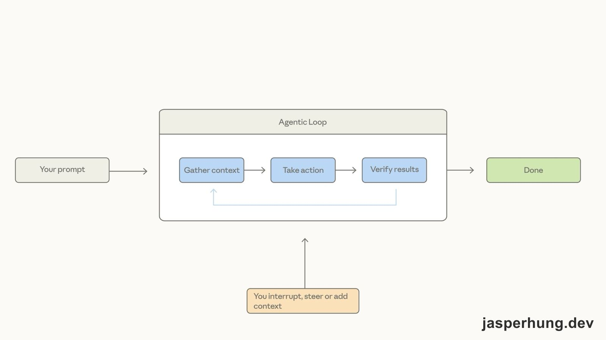
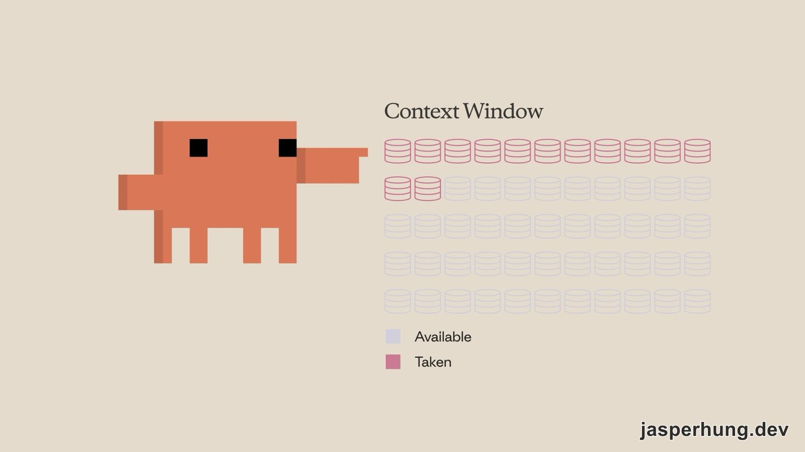

import KeyTakeaways from "../../../components/KeyTakeaways.astro";

<KeyTakeaways>
  <p>
    Claude Code 是什麼？它是一個能讀取 codebase、修改檔案、執行指令並驗證結果的 AI 編碼代理；這堂課再用 Explore → Plan → Code → Commit 串起權限、
    context、CLAUDE.md、Subagent、Skill、MCP 與 Hooks，實際功能依版本、平台與帳號方案而異。
  </p>
</KeyTakeaways>

昨天的 Claude 101 比較像一張產品地圖，今天進到 Claude Code 101，開始看 Claude 怎麼真的參與寫程式。課程一開始講的是 AI 編碼代理，最後一路講到 Hooks，中間也把權限、context、專案規則和子代理都串了起來。

課程原文：[Claude Code 101](https://academy.claude.com/zh-TW/courses/claude-code-101)

## 課程資訊一覽

| 項目 | 內容 |
|---|---|
| 堂數 | 12 堂課 |
| 總時長 | 1.5 小時 |
| 測驗 | 1 個（4 題） |
| 完成 | 有完成徽章 |
| 先決條件 | 對程式碼編輯器和命令列有基本熟悉度；一個 Claude 帳戶（Pro、Max 或 Enterprise）或一個 API 金鑰 |
| 適合對象 | 剛進軟體工程領域的新手，以及對編碼代理好奇但還沒用過的資深工程師 |

官方列出的學習內容，主要有這些：

- 理解 AI 編碼代理，以及 Claude Code 和聊天型 AI 工具的差別。
- 看懂代理循環、context、工具和權限怎麼一起運作。
- 在終端機、VS Code、JetBrains、Claude Desktop 或網頁上使用 Claude Code。
- 用手動模式、自動接受和計畫模式工作。
- 依照「探索 → 計畫 → 編碼 → 提交」完成一個任務。
- 用 `/compact`、`/clear`、`/context` 管理 context。
- 建立 CLAUDE.md、子代理、MCP 伺服器和 Hooks。

## 什麼是 Claude Code？

### 1. 什麼是 Claude Code？

白話講，Claude Code 是裝在終端機裡的代理式編碼工具。它可以讀 codebase、修改檔案、跑指令，也可以和既有的開發工具接在一起。

Claude.ai 比較像聊天視窗：你把程式碼貼進去，它回覆建議，再由你把結果貼回專案。Claude Code 則能直接在專案裡工作，會以 **AI agent** 的方式持續採取行動。

一個 agent 能和環境互動，使用工具、連接外部服務，必要時也能呼叫其他 agent。Claude Code 常見的工作包括：

- 讀 codebase，解釋功能或追蹤 bug。
- 跨檔案修改，重構函式時一併更新呼叫端。
- 執行 build、測試和其他終端機指令，依輸出決定下一步。
- 需要時搜尋技術文件或最新的 API 資訊。

剛開始用時，先記住三件事就好：context 是有限的工作記憶；修改檔案和執行指令通常會先請你核准；Claude 仍然可能誤解需求、引入 bug 或過度設計。

### 2. Claude Code 如何運作

Claude Code 的核心是 **agentic loop**。流程大概是：

1. 你提出需求。
2. Claude 讀取需要的 context，決定要回覆文字還是呼叫工具。
3. 它修改檔案、執行指令或使用外部服務。
4. 它檢查結果是否符合目標。
5. 如果還沒完成，就繼續下一輪。

你可以在中途補充資料、打斷它，或把方向拉回來。這也是它和只產生文字的聊天工具最不一樣的地方：它不只回答「應該怎麼做」，也能真的動手做，再看結果。



<p class="image-caption">圖：Agentic Loop 會在取得 context、採取行動和驗證結果之間反覆迭代，也可以被人中途打斷或補充 context。</p>

課程先從三種常見的權限模式開始：

| Mode | 設定值 | 說明 |
|---|---|---|
| Ask permissions | `default` | 每次編輯檔案或執行指令前，都要明確許可 |
| Auto accept edits | `acceptEdits` | 檔案編輯自動核准，但其他指令仍可能需要核准 |
| Plan mode | `plan` | 先用唯讀工具分析 codebase，整理出行動計畫，不直接修改 source |

計畫模式很適合複雜變更或程式碼審查；權限放得越寬，工作速度可能越快，但你也要更主動檢查結果。

## 您的第一個提示

### 3. 安裝 Claude Code

Claude Code 可以從幾個入口開始，課程的建議比較像是依工作方式選工具：

- **終端機**：macOS、Linux 和 WSL 可以用 `curl` 安裝，也可以用 `brew install`；後者不支援自動更新。Windows 則有 PowerShell、CMD 和 `winget` 的選項。
- **VS Code**：安裝 Anthropic 官方的 Claude Code 擴充功能，再從 Command Palette 開啟。
- **JetBrains**：從 Marketplace 安裝外掛。
- **桌面版**：在 Claude Desktop 裡切換到 Code，可以在指定資料夾工作。
- **網頁版**：從 `claude.ai/code` 或 Claude 的 Code 分頁使用，主要針對 GitHub repository。

官方的選擇邏輯可以整理成這張表：

| 需求 | 選哪個 |
|---|---|
| 想跟緊最前沿的新功能 | 終端機 |
| 想和編輯器緊密整合 | VS Code／JetBrains |
| 想讓任務在背景執行 | 桌面版 |
| 想遠端處理 GitHub repo | 網頁版 |

第一次執行時，要完成主題、登入方式和工作環境設定。如果在專案目錄下啟動 `claude`，它就會以該目錄作為工作的起點。

### 4. 您的第一個提示

`Shift + Tab` 可以在這些模式之間切換。Claude 的建議是先用 **Explore（探索）** 或 **Plan mode（計畫模式）** 逐步釐清需求，確認方向後，再依信任程度透過 **Permission settings（權限設定）** 決定哪些檔案編輯或指令可以自動核准。

沒有哪一個模式永遠最好：想逐步看懂它做什麼，就用 Ask permissions；想少一點檔案編輯確認，就用 Auto accept edits；需求複雜時，先從 Plan mode 開始。

## 日常工作流程

### 5. 探索 Explore → 計畫 Plan → 編碼 Code → 提交 Commit

這堂課最值得帶走的工作流程，是：

> Explore → Plan → Code → Commit

先讓 Claude 讀檔、找出相關程式碼和限制，再決定怎麼做；計畫確認後才開始修改，完成後跑測試並交給另一個角度的 reviewer 檢查。這裡的 Explore 是探索階段，Plan mode 則是權限模式；兩者相關，但不是同一個東西。

例如要替圖片上傳流程加入 WebP 轉換，可以先問：「幫我找出應該在哪一層處理、需不需要新依賴，以及要怎麼驗證。」這時 Claude 先整理實作選項，不會一收到需求就直接改檔。

課程裡反覆出現幾個讓流程比較穩的做法：先定義成功標準、準備可以持續執行的測試、需要時加上瀏覽器工具；如果 Claude 一直在同一個問題上繞圈，就把最後確認過的解法寫進 CLAUDE.md 裡面，作為工作規範。下次 Claude 再跟你一起工作時，就比較不容易重複犯同樣的錯誤。

白話一點：探索是給背景，計畫是定義「對」的樣子，編碼是一起把它做完，提交則是審查、推送，準備下一個功能。

### 6. 上下文管理

Context 可以想成 Claude 的工作記憶。讀過的檔案、跑過的指令和對話訊息都會佔用空間；接近上限時，Claude 會自動壓縮，但壓縮過程仍可能捨掉細節。



<p class="image-caption">圖：Context Window 會隨著讀檔、執行指令和對話逐步使用；接近上限時，就需要壓縮或清理。</p>

三個常用指令如下：

| 指令 | 用途 |
|---|---|
| `/compact` | 保留目前工作的摘要，釋放 context 空間 |
| `/clear` | 清掉目前對話，重新開始 |
| `/context` | 檢查 context 使用狀態和主要佔用來源 |

還在做同一個功能，只是快滿了，用 `/compact`；要開始完全不同的工作，用 `/clear`。想跨 session 保留專案規則，就放進 CLAUDE.md，不要期待每次都從頭猜一次。

MCP 伺服器也會佔用 context。沒有在用的伺服器可以先關掉；如果有 CLI 可以完成同一件事，也不一定要為了它長期掛一個 MCP 工具。子代理則可以把探索工作放到另一個 context，主 session 只接收最後摘要。

### 7. 程式碼審查 Code Review

Claude 寫完 code，不代表工作已經結束。課程建議在推送 PR 前，讓另一個 subagent 用獨立 context 審查變更，並限制它只能讀取和回報問題，不要自己改 source。

另外還提到兩個實用工具：`/commit-push-pr` 可以把 commit、push 和建立 PR 串成一個流程；如果 PR 後來需要補修，可以用 `claude --from-pr <PR_NUMBER>` 接回原本的工作脈絡。

這也是我常用的方式：另外呼叫一個 agent 做獨立的 **adversarial review（對抗式審查）**，專門從挑錯的角度檢查主 agent 可能漏掉的問題。

## 自訂 Claude Code

### 8. CLAUDE.md 檔案

沒有 CLAUDE.md 時，Claude 每次進專案都要重新猜專案使用的技術與框架、指令和程式碼風格。這個檔案可以看成專案給新成員的入職說明：告訴 Claude 專案怎麼跑、哪些規則不能踩。

例如可以寫：

```markdown
# Project
This is a Next.js app using the App Router and Tailwind.

# Commands
- Dev server: `pnpm dev`
- Run tests: `pnpm test`

# Code Style
- Prefer named exports
- Use server actions instead of API routes
```

這一堂最重要的觀念，是 CLAUDE.md 原本就是為團隊協作設計的。只要是專案層級的規則，就可以提交到 version control，讓整個 team 都能受益；個人偏好則放在 user-level CLAUDE.md，只套用到自己的所有專案。

官方依照服務對象，把記憶檔案分成兩個主要層級：

| 層級 | 英文名稱 | 位置 | 適用範圍 |
|---|---|---|---|
| 專案層級 | Project-level | 專案根目錄 | 與 team 共用，應提交到 version control |
| 使用者層級 | User-level | 個人設定資料夾 | 只套用到自己的所有專案 |

一開始不要急著把所有規則都寫進去。等到你真的重複糾正 Claude 幾次，再把穩定的規則留下來。

`@path/to/file` 是匯入檔案的寫法，會把指定檔案帶進目前的 context；如果只是低頻參考資料，不想每次啟動都載入，可以在 CLAUDE.md 留下 `~/path/to/reference.md` 這種路徑提示，等任務真的需要時再請 Claude 讀取。`~/` 在這裡只是按需讀取的工作慣例，不是 Claude Code 的特殊載入語法。

### 9. Subagent 子代理

探索 codebase 或查外部技術文件都很吃 context。這類只需要答案、不需要一直佔住主線的工作，可以交給 subagent；它有自己的 context，完成後把摘要交回來。

自訂子代理時，可以用帶 YAML front matter 的 Markdown 檔描述名稱、用途和可使用的工具，也可以從 `/agents` 開始建立。進一步還能替子代理設定持久記憶，或預先載入 Skills；後者要留意，載入的是整份 Skill，不只是名稱。

### 10. Skill 技能

如果每次做 PR review、寫 commit message 或套 coding standards，都要重新跟 Claude 解釋一次，這就是 Skill 想處理的重複工作。

Skill 不只是一個提示，而是一包指令、腳本和資源。Claude Code 會先讀 `SKILL.md` 的 `description`，判斷目前任務是否符合，再按需載入完整內容。

存放位置依使用範圍不同：

| 類型 | 位置 | 誰會用到 |
|---|---|---|
| 個人 Skills | `~/.claude/skills` | 跟著個人走遍不同專案 |
| 專案 Skills | repo 根目錄 `.claude/skills` | 讓使用這個 repo 的人共用 |

它和其他自訂方式的分工可以這樣記：CLAUDE.md 是每次對話都會讀的常駐規則；Skill 是情境符合時才載入的工作流程；Slash command 則是你主動輸入才會執行的指令。

### 11. MCP

**Model Context Protocol（MCP）** 是讓 Claude Code 接上外部工具和資料來源的開放標準。資料庫、專案管理工具、公開文件或其他服務，都可以透過 MCP 變成 Claude 能使用的工具。

新增 MCP 伺服器可以用 `claude mcp add`，常見類型有兩種：

| 類型 | 說明 |
|---|---|
| HTTP 伺服器 | 遠端服務透過網路提供 |
| Stdio 伺服器 | 在本機執行的程式 |

用 `/mcp` 可以查看、檢查或停用目前的伺服器。伺服器也有不同的使用範圍：

| Scope | 說明 |
|---|---|
| Local | 只在目前專案可用，只有自己能用 |
| User | 自己所有專案都能用 |
| Project | 寫進 `.mcp.json`，讓 repo 團隊共用 |

MCP 的方便之處是工具接上就能用，代價則是工具定義也會進入 context。沒有在用的伺服器不必全部開著；能用 `gh`、`aws` 這類 CLI 解決的任務，也可以先比較哪一種方式比較省 context。

### 12. Hooks

CLAUDE.md 裡寫「每次編輯完都跑 Prettier」，Claude 大多會照做，但它仍可能漏掉。Hooks 的定位不同：把規則放在 Claude Code 的生命週期事件上，讓它確定執行。

常見用途包括自動格式化、記錄指令、封鎖危險操作，以及在任務完成時通知。設定位置通常是 `settings.json`，也可以用 `/hooks` 開始設定。

常見事件有：

| 事件 | 時機 |
|---|---|
| `PreToolUse` | 工具呼叫之前 |
| `PostToolUse` | 工具呼叫完成後 |
| `UserPromptSubmit` | 提交 prompt、Claude 處理之前 |
| `Stop` | Claude 完成回應時 |
| `Notification` | Claude 發出通知時 |

Hook 也可以依 exit code 決定要不要讓動作繼續：

| Exit code | 行為 |
|---|---|
| `0` | 正常繼續 |
| `2` | 封鎖動作，並把 stderr 訊息回傳給 Claude |
| 其他 | 顯示錯誤，但不阻止動作 |

例如用 `PreToolUse` 擋掉寫入 production 設定的指令，或擋掉含有 `rm -rf` 的 Bash 指令。這裡的重點很簡單：需要「建議」的事寫在 prompt，需要「保證」的事放進 Hook。

## 測驗：Claude Code 101 Q&A

課程測驗共有 4 題，約 3 分鐘，剛好把這堂課的核心觀念重新問一次。

### Q1. 有效使用 Claude Code 的建議工作流程是什麼？

答案：**探索 → 規劃 → 編碼 → 提交**。

### Q2. Claude Code 作為 AI agent 運作，什麼是 AI agent？

答案：**採取行動以完成目標的 AI**。

### Q3. Claude Code 如何使用 CLAUDE.md 檔案？

答案：**它會在每個 session 開始時自動讀取**。

### Q4. 當 Claude Code 達到 context window 限制時會發生什麼？

答案：**它會自動壓縮對話以釋放空間**。

四題放在一起看，答案剛好把整堂課串起來：先理解專案，再決定怎麼做；讓 agent 採取行動時保留專案規則；開始修改後持續管理 context 並驗證結果，最後才提交。

## 小結

Claude Code 101 同時介紹 coding tool，以及和 coding agent 合作的工作節奏。你可以先理解每個功能在流程裡負責哪一段，再依自己的需求逐步加入計畫模式、CLAUDE.md、子代理、MCP 和 Hooks。

昨天 Claude 101 留下「先交代、看結果、再回饋」；今天則把這個循環帶進 codebase，整理成「探索、規劃、編碼、提交」。課程看到最後，我最想記住的是：Claude 可以幫忙把事情做完，人仍然需要定義問題、驗證結果，並決定什麼樣的結果才算完成。
