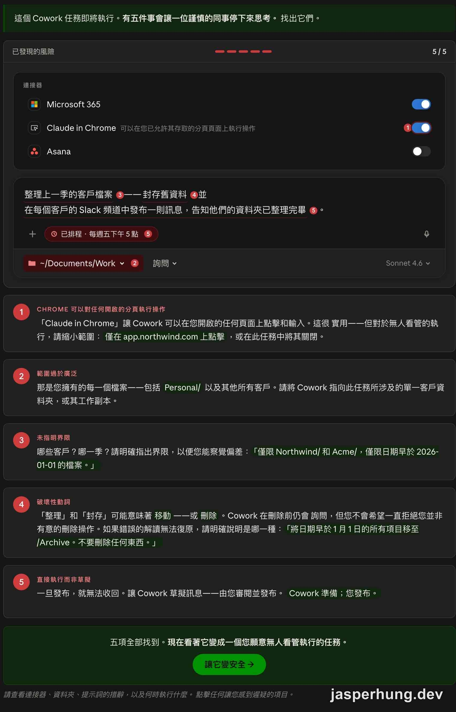
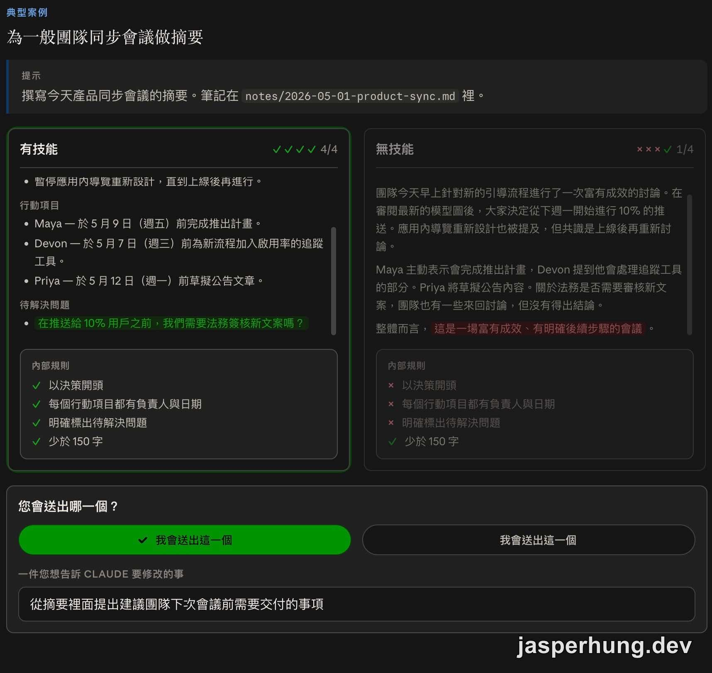

import KeyTakeaways from "../../../components/KeyTakeaways.astro";

<KeyTakeaways>
  

    Claude Cowork 後半段把工作延伸到瀏覽器與 Microsoft 365，再補上安全、技能評估和團隊分享；Claude in Chrome 負責讀取並操作沒有 connector 的網頁，M365 add-in 負責在現有檔案裡接續工作，最後以專用資料夾、明確範圍、人工審查和 evals 控制風險。實際功能依版本、平台與帳號方案而異。
  

</KeyTakeaways>

前半段看完 Cowork 的工作資料夾、connectors、Projects、Skills 和 Plugins，這次接著把它帶到瀏覽器與 Office 檔案裡。課程後半段也開始談一個更現實的問題：Claude 可以替你做更多事之後，哪些地方需要先設好邊界？

這篇整理 [Introduction to Claude Cowork](https://academy.claude.com/zh-TW/courses/introduction-to-claude-cowork) 的後 6 堂課，也可以先讀[前半段文章](/posts/introduction-to-claude-cowork/)了解前面的 8 堂內容。

## 課程資訊一覽

| 項目 | 內容 |
|---|---|
| 本篇範圍 | 第 9–14 課（共 6 堂）＋ 1 個測驗（8 分鐘）＋完成徽章 |
| 全課程 | 14 堂課／2.5 小時／1 個測驗／完成徽章 |
| 測驗 | 10 題，作答結果為 100% |
| 先決條件 | 付費 Claude 方案（Pro、Max、Team 或 Enterprise）且能使用 Claude Desktop App |
| 官網公告 | Claude Cowork 已整合為 Claude；課程中的介面名稱與畫面可能跟目前版本不同 |

## 隨時隨地使用 Claude

### 9. Claude in Chrome

Claude in Chrome 可以補上沒有 connector 的那一段。只要內容存在瀏覽器裡，Claude 就能在你已登入的頁面讀取資訊、執行操作，再把結果帶回 Cowork 組成交付成果。簡單記就是：瀏覽器負責收集與動作，Cowork 負責建構最後的檔案。

它適合幾種情境：

| 情境 | 例子 |
|---|---|
| 內部儀表板 | 從 Tableau、Looker 或其他 BI 儀表板提取數字，下載後交給 Cowork 使用 |
| 供應商入口網站與客戶系統 | 操作沒有 API 的採購入口、SSO 後的 CRM，分類客服工單 |
| 需要登入的網頁應用程式 | 開啟採購系統，找出前十大供應商第三季的採購單，整理到試算表 |
| 以交付成果結尾的網路研究 | 開啟多個分頁、提取內容，再整理成簡報 |

官方給的判斷方式很直白：每當你想著「我很想把這個內容給 Claude，但它存在於網路上」，就可以考慮 Claude in Chrome。

例如客戶健康儀表板藏在登入後、又沒有 connector，可以請 Cowork 在 Chrome 開啟儀表板，找出黃色與紅色帳戶，再從 Drive 取得過去 30 天活動，從 Slack 的 `#customer-success` 取得近期討論，最後在工作資料夾產出一頁摘要。一次委派，背後串起三個內容來源。

使用前有兩件事要先確認：

- Claude 無法代你登入工具。需要驗證的儀表板，要先在瀏覽器登入，讓 Claude 在已驗證的工作階段裡工作。
- Claude 看到的範圍等同於你看到的範圍。敏感網站要限縮可執行的動作，任何核准提示都先讀過再決定。

### 10. 適用於 Microsoft 365 的 Claude

Claude 會以 add-in 的形式出現在 Word、Excel、PowerPoint 和 Outlook 裡，直接處理你目前開啟的檔案。一個對話可以從 Excel 的分析接到 PowerPoint 的簡報，也可以從 Word 的備忘錄接到 Outlook 的回覆草稿。

| 應用程式 | 能做什麼 | 官方「最強大的操作方式」範例 |
|---|---|---|
| Excel | 分析資料、寫公式、除錯 `#REF!` 與循環參照、做情境測試、從範本建立工作表、引用特定儲存格 | 從 Q3 工作表提取實際資料，和同一工作簿的 Q3 計畫比較，在 F 欄寫差異說明 |
| PowerPoint | 讀取投影片母片、字型和配色，建立相符投影片；產生原生可編輯圖表 | 把 Excel 完成的分析轉成客戶範本中的三張 QBR 簡報 |
| Word | 就地草擬、修訂、重新格式化，處理註解與追蹤修訂 | 根據備忘錄正文與附錄來源，草擬執行摘要 |
| Outlook | 依工作脈絡分類信件，草擬反映對話串、日曆和近期決策的回覆 | 官方沒有提供單一範例 |

官方用一條跨應用程式的流程示範這件事：

1. **Outlook → Word**：從客戶簡報的郵件開始，在 Word 用公司範本寫備忘錄。
2. **Word → Excel**：從簡報提取假設，建立含可檢視公式的市場規模模型。
3. **Excel → PowerPoint**：把更新後的數字轉成客戶範本中的指導委員會簡報，使用原生圖表。
4. **回到 Outlook**：找出週四前可用的 30 分鐘，建立邀請函草稿，最後由你按下傳送。

這裡可以用工作型態來分辨工具：

- 選 **Cowork**：要從多個來源提取資料，最後交付一份完整成果。
- 選 **M365 中的 Claude**：人已經在 Office 檔案裡，需要就地編輯、除錯或延續上下文。
- 實際工作通常會兩者並用：Cowork 先做初稿，再在 PowerPoint 或 Excel 裡精煉、檢查和修正。

## Claude Cowork 中的分享與安全

### 11. 安全工作的最佳實踐

Claude 刪除檔案前會先詢問；在預設權限模式中，傳送或分享也會先等你確認。課程接著把安全拆成三個工作時點：開始前設定環境、提示裡寫清楚範圍、執行中檢查計畫與確認提示。

先從工作環境下手：

| 做法 | 重點 |
|---|---|
| 用專用工作資料夾 | 只放這項工作需要的內容，別直接指向整個文件、下載或桌面資料夾 |
| 備份無法取代的內容 | 合約、舊客戶交付成果等資料，放在 Cowork 碰不到的位置 |
| 先在副本上測試 | 每週執行的排程任務，第一次先對資料副本試跑，確認行為符合預期 |

提示也要把容易誤解的動詞改寫清楚。「剪下這個段落」可能代表從畫面移除，也可能代表從檔案刪除；「更新這個檔案」也可能被理解成整份重寫。可以改成「從草稿中移除這個段落，但保留檔案」，或「新增一個附錄，不要重寫現有段落」。

同樣重要的是限制範圍，例如只處理這個資料夾最近更新的 3 個檔案、只處理第三季完成的合約，或明確寫上「不要傳訊息給任何人，只起草即可」。範圍越清楚，越容易察覺 Claude 什麼時候偏離要求。

執行中則看三件事：

1. Claude 完成計畫後，快速讀一次步驟、順序和來源。
2. 如果它開始處理沒提過的檔案或網站，先停下來檢查，不要等到任務結束才回頭看。
3. 傳送、發布、分享前維持「執行前先詢問」，每個確認提示都要確認真的符合原意。

課程的 **Spot the risk** 互動把這些問題放在同一個任務裡：Microsoft 365、Claude in Chrome 和 Asana 都已連接；提示詞要整理上一季客戶檔案、封存舊資料，還要在每個客戶的 Slack 頻道發布訊息；任務每週五下午 5 點排程執行，資料夾則指向 `~/Documents/Work`。最後要找出的五個風險，剛好落在連接器權限、資料夾範圍、提示詞界線、破壞性動詞，以及直接執行後難以收回這幾個地方。

圖：Spot the risk 互動完成後，畫面顯示已找出五個需要停下來檢查的風險。

有三類工作不適合交給 Cowork 自動完成：需要稽核軌跡的受監管流程、你不會放心讓同事獨立執行的對外動作，以及超出 IT 團隊核准範圍的高度敏感資料。這些工作可以讓 Claude 準備草稿，最後由人審查和發布。

### 12. 驗證外掛程式的技能

建立 Skill 或把它打包成 Plugin，等於在做一個會被其他人使用的小型產品。作者自己知道要怎麼問、要提供哪些檔案；換成團隊成員使用時，可能會換一種說法、提供不同輸入，或遇到原本沒想過的 edge case。

課程用 **evals（evaluations，評估）** 來處理這個問題。評估不必先寫測試腳本，可以先拿真實請求試用，觀察結果，再把具體回饋交給 Claude。`skill-creator` 會在建立 Skill 的流程裡協助產生兩個以上的真實提示，並為每個提示做一組對照：一份使用 Skill 的輸出，以及一份沒有 Skill 的 baseline。

比較時只要回答兩個問題：這個 Skill 版本是否是你會採用的結果？如果不採用，缺少什麼或哪裡不對？「語氣太正式」「漏掉執行摘要」這種回饋能直接指向下一輪修改；「這不太對」就沒有足夠方向。

改進時一次只調整一件事。若第一輪同時出現內容太長和缺少段落，先處理影響較大的那一項，再重跑評估，才知道哪個修改真的有幫助。發布標準也很實際：在你在意的案例上明顯優於 baseline，同時說清楚目前還處理不了哪些案例。

圖：評估畫面把有 Skill 和無 Skill 的輸出並排，連同規則檢查結果一起比較。

### 13. 與您的團隊分享您所建立的內容

當一個 Skill 已經證明有用，下一步是讓需要的人拿得到。較大的組織通常會透過私有市集（private marketplace）發布由管理員核准的 Plugins；實務上比較像交接，把 Plugin、適用對象和上線方式交給市集負責人、團隊主管、營運或 IT。

| 安裝層級 | 意思 |
|---|---|
| 可供使用（可用） | 出現在公司目錄，由成員自行安裝 |
| 預設安裝 | 開啟 Cowork 時已安裝，但可以關閉 |
| 必須安裝（必要） | 安裝後保持開啟，適合統一的合規檢查 |
| 隱藏 | 留在市集中但不顯示於目錄，適合分階段或限制性推出 |

同事看到的 Plugin 會標示來自公司，能使用或關閉（必要安裝除外），但不能自行編輯；更新由維護者推送。

分發路徑可以先這樣判斷：

| 路徑 | 情境 | 下一步 |
|---|---|---|
| A（交接） | 市集已存在，也知道擁有者 | 把 Plugin 交給市集擁有者，說明適用對象和上線方式 |
| B（探索） | 不確定市集是否已存在 | 先找到組織內負責管理或發布的人 |
| C（設定） | 自己就是管理員 | 建立市集、設定安裝層級，再安排發布 |

共享後仍需要維護：每個 Plugin 指定一位負責人，每次發布前重新跑 evals，名稱寫得具體，並設定定期審查節奏。像 `sales-customer-renewal-prep` 會比 `meeting-prep` 更容易讓團隊知道用途，也比較不會和其他技能撞名。

### 14. 總結與後續步驟

官方最後用四個模組回顧整門課：

| 模組 | 一句話 |
|---|---|
| 1 認識 Claude Cowork | Cowork 是什麼、和 Chat 及 Code 有什麼差別，以及適合哪些工作 |
| 2 打造專屬於您的 Claude Cowork | 用全域指示、Projects、Skills 和 Plugins 累積工作脈絡與團隊做法 |
| 3 在任何工作場景中使用 Claude | 透過 Claude in Chrome 操作瀏覽器，透過 M365 add-in 在 Word、Excel、PowerPoint 和 Outlook 裡工作 |
| 4 Claude Cowork 中的共享與安全 | 控制自主性、驗證產出，再把個人工作流程整理成團隊基礎設施 |

整堂課的主軸可以濃縮成「交付一項任務，獲得一份精緻的成果」。課程建議從一個小步驟開始：寫一段全域指示、排程一項任務、安裝一個 Plugin、試用 Claude in Chrome 或 M365，或把已經驗證過的流程分享給團隊。

## 測驗：Claude Cowork Q&A

| 項目 | 內容 |
|---|---|
| 類型 | 測驗 |
| 時間 | 8 分鐘 |
| 題數 | 10 題 |
| 作答結果 | 100% |

### Q1. A good Cowork prompt typically names which three things?

答案：The deliverable you want, the inputs to use, and any nuance like audience or format（你想要的交付成果、要使用的輸入內容，以及受眾或格式等細節。）

### Q2. What's the main difference between global instructions and project instructions in Cowork?

答案：Global instructions apply to every Cowork session; project instructions apply only inside that project.（全域指示適用於每一個 Cowork session；專案指示只適用於該專案內。）

### Q3. In the default permission mode, which of these actions will Claude pause and ask you to confirm before taking?

答案：Sending a Slack message it drafted（傳送它草擬好的 Slack 訊息。）

### Q4. What's the recommended habit before you send, publish, or act on something Claude produced in Cowork?

答案：Review it yourself — Claude accelerates the work, but you own the judgment.（自己審查；Claude 加速工作，判斷仍在你手上。）

### Q5. What does Claude in Chrome add to Cowork?

答案：It lets Claude read and act on web pages in your browser.（讓 Claude 能讀取並在瀏覽器中的網頁上操作。）

### Q6. Which statement best describes the relationship between skills and plugins?

答案：A plugin bundles skills together so they can be installed in one package.（Plugin 會把多個 Skill 打包在一起，讓它們可以一次安裝。）

### Q7. When you connect a working folder in Cowork, what can Claude do with it?

答案：Read and write files in that folder (and it asks before deleting).（讀寫該資料夾中的檔案，刪除前會先詢問。）

### Q8. Which of these tasks is the best fit for Cowork?

答案：Reading a folder of last month's meeting notes and saving a one-page summary back into it（讀取資料夾裡上個月的會議記錄，並把一頁摘要存回該資料夾。）

### Q9. You've set up a scheduled task while running Cowork in the cloud. What needs to be true for it to run at its set time?

答案：Nothing more — the task runs in the cloud at its set time.（不需要其他條件；題目前提是雲端任務，因此會在設定時間執行。若任務需要本機檔案或 App，執行位置和必要條件就會不同。）

### Q10. Claude is partway through a task when you realize it's working from the wrong template. What's the best next step?

答案：Tell Claude now and direct it to the right template.（現在就告訴 Claude，並指向正確的範本。）

## 小結

這堂課把 Cowork 從工作資料夾延伸到瀏覽器和 Office 檔案，也把「交付成果」後面的責任補完整：先限制資料範圍，執行中看計畫，完成後親自審查。

Skill 和 Plugin 則多了一個團隊角度。流程能重複使用之前，先用真實案例做 evals；分享出去之後，也要有人負責更新和淘汰。對我來說，Cowork 最值得記住的用法，是把工作交出去，同時把最後的判斷留在自己手上。
