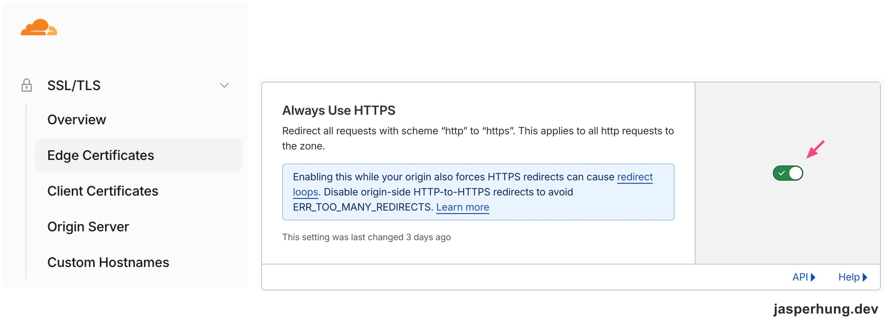

<KeyTakeaways>
  <p>Google Search Console 顯示頁面重新導向，是不是網站索引壞掉了？不是，問題出在漏掉全站 HTTP→HTTPS 導向，而不是 sitemap 或 canonical 設定；這是 Cloudflare Proxy 搭配 GitHub Pages 這個特定架構下才會出現的檢查步驟。</p>
</KeyTakeaways>

Google Search Console 把幾個網址列成「頁面會重新導向」，而且驗證修正失敗。第一眼很容易懷疑 sitemap、canonical，甚至覺得網站索引壞掉了。

但沿著 sitemap、response header 和憑證一路檢查後，問題落在另一個地方：網站的 URL 格式其實已經整理好，漏掉的是全站 HTTP→HTTPS 導向。這也順手拆開了一個常被混在一起的問題：Cloudflare 和 GitHub Pages 各自處理哪一段 HTTPS。

## GSC 的 redirect 是哪一種 redirect？

sitemap 只提交 HTTPS、帶結尾 `/` 的網址；像少了 `/` 的網址，或舊的 HTTP 網址，都是 Google 從其他地方發現的非 canonical 變體。它們被 301 導向正確頁面，是正常行為。

Google 對「Page with redirect」的定義也是如此：這個 URL 不會被索引，因為它會前往另一個頁面。想確認內容是否在索引，應該檢查目標 canonical URL，而不是對仍需保留的 redirect 反覆按「驗證修正」。Google 再爬一次，結果仍會是 redirect，驗證自然不會通過。[官方說明](https://support.google.com/webmasters/answer/7440203?hl=en)

這和之前在[把 blog 交給 Google 找到](/posts/rss-gsc-aeo/)時送 sitemap 是同一件基礎建設的延續：sitemap 負責宣告首選網址，redirect 負責接住其他變體；兩者不該互相取代。

## Canonical 正常，協定導向仍可能漏掉

實測後，HTTPS 的 `/about` 會 301 到帶結尾 `/` 的 canonical URL，這段沒有問題；但 `http://` 首頁和文章卻回傳 200，而不是升級到 HTTPS。

這表示「路徑正規化」和「協定正規化」是兩條不同的規則。前者由網站處理 `/about` 與 `/about/`，後者則需要 Cloudflare 的 **Always Use HTTPS**，把所有 HTTP 請求單向導向 HTTPS。[Cloudflare 文件](https://developers.cloudflare.com/ssl/edge-certificates/additional-options/always-use-https/)

操作路徑是 **SSL/TLS → Edge Certificates → Always Use HTTPS**。Cloudflare 設定頁顯示這個開關已經啟用，會套用到整個 zone 的 HTTP 請求。



<p class="image-caption">Cloudflare 的 Always Use HTTPS 開關已啟用。</p>

接著不必猜，直接驗證即可：

```bash
curl -I http://jasperhung.dev/
```

預期會看到 301 或 308，`Location` 指向 `https://jasperhung.dev/`。設定頁只是設定已儲存的證據；response header 才是確認訪客實際收到導向的最後一步。

:::tip
Cloudflare 介面提到 redirect loop，是提醒 origin 也可能有衝突規則；它不是說開啟 Always Use HTTPS 一定會造成迴圈。仍應以實際 HTTP response 驗證。
:::

## 一個鎖頭，背後是兩段 HTTPS

Cloudflare Proxy 開啟後，連線不是「Cloudflare 或 GitHub Pages」二選一，而是兩段：

```text
瀏覽器 ── HTTPS ──> Cloudflare ── HTTPS ──> GitHub Pages
```

第一段是訪客看到的 Cloudflare edge 憑證；`server: cloudflare`、`cf-ray` 等 header 也能辨識這層。第二段則是 Cloudflare 到 GitHub Pages origin 的連線。GitHub Pages 仍需要維持 custom domain 的 HTTPS／Enforce HTTPS，因為它不是被 Cloudflare Proxy 消失，而是成為了 origin。

在 Cloudflare 的 SSL/TLS mode 中，`Full` 會加密第二段連線，但不嚴格驗證 origin 憑證；`Full (strict)` 則要求 origin 憑證有效且符合網域。確認 GitHub Pages 的 Enforce HTTPS 正常後，才適合評估切換到 strict，讓加密和驗證都走完整。

最後回頭看，這次最有趣的地方不是找到一個錯誤設定，而是把一份搜尋報表拆回它真正描述的網路行為。畫面上都寫著 redirect，但每一條 redirect 回答的問題並不相同；先叫對問題的名字，設定頁通常就沒那麼可怕了。
