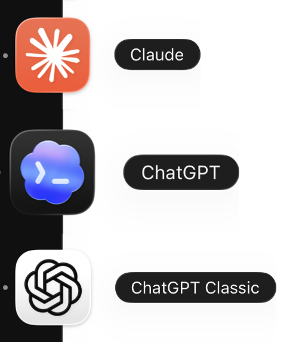
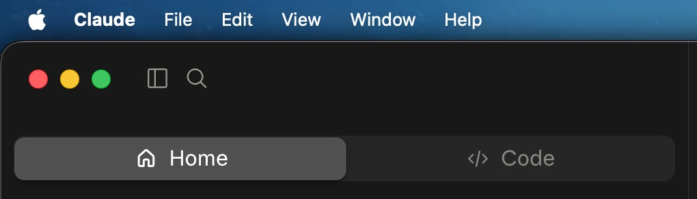
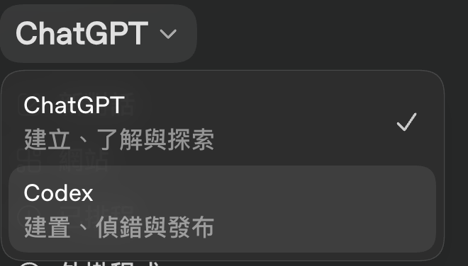
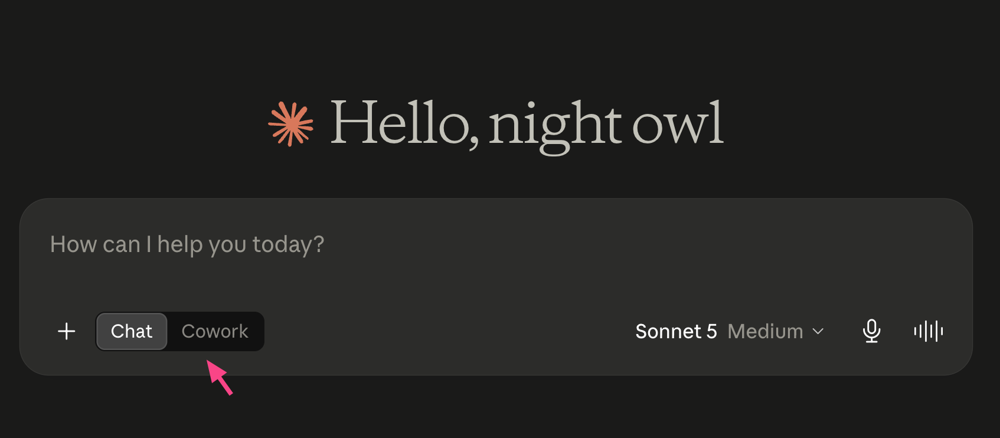
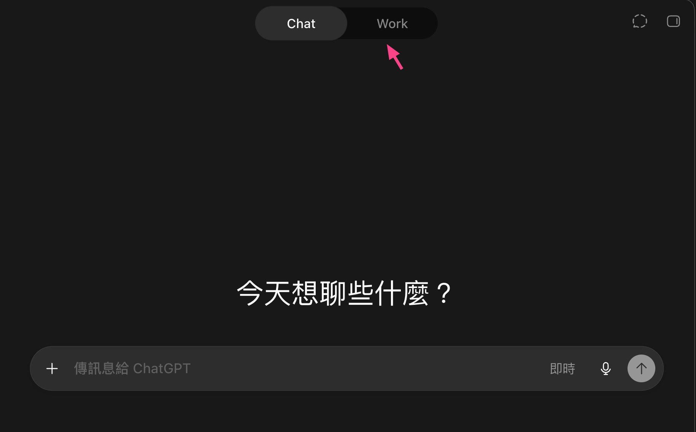
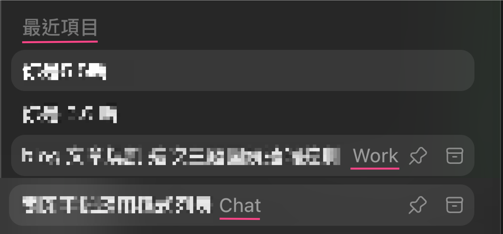

<KeyTakeaways>
  <p>Codex App 更新後為什麼變成 ChatGPT？舊 Codex 升級成新版 ChatGPT，舊 ChatGPT 被改名為 Classic；左欄的 Chat／Work 是對話類型而非 App 來源，Chat 走一般 ChatGPT 額度、Work 與 Codex 共用同一個 pool。這是我自己帳號改版後看到的狀態，可能仍是過渡期。</p>
</KeyTakeaways>

我原本只是想用新的 GPT-5.6。直覺上，先更新 Codex CLI 就好了吧？

CLI 更新完，模型還是沒出現。我又打開 Codex App，它也沒有明顯提示我該做什麼。於是一路問 AI、查版本、查官網，一度以為只是新的 model 還在 rollout，還沒輪到我的帳號。

真正的入口，最後竟然在我幾乎沒想到要打開的舊 ChatGPT App。

## 更新按下去後，名字整個交換了

舊 ChatGPT App 跳出更新，我按下去後，神奇的事發生了：原本的 Codex App 變成新版 ChatGPT App；原本的 ChatGPT App 則被留下來，改叫 ChatGPT Classic。

```text
舊 Codex.app
  → 升級後變成新版 ChatGPT.app

舊 ChatGPT.app
  → 被改名成 ChatGPT Classic.app
```



<p class="image-caption">原 Codex 圖示顯示為 ChatGPT，原 ChatGPT 圖示顯示為 ChatGPT Classic；這是我更新後在桌面實際看到的排列。</p>

所以我一開始的想法沒有錯：Codex 的確把 GPT 合進來了，甚至可以說它把 ChatGPT 的名字吃掉了。但 OpenAI 的執行順序和我的直覺相反——我以為是 GPT 被搬進 Codex，實際上是 Codex 升級後接管新的 ChatGPT 外殼，而舊 GPT 先被安置成 Classic。

這個順序其實比較合理。要是 Codex 先直接變成 ChatGPT，而舊 ChatGPT 還占著名字，才真的會天下大亂。只是從使用者眼中看，更新提示卻出現在舊 ChatGPT App，才讓整段遷移看起來像魔術。

[OpenAI 的遷移文件](https://help.openai.com/en/articles/20001276-moving-to-the-new-chatgpt-desktop-app)也確認：既有 Codex app 更新後會成為新的 ChatGPT desktop app；舊 ChatGPT 可能與它並存，名稱為 ChatGPT Classic。

## 沒看到新模型，不一定是沒更新

我一開始卡在 GPT-5.6 的 model picker。CLI 版本更新後，仍只看到部分模型；新版 App 也一度沒有我想找的 Sol。那時候很容易把它判斷成「我還沒升級成功」。

但後來它在當天晚上、隔天陸續出現，才證明這不只是本機版本問題，也有 server-side rollout 或帳號 entitlement 的時間差。這次經驗讓我記住：CLI、桌面 App、帳號可見的 model catalog 是三層不同的東西；前兩層都更新了，第三層也不一定立刻到位。

## 原來有兩層：ChatGPT／Codex，Chat／Work

更新後最值得重新理解的，不是 icon，而是產品入口怎麼被重新安排。我一開始把第二層的 Chat／Work，拿去和 Claude 的 Chat／Cowork／Code 三條線相比，才會一直對不齊。

先看整體演進，四列對照其實很清楚：

|  | 聊天入口 | 泛用工作入口 | 開發工作入口 |
|---|---|---|---|
| Claude 舊版 | Chat | Cowork | Code |
| Claude 新版 | Home 裡的 Chat | Home 裡切 Cowork | Code |
| ChatGPT／Codex 舊版（兩個 App） | ChatGPT | — | Codex |
| ChatGPT 新版 | Chat | Work | Codex |
| ChatGPT Classic | Chat | — | — |

ChatGPT 新版的兩列如果只看名字，還是很容易誤解；關鍵在於新的 ChatGPT App 其實有兩層：

| 層級 | Claude Desktop | 新 ChatGPT Desktop |
|---|---|---|
| 第一層：工作桌 | Home／Code | ChatGPT／Codex |
| 第二層：泛用工作桌內的 mode | Chat／Cowork | Chat／Work |

```text
Claude.app                  ChatGPT.app
├─ Home                     ├─ ChatGPT
│  └─ Chat ｜ Cowork         │  └─ Chat ｜ Work
└─ Code                     └─ Codex
```



<p class="image-caption">Claude 第一層先選 Home 或 Code。</p>



<p class="image-caption">新 ChatGPT App 的第一層先選 ChatGPT 或 Codex；Codex 沒有消失，只是被收進同一個 App。</p>



<p class="image-caption">Claude 的第二層也一樣是 Chat／Cowork，只是把切換放在 Home 的輸入框旁。</p>



<p class="image-caption">進入 ChatGPT 後，頁面頂部再切換 Chat／Work。</p>

這樣才完全對標：Claude 把 Chat 與 Cowork 收進 Home；OpenAI 把 Chat 與 Work 收進 ChatGPT。兩家都另留一張開發工作桌，分別叫 Code 與 Codex。

### 左欄標籤是 Conversation Type

我一開始以為可以用升級前的名稱簡化成「GPT = Chat，Codex = Work」，但後來發現那只是我的使用習慣造成的盲點。新 UI 左欄的 Chat／Work 是 **Conversation Type（對話類型）**：一般對話標 Chat；較長、會持續推進的任務標 Work。

我平常習慣在 ChatGPT Classic 討論事情、查資料；回到新的 ChatGPT App，才發現那些舊對話也被整進來。反過來說，我很少在新 App 用一般 Chat 討論，真的要操作電腦或做實作時，通常直接從 CLI 啟動 Codex。因此清單裡大多是 Work，才讓我一度誤以為它按 App 來源分類。



<p class="image-caption">同一張最近項目清單可同時看到 Work 與 Chat；對話名稱已模糊處理。</p>

實際上只要新開一條一般 Chat 就能看出差別。這比替它硬編一條遷移規則有意思得多：新版確實把舊 App、桌面工作與 CLI 的痕跡拉到同一張清單；但清單上的標籤，反映的是這條對話在做什麼，不是它從哪個 App 開始。

另一個這次才注意到的變化是專案。ChatGPT Classic 與新的 ChatGPT App 都看得到同一批 ChatGPT Projects；至少在我的帳號上，它們不是各自一份專案清單。這是否早就存在、只是我以前沒注意到，我無法確定；但新版把它做得更顯眼，也讓 Classic 和新 App 並存時不至於立刻變成兩個孤島。

## 額度不能只看「都在 ChatGPT 裡」

最簡單的分法是：**Classic／Chat 看一般 ChatGPT 額度；Work 看 Codex 額度。**

Classic 沒有公開的獨立「三小時額度池」。三小時是特定方案與模型的例子：例如 Plus／Go 使用 GPT-5.5 Instant，官方目前列為每 3 小時最多 160 則；手動選 reasoning 或 Pro model 則另有各自的 model limit。[GPT-5.6 使用限制](https://help.openai.com/en/articles/20001354-gpt-56-in-chatgpt)

Work 則沿用 Codex 的 usage structure：Work、Codex 和 Workspace Agents 共用同一個 agentic usage／credit pool。也就是說，我在 Classic 裡一直聊天，不代表 Work 還有足夠額度跑長任務；反過來也一樣。[Work 與 Codex 說明](https://help.openai.com/en/articles/20001275-chatgpt-work-and-codex)

## 這次升級真正改的是產品地圖

以前我會把 ChatGPT、Work、Codex 當成幾個不太相關的產品：一個聊天、一個 agent、一個 coding agent。這次改版至少證明，OpenAI 正在把它們放進同一張產品地圖。

現在我理解它的方式是：ChatGPT 是新的總入口；第一層仍可切回 Codex，進到 ChatGPT 才用 Chat／Work 分流，而舊 ChatGPT 被留成 Classic。Codex 確實從 App 名稱消失了，卻也正因為它被升級成新的 ChatGPT，才讓這次命名反轉看起來特別幽默。

這會不會只是過渡期，還要繼續觀察。但我猜最後合理的方向，仍會是一個整合的桌面 App：使用者不用先想自己該開 GPT 還是 Codex，而是先說要做什麼，再由產品把對話、任務與本機工作接起來。

最後查了時間線才發現，兩家的產品地圖剛好在同一週收斂成相似的結構：Claude 先在 [7 月 7 日](https://claude.com/docs/cowork/changelog)把 Chat 與 Cowork 收進 Home；兩天後，[OpenAI 在 7 月 9 日](https://help.openai.com/en/articles/6825453-chatgpt-release-notes)發表把 Chat、Work、Codex 放進同一個桌面 App 的設計，coding 也跟 Claude 一樣留成獨立的專業工作桌。公開資訊不足以判斷兩者是否互相影響，但它們確實在處理同一件事：使用者先說需求，再由介面和 agent 決定這是一段一般對話，還是一個該啟動工具、執行多步驟的工作。[Claude 的 Cowork 官方說明](https://support.claude.com/en/articles/15520349-use-claude-cowork-on-web-desktop-and-mobile)也確認 Chat 與 Cowork 現在共用 Home。
