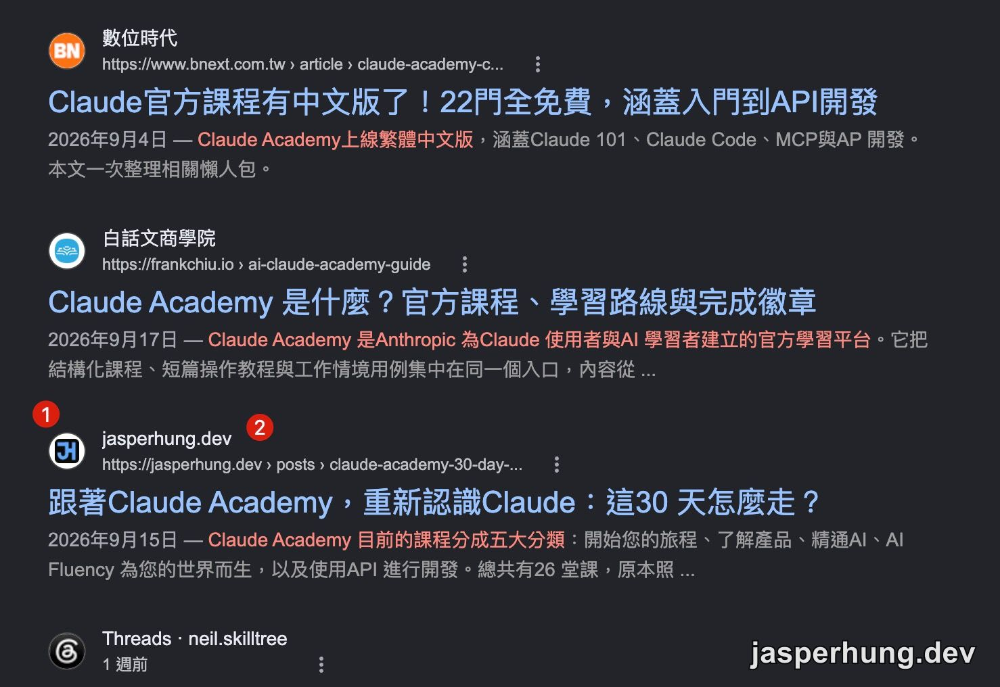
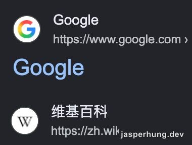
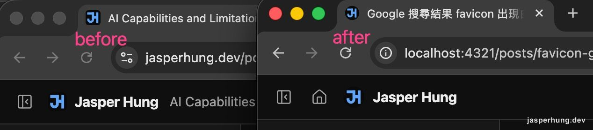

<KeyTakeaways>
  
Google 搜尋結果的 favicon 出現白色外圈，讓 JH 主視覺看起來更小，也讓整個 icon 不夠俐落。我查了官方規格與幾個大型網站的做法，最後先把它改成圓形；這是針對搜尋結果的實測選擇，不是 favicon 的通用規則。

</KeyTakeaways>

## 問題：搜尋結果裡的 favicon 多了一圈白

這個問題不是我原本安排要研究的。某次搜尋時，我意外看到 jasperhung.dev 的 favicon 在 Google 搜尋結果裡多了一圈白邊。原本是黑色圓角方塊裡放藍色 JH，白邊一出現，整個 icon 看起來比旁邊的網站更小，也很難忽略。

我開始研究 Google 搜尋 favicon 白邊到底是怎麼來的。白色外圈不只是顏色問題：如果顯示範圍要把外圈和裡面的正方形圖示一起放進去，主視覺就得縮小，結果既小又不俐落。這種細節會讓我覺得，網站好像沒有把自己的 icon 收好。

原本的 SVG 是 1254×1254 的方形，黑底用 `rx="232"` 做圓角，四角是透明像素。

圖：問題發生時的搜尋結果，紅點 1、2 標示的是 jasperhung.dev 那一列。

## Google 官方 favicon 規格沒有要求圓形

[Google 官方的 favicon 說明](https://developers.google.com/search/docs/appearance/favicon-in-search)寫的規格是：正方形（1:1）、至少 8×8px，建議大於 48×48px。支援格式列出 BMP、GIF、ICO、PNG、JPEG、PPM、TIFF，沒有 SVG。裡面沒有要求 favicon 必須是圓形。

我也沒有在官方頁面找到「透明背景會被加上白底」的規則。網路上確實有第三方文章把這種結果解釋成 Google 會把圖示放進白色圓形容器，例如 [Logo.dev 的觀察](https://www.logo.dev/docs/brand-visibility/google-favicon)；但這不是 Google 的官方規格，不能直接當成通用結論。

我順便看了 [Apple 的 App icon 規範](https://developer.apple.com/design/human-interface-guidelines/app-icons) 和 [Android 的 adaptive icon 文件](https://developer.android.com/develop/ui/compose/system/icon_design_adaptive)。它們不是 favicon 標準，但兩邊都沒有要求設計者把來源圖先裁成圓形：Apple 要提供正方形圖層，再由系統套用圓角；Android 則由裝置套用不同形狀的 mask。換句話說，圓形不是跨平台的通用做法，圖示內容留在安全範圍內比較重要。

另外，網路上常見的「要是 48 的倍數」也不是官方規定，官方只建議大於 48px。

## 觀察：我為什麼改成圓形

我後來找不到一篇能直接證明「Google 建議 favicon 做成圓形」的官方或專門文章，所以沒有把圓形寫成規格。剩下的線索是觀察：我回頭看了幾個常在搜尋結果遇到的大型網站，看到的 favicon 多半是圓形，像數位時代、Threads，以及搜尋結果裡的 Google 和維基百科。

圖：Google、維基百科在搜尋結果中的圖示，都是圓形。

這讓我覺得，針對 Google 搜尋這個畫面，圓形比較穩妥。但這是顯示情境的選擇，不是 favicon 的通用建議。圓形其實也是把正方形四角變成透明，只是透明範圍比圓角方塊更大；我的問題因此不再是「有沒有透明」，而是圖示外框和搜尋結果的呈現方式是否合得來。

另一個比較通用的做法，是保留正方形畫布，使用品牌色作背景，把主視覺縮在中央的安全範圍。這樣放在瀏覽器 tab 裡，還能保留完整的方形構圖；如果搜尋結果以圓形呈現，也比較不容易切到主視覺。對我來說，這比把來源檔直接裁成圓形更有彈性，也是之後重畫 JH icon 時會考慮的方向。

## 兩種改法

1. **拿掉圓角、改成滿版黑底**：白邊不見了，但形狀變成方的，跟其他站的圓形圖示不太一樣。
2. **改成圓形、四角透明**：圓的半徑設為 595（佔 1254 的 95%），讓外框更接近我想要的圓形顯示效果。

圓形會切掉 JH 的角，所以字形要縮小。我用 `rsvg-convert` 把 SVG 渲染出來，量測藍色像素離圓心的最遠距離：

| 縮放 | 最遠像素距離 | 圓半徑 |
|---|---|---|
| 1.0 | 500 | 595 |
| 1.1 | 549 | 595 |
| 1.2 | 599 | 595 |

1.2 會超出圓，所以選 1.1，邊距留 46px。

## 我最後重新產生哪些檔案

SVG 是唯一的來源，其他檔案都從它 render：

- `favicon-96x96.png`、`favicon.ico`（48 + 32px）：從新 SVG 重產，透明四角會保留。
- `apple-touch-icon.png`：維持滿版方形。它是另一個顯示情境，透明區域在 iOS 上的最終效果這次沒有實測。

我不能只改 SVG。Google 搜尋的格式列表沒有 SVG，所以 ICO 和 PNG 也要一起更新。

## 結果與還沒確認的事

topbar 的 icon 從 20px 調成 24px，並移除 `rounded-[5px]`，因為圓形本身已經沒有角。本機的分頁 favicon 和 topbar 都顯示為圓形，沒有白邊。

圖：修正前（左）與修正後（右）的 topbar 與分頁 favicon，後者是圓形、沒有白邊。

搜尋結果裡的白邊還沒確認消失，要等 Google 重新抓取 favicon 才會看到變化。確認後會回來補上。

## 心得

這件事花的時間比預期久，因為一開始我把重點放在「透明會被加白底」這個說法上。回頭看官方文件才發現，能確認的只有自己的實測，而實測結果還要等 Google 那邊更新才算數。
