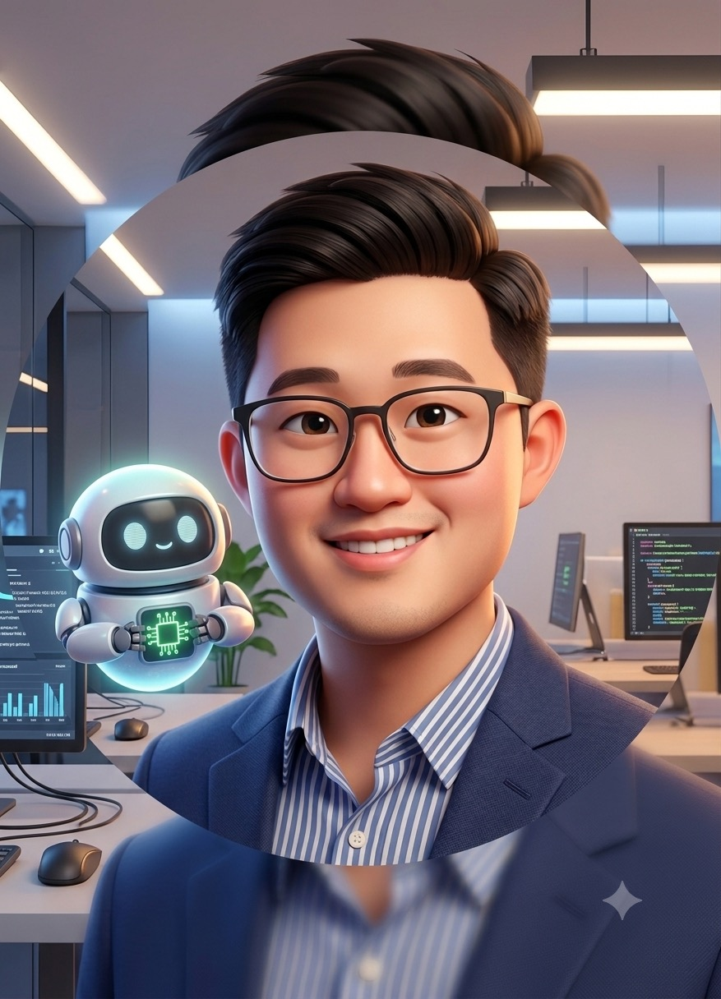
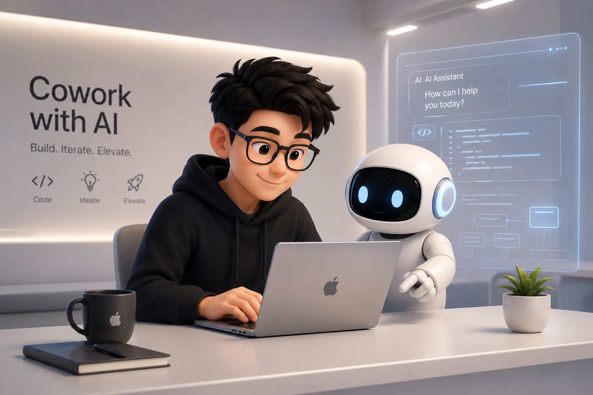
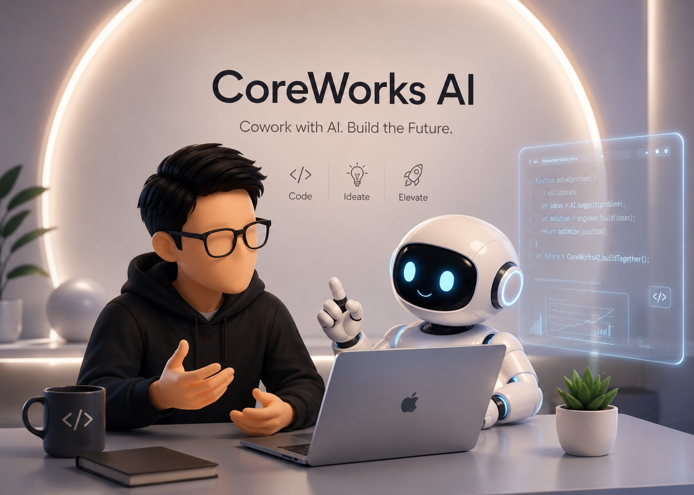

Blog 架好後，我想在 author card 放一張不是普通頭像的圖：它要有一點我的樣子，但又不是證件照或真人照片。於是我開始嘗試用自己的照片，透過圖片生成 AI 做一個數位分身。

主題是「跟 AI 一起工作」：一個有我個人感、但不是寫實照片的卡通化角色，和 AI 機器人坐在一起。聽起來很簡單，結果光是控制風格、構圖和一致性，就耗掉一整晚。

## 先找 Claude 討論

因為 Claude 不能直接生圖，所以我先把它當策略師用：描述我要的感覺、使用場景、AI 機器人的意象選擇，再請 Claude 把這些想法整理成英文 Prompt。

這是第一個階段：先在語言層把模糊的畫面說清楚，讓腦中的感覺變成模型看得懂的文字。準備好之後，再帶著 Prompt 去生圖。

## Gemini：第一張有生命力，越改越崩壞

第一張出來效果其實不錯，有種真實協作的感覺。唯一的問題是人物被放在圓形外框裡，作為數位分身或後續延伸使用都很卡。



所以我開始加條件：去掉圓框、改長方形裁切、人物偏左、機器人在右肩高度……

越加越奇怪。

每多一條規格，整張圖的協調性就少一分。第一張才有的生命力慢慢消失，模型像是在勉強執行規格書，而不是延續原本那個畫面的氣質。

## ChatGPT：不給照片，反而出神圖

換到 ChatGPT 時，我把 Gemini 裡最接近目標的 Prompt 拿來，只保留場景和感覺，沒有先上傳照片就送出。

結果意外地對。

第一張出來就很對：卡通風格的人坐在桌前，旁邊是白色圓頭機器人，背景還自動生成了「Cowork with AI」幾個字。這次 Prompt 裡我沒有明講這段文字，但它很可能吃到了我前面對話裡反覆討論過的脈絡，所以才剛好命中主題。



接著我上傳了自己的照片，想讓人物更像我。

但臉整個不見了。



照片把模型鎖在寫實渲染的路徑上，人物變成照片質感，機器人繼續是卡通，兩個不同世界的東西拼在一起，整張圖的視覺語言斷掉了。

## 逆向工程 Prompt

卡在這裡的時候，我試了一件事：不是問模型它內部到底用了什麼秘密指令，而是請它把「剛剛那張最接近目標的圖」反推成一段可以重複使用的英文 Prompt。

結果，它真的還給我一份完整、可重複使用的英文 Prompt。

而且那段 Prompt 跟我想像的不一樣。它不是把想要的元素全部堆在一起，而是有結構的：先定義意圖，再定義風格、主體、場景，最後補上不能出現的東西。

```
Intent → Style → Subject → Scene → Hard Constraints
```

這個發現後來可以獨立整理成另一篇：生圖 Prompt 不是願望清單，而是一份控制圖片方向的規格。

ChatGPT 也一樣。兩個模型都能把圖片生成的判斷，轉回一段可以討論、修改、再利用的文字。

這讓生圖工具突然多了一條縫。你可以把 Prompt 拿回來，在文字層面看它到底理解了什麼，再決定要調整意圖、風格、鏡頭，還是參考圖的使用方式。

## 討論模式：ChatGPT 的迭代能力

我開始直接跟 ChatGPT 討論：上一張哪裡出問題、建議怎麼調。

它能分析自己之前生的圖，告訴你為什麼那張不對，給出具體調整方向。在同一個對話裡累積 context，第三張、第四張越來越接近我要的感覺。

最後我請它同時生三種構圖版本讓我比較，並用文字說明 A、B、C 各自差在哪裡。

結果它不是回傳三張乾淨的圖，而是把三張拼成一張比較圖，左上角真的印上 A、B、C 標籤，旁邊還把差異說明直接寫進畫面。

圖不能用。Token 也爆了。

前面表現這麼好，最後被這個壞掉。

這個問題後來想起來其實很工程：我把「生成成品」和「分析差異」塞在同一個指令裡，模型就把分析也當成畫面的一部分。比較好的做法應該是拆成兩步：先要求三張乾淨圖片，明講不要任何標籤或文字；再另外請它用文字比較三張差異。

---

## 我發現自己在扮演控制層

踩完這些坑，開始從開發者的視角去想這整件事。

寫 code 的時候，LLM 外面通常會有一層控制系統。工程語境裡常把這類東西叫做 Harness：它不負責思考本身，而是負責控制行為、攔截輸出、分派任務、決定下一步。複雜任務給大模型，簡單任務給小模型，必要時再把結果拿去驗證。

然後我意識到，我這一晚上做的事情，其實就是手動調度：

```
Claude（討論 + 生成 Prompt）← 語言策略層
    ↓ 把 Prompt 帶過去
Gemini / ChatGPT（實際生圖）← 執行層
    ↓ 結果不對，逆向拿回 Prompt
Claude 或生圖 LLM（繼續討論怎麼改）
    ↓ 再生一張
```

Claude 做策略和語言層，生圖 LLM 做執行層，Prompt 文字是兩者之間的介面，我本人是中間的調度者。

**當工具沒有內建控制層，人就會開始手動駕馭模型。**

## 為什麼商用生圖工具很難被穩定駕馭

文字 LLM 的世界比較容易拆成控制層和生成層：

```
外層系統（行為控制）
    ↕ 可以換腦
LLM（算力）
```

但圖片生成比較像這樣：

```
Prompt
    ↕ 很難完全分離
Model（算力 + 美學 + 行為）
```

DALL-E 3 有 DALL-E 3 的感覺，Midjourney 有 Midjourney 的感覺。Prompt 當然能影響結果，但引擎的底色仍然會透出來。你很難只換「算力強度」，卻保持同一套視覺語言。換模型不太像換腦，比較像換了一個美術總監。

文字 LLM 能相對容易地「換腦」，是因為語意和表達形式比較容易分開。同一個意思可以交給不同模型說，外層系統管語意和流程，LLM 管生成能力。

圖片沒有這麼乾淨。內容和美學在 pixel 層面是糾纏的，每個 pixel 都帶著那顆模型的審美偏好。你要的不只是「一個人和一台機器人」，還包括材質、光線、表情、距離、空氣感，以及那張圖到底像不像「你」。

還有一個差異：寫程式的世界比較容易驗證。你可以寫 unit test、跑 CI/CD、做 lint 檢查，最後至少有一部分答案是明確的。Output 對不對，不對就重生、重修、重測，流程會慢慢收斂。

圖片不是完全不能評估，但很難用單一 test case 判斷「這張圖是不是對的」。同一個 Prompt 給四個模型，四個都能說「我有照著做」，結果卻完全不同。這不是單純的工具不成熟，而是圖片生成本來就混合了意圖、審美和主觀判斷。

## 那開源模型呢？

Gemini 提到 ComfyUI 和 ControlNet——開源本地端生態確實有接近控制層的東西，可以控制骨架、分階段省算力、讓多個模型各司其職。

但那是另一個世界。

那條路需要夠強的顯卡，要會裝 Python 環境、理解 Latent Space、自己搭 ComfyUI workflow。這已經接近 AI 工程師的副業，不是多數一般使用者會走的路。

對大多數人來說，選擇主要還是閉源工具：ChatGPT、Gemini、Midjourney。官方把大部分控制層放在雲端後台，你拿到的是一盤做好的菜，廚房進不去。

所以對一般使用者而言，商用圖片生成 AI 目前比較缺的不是更多 Prompt 技巧，而是一套可重複使用的控制層。最接近的東西，Gemini 給了一個更精確的名字：**Style Kit**。

Style Kit 是：固定角色設定、固定鏡頭語言、固定色彩規範、固定參考圖、固定後製流程。把這些都備齊，可以明顯提高生成一致性。但最後仍然會有一部分結果來自模型自己的審美偏好，Prompt 很難完全拔掉它。

這也解釋了一個現象：很多創作者一旦找到順手的生圖工具就不換。他們不只是在用「文字轉圖片」的功能，他們在使用那個模型的整套審美系統。換模型不是升級，是換了一個完全不同的合作夥伴。

Style Kit 不是完整的控制層，是在工具不開放底層調度的條件下，能做到的最好結果——至少目前如此。

## 越說越錯，是這個工具的特性

整晚還讓我注意到另一件事：跟圖片模型說得越精確，出來的東西越沒有靈魂。

Gemini 第一張有生命力，是因為我描述的是感覺，沒有鎖死每個元素。ChatGPT 第一張自動生出「Cowork with AI」，也是因為我給了意圖，不是規格。模型擅長詮釋意圖，不一定擅長逐條執行規格書。說少一點，留白給模型，有時反而是策略。

這也是目前工具體驗最卡的地方：說少了沒方向，說多了又可能崩壞，邊界很難判斷。設計師、導演、攝影師比較容易和它溝通，不是因為他們比較會下咒語，而是因為他們長期習慣把畫面拆成鏡頭、光線、比例、材質和情緒。

但對大部分使用情境來說，真正困難的是：人腦裡的畫面通常不是一串規格，而是一個整體感覺。要把那個感覺翻譯成文字，再要求模型還原成圖片，中間本來就會失真。

---

## 兩個延伸觀察

**第一：圖片生成的控制問題，短期很難只靠 Prompt 解。**

除非有更穩定的方式把內容、構圖、角色一致性和視覺風格拆開控制，否則「換引擎不換風格」會一直很難。這比較像模型和產品架構問題，不只是 Prompt 寫得夠不夠漂亮。

**第二：未來的圖片生成體驗，可能要從「Prompt 輸入」轉向「意圖對話」。**

這次最有效的路徑是跟 ChatGPT 聊清楚問題在哪，讓它自己決定怎麼調整——比我自己改 Prompt 有效得多。如果圖片生成工具能把「討論 → 生成 → 再討論」做成一等公民體驗，而不是讓使用者在對話框裡自己摸索，可能才是真正降低文字和圖像之間轉譯成本的方向。

如果介面能先讓你宣告使用情境，例如「這張圖要直接交付，不要把說明文字畫進圖片」，很多過度熱心的錯誤就能更早被防住。

這其實就是控制層該做的事：不是替模型增加更多算力，而是替人和模型之間補上一層更可靠的駕馭方式。
