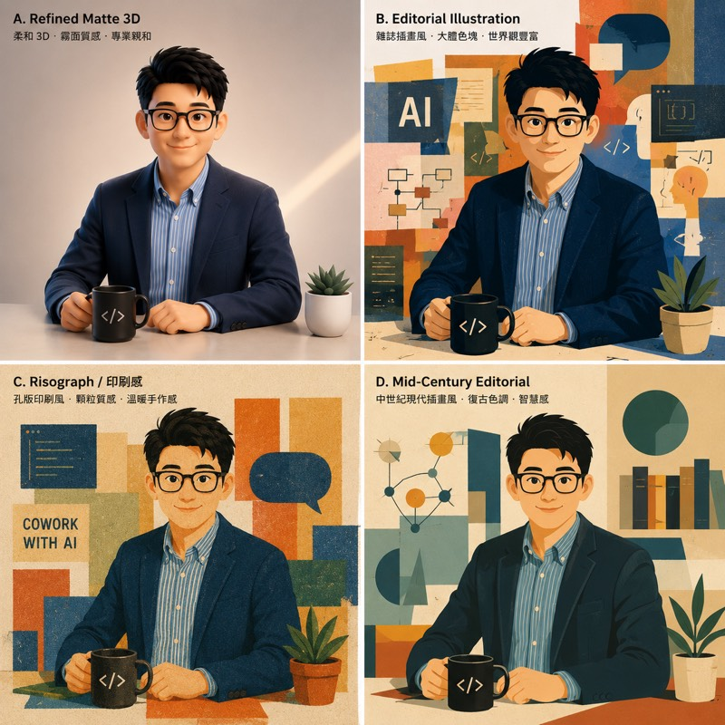

前一篇寫數位分身時，我卡在一個很奇怪的地方：同一個「我和 AI 一起工作」的意圖，丟給不同圖片生成工具，結果可以差非常多。

後來我請 GPT 把最接近目標的那張圖反推成 Prompt，才發現生圖 Prompt 好像不是把想要的東西全部列出來，而是有一種比較穩的組織方式。這篇不是官方標準教學，比較像是我從那次踩坑裡整理出來的工作筆記。

## Prompt 格式沒有唯一標準

我一開始以為應該可以找到一份「生圖 Prompt 標準格式」，例如每次都照某個固定欄位填就好。查了一圈官方文件後，答案比較微妙：有常見元素，但沒有單一標準格式。

[OpenAI 的 GPT image prompting guide](https://developers.openai.com/cookbook/examples/multimodal/image-gen-models-prompting-guide) 直接提到，Prompt 可以是短句、描述性段落、JSON-like 結構、instruction-style，或 tag-based prompt。重點不是語法多漂亮，而是 intent 和 constraints 清楚，production 使用時則優先考慮好讀、好維護的 template。

[Google 的 Gemini prompt design strategies](https://ai.google.dev/gemini-api/docs/prompting-strategies) 也把 prompt engineering 說成一個 iterative process，指南和 template 只是起點，要根據實際輸出繼續調整。到圖片生成時，[Google Nano Banana Pro 的提示文章](https://blog.google/products-and-platforms/products/gemini/prompting-tips-nano-banana-pro/) 建議補上 subject、composition、action、location、style，進階一點再加 camera、lighting、aspect ratio 和 reference inputs。

[Midjourney 的 Prompt Basics](https://docs.midjourney.com/hc/en-us/articles/32023408776205-Prompt-Basics) 則更偏向創作工具的語氣：短而清楚的 prompt 通常比較好，不要把它寫成一長串規格書。但它也列出幾個值得控制的方向：subject、medium、environment、lighting、color、mood、composition。

所以我比較確定一件事：GPT 給我的格式不是某種神秘標準，但它跟官方文件裡反覆出現的元素是對得上的。

## 我整理出來的五段骨架

那次 GPT 反推出來的 Prompt，大致可以整理成這樣：

```text
Intent → Style → Subject → Scene → Hard Constraints
```

第一段是 Intent，也就是這張圖到底要傳達什麼。我原本也會很直覺地先描述畫面：「一個人坐在桌前，旁邊有機器人」。但對模型來說，這只是物件清單，不一定知道整張圖要往哪個方向詮釋。

我後來會先寫這張圖的用途和氣質，例如「一張用在個人 blog author card 的數位分身圖，感覺是安靜、可信、正在和 AI 協作，而不是科技公司廣告」。這段放最前面，是因為後面的 style、pose、lighting 都應該服務這個意圖。

第二段是 Style。這裡不是單純寫「好看一點」，而是給模型一個品質錨點，例如 editorial portrait、soft 3D illustration、Apple keynote quality。這些詞不一定精準，但它們會把模型推向某個既有視覺系統。

第三段是 Subject，包含角色、服裝、姿勢、表情。如果有參考照片，我會明確寫 preserve features from the reference photo，但不會期待它精準複製臉。我的經驗是，參考照片很容易把模型拉向寫實路線，所以要同時提醒它保留原本的 illustration style。

第四段是 Scene，包含構圖、背景、道具和光線。這一段最像攝影或導演語言：eye-level angle、medium close-up、negative space on the right、soft diffuse lighting。它控制的不是「有哪些東西」，而是讀者第一眼怎麼看這張圖。

最後是 Hard Constraints，也就是不要出現什麼。這段在生圖裡比我原本想像的重要很多，尤其是不要文字、不要 logo、不要過度科幻 UI、不要 AI influencer 感。負面約束不是萬靈丹，但它可以把幾種常見歪路先擋掉。

## 寫效果，不要寫數量

這次最有用的教訓之一，是不要太相信模型會精準執行數量規格。

如果我寫「襯衫解開兩顆扣子」，模型不一定真的理解兩顆，甚至可能把衣服弄得很怪。比較好的寫法是描述效果：「open collar, relaxed but still neat」。也就是不要執著在實作細節，而是告訴模型最後看起來應該是什麼感覺。

這也呼應 Midjourney 文件裡的提醒：短 prompt 會讓模型自己的風格補上空白，細節越多控制越強，但也越可能讓整張圖變僵。我的體感是，生圖 Prompt 很像跟設計師 brief，不像寫 SQL。你可以定方向，但不能把每個 pixel 都交代完。

## 負面約束有時比正面描述更準

有些氣質很難正面描述。

例如「沉穩可信」這種詞，模型可能理解成西裝、抱胸、企業簡報風。但如果我寫 avoid AI influencer feeling、not a startup founder marketing portrait、no holographic dashboard，反而比較快把它從錯的方向拉回來。

這不是因為負面 prompt 比正面 prompt 高級，而是很多錯誤風格都有明確名字。當你說不要某種東西，模型有時比你說「我要一個剛剛好的感覺」更容易理解。

:::tip
如果圖片是要放到網頁裡，文字最好不要烤進點陣圖。標題、標籤、說明文字留在 HTML 層，之後才改得動，也比較不會遇到無障礙和 SEO 問題。
:::

## 比較版本時，一次只改一個變數

我以前會很自然地叫模型「給我三個版本比較」，然後同時改風格、構圖、背景、角色姿勢。結果每一張都不一樣，根本不知道是哪個變數造成差異。



比較穩的做法，是固定其他 block，只改一段。例如只換 Style：

```text
Version A: soft 3D illustration
Version B: editorial flat illustration
Version C: warm semi-realistic portrait
```

這很像前端調 UI：如果你同時改 font、spacing、color、border radius，最後很難知道到底是哪個改動讓畫面變好或變壞。生圖也是一樣，一次只動一個主要變數，才比較能收斂。

## 這份格式的定位

所以我現在不會把這套 `Intent → Style → Subject → Scene → Hard Constraints` 當成標準答案。它比較像一份可重複使用的生圖模板。

官方文件給我的結論是：格式可以自由，但 prompt 裡通常要交代清楚用途、主體、風格、構圖、光線和限制。GPT 當時給我的格式剛好把這些東西排成一個我看得懂、也改得動的順序。

這讓生圖變得比較不像下咒語，而是比較像在寫一份視覺 brief。它仍然不保證結果穩定，但至少當圖不對時，我知道可以回到哪一段改：是 intent 太模糊、style 太強、subject 被參考照帶歪，還是 constraints 沒有擋掉模型自己的壞習慣。

這大概是那晚最有價值的副產品。原本只是想生一張 blog 頭像，最後得到的反而是一份下次還能拿來用的溝通格式。
