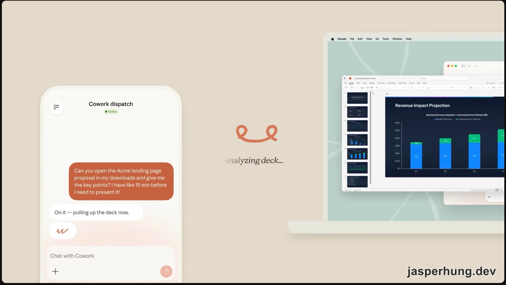
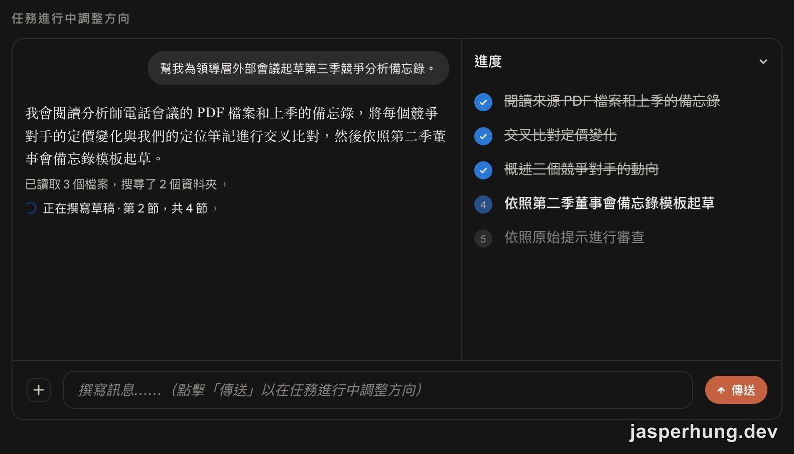
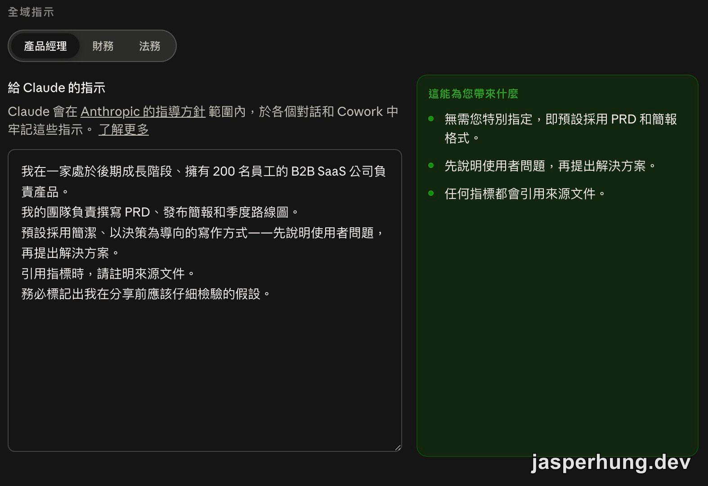
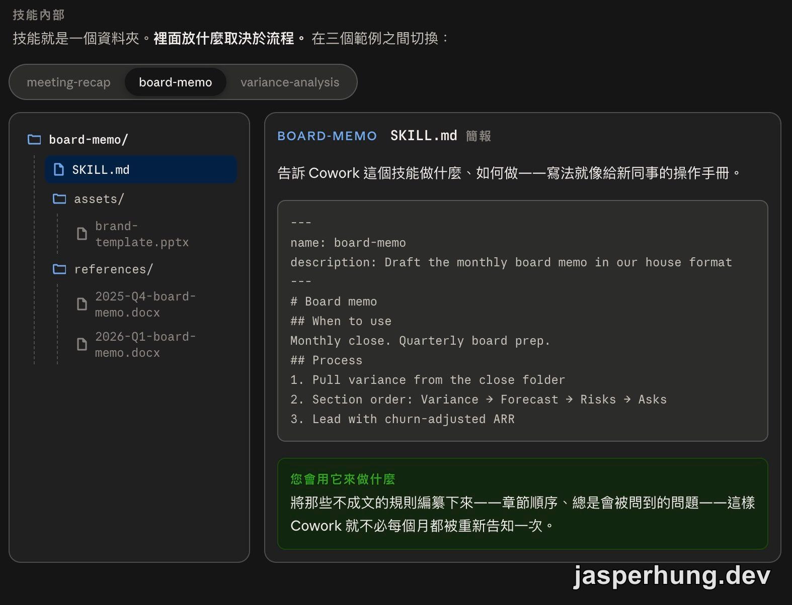

<KeyTakeaways>
  

    Claude Cowork 怎麼把 AI 帶進真實工作流程？它讓 Claude
    讀寫指定的工作資料夾，透過 connectors
    取得其他工具的脈絡，規劃並執行多步驟任務，再交付可以審查的檔案；本篇整理前 8
    堂的委派、權限、排程、Dispatch、全域指示、Projects、Skills 與
    Plugins，實際介面與可用性仍依版本、平台與帳號方案而異。
  

</KeyTakeaways>

Claude 101 講完，今天換一個角度看 Claude：把一件事情交出去，讓它自己讀資料、跨工具整理、產出檔案，再回來交付成果。這跟單純問問題的節奏差很多，也讓「我到底該把什麼工作交給 AI」變成一個需要先想清楚的問題。

這篇整理 [Introduction to Claude Cowork](https://academy.claude.com/zh-TW/courses/introduction-to-claude-cowork) 的前兩個小節，共 8 堂課；後兩個小節會另篇整理，本篇沒有測驗。

## 課程資訊一覽

| 項目     | 內容                                                                                                                           |
| -------- | ------------------------------------------------------------------------------------------------------------------------------ |
| 堂數     | 本篇 8 堂課（全課程共 14 堂）                                                                                                  |
| 總時長   | 全課程 2.5 小時，本篇為前半段                                                                                                  |
| 測驗     | 本篇沒有測驗                                                                                                                   |
| 完成     | 全課程有完成徽章                                                                                                               |
| 適合對象 | 知識工作者——每天的工作是在檔案、應用程式、工具之間搬運資訊，希望 Claude 能真正接手多步驟工作                                   |
| 先決條件 | 付費 Claude 方案（Pro、Max、Team 或 Enterprise）且能用 Claude 桌面應用程式；熟悉日常桌面應用程式即可，不需要寫程式或命令列經驗 |

## 先留意 Claude Cowork 的名稱變化

課程頁面擷取時，官網頂部有一則公告：**Claude Cowork 現在已整合為 Claude**，目前先推出給 Pro 和 Max 使用者，之後會支援更多方案。課程裡的工作資料夾、連接器、任務循環、全域指示、Projects、Skills 和 Plugins 等概念仍然適用；實際畫面和模式名稱則可能跟課程影片不同，可以參考 [官方更新說明](https://claude.com/blog/cowork-is-now-claude)。

### 1. 什麼是 Claude Cowork？

Cowork 的核心是委派。Chat 適合拿來思考問題、起草內容、修改文字和發想；Cowork 則是描述一個成果，讓 Claude 規劃、執行，再把整件工作交付回來。

Claude Cowork 是 Claude Desktop 裡的一種工作模式。你可以指定電腦上的資料夾，連接 Gmail、Slack、Google Drive 或日曆等工具，說明想完成的事情。Claude 會按照計畫讀取檔案、取得工作脈絡、使用工具，最後把成果存回資料夾。

它能在三個地方工作：

- **檔案**：讀取指定資料夾，將 Word 檔案、試算表、簡報或 PDF 的成果寫回去。
- **應用程式**：透過 connectors 從信箱、日曆、訊息、雲端硬碟或 CRM 取得背景資訊。
- **瀏覽器與工具**：沒有 connector 的網站，可以搭配 Claude in Chrome 直接操作瀏覽器。

把 Chat、Cowork 和 Code 放在一起看，差異大概是這樣：

| 工作方式 | 適合用來做什麼                   | 主要特徵                              |
| -------- | -------------------------------- | ------------------------------------- |
| Chat     | 思考、發想、提問、起草與修改     | 一輪一輪對話，適合快速交流            |
| Cowork   | 跨工具、多步驟任務與完整交付成果 | Claude 會規劃工作，讀寫檔案並採取行動 |
| Code     | 在 codebase 裡開發軟體           | 有終端機和 git 存取權限，面向開發工作 |

這裡的重點可以記成一句話：Chat 是一起思考，Cowork 是委派工作，Code 是一起建構軟體。

### 2. Set up Claude Cowork｜設定 Claude Cowork

Cowork 跑在 Mac 或 Windows 的 Claude Desktop App 裡。安裝、登入後，可以在右上角的模式選擇器找 Cowork；如果看不到，可能跟帳號方案或 App 版本有關。

最重要的設定是工作資料夾。提示欄的「在專案中工作」可以指定一個資料夾，Claude 會讀取裡面的檔案，把完成品存回同一個位置。這個資料夾最好只涵蓋單一專案或工作流程，不需要一開始就開放整個檔案資料夾。

資料夾代表 Cowork 可以讀寫的範圍。雲端 connectors 通常偏向讀取與搜尋，建立和反覆修改檔案時，本機工作資料夾仍然比較直接。可以依工作需要連接幾類服務：

- 電子郵件與日曆：Outlook、Gmail。
- 團隊訊息：Slack、Teams。
- 雲端儲存：SharePoint、OneDrive、Google Drive、Box。
- CRM 與專案工具：Notion、Salesforce、HubSpot、Asana、Linear。

沒有 connector 的內部儀表板、供應商入口網站或需要登入的網頁，則可以使用 Claude in Chrome；這部分會在課程後半段再深入。

權限模式則決定 Claude 什麼時候需要停下來問你：

| 權限模式             | 行為                                                           |
| -------------------- | -------------------------------------------------------------- |
| 執行前先詢問（預設） | 傳送 email、發布訊息、分享檔案等涉及外部世界的動作，先等你確認 |
| 無需詢問即執行       | 信任的工具和任務可以直接執行，不為每個動作暫停                 |

永久刪除檔案前，Claude 仍然會詢問，而且這個提示不能跳過。

第一次使用時，可以照這個順序試跑：

1. 選一個放著真實工作的資料夾。
2. 連接一個常用應用程式，從 email 或雲端儲存開始都可以。
3. 請 Claude 總結資料夾內容，例如：「看看這個資料夾裡的所有內容，寫一份簡報告訴我您學到了什麼。」
4. 讀完成果，再跟自己的知識核對：它抓到什麼、漏掉什麼，又有哪些地方需要修正？

資料夾決定 Claude 能碰到什麼，connectors 決定它能取得哪些工作脈絡，權限模式則決定它動手前要不要先問你。三者一起構成委派工作的基礎。

### 3. What can Claude Cowork do for you?｜Claude Cowork 能為您做什麼？

課程把適合 Cowork 的工作整理成三種模式。

1. **多步驟任務**：在同一個提示裡收集脈絡、比較來源、做額外研究、草擬摘要，再整理成指定格式。例如把一週的客戶回饋 email 分成幾個主題，附上代表性引述；或把報告和試算表整合成互動儀表板。
2. **基於真實檔案的任務**：輸入和輸出都在電腦上的檔案裡，像是用範本和會議記錄組成客戶提案，或從原始試算表產出月度指標報告。Chat 可以產生新檔案，Cowork 會處理你已經擁有的檔案。
3. **跨多個工具的任務**：從日曆邀請、與會者名單和會議記錄取得資訊，再在 Outlook 草擬會後信；或從 Slack 搜尋團隊討論，整理成發布更新報告。

這三種工作的共同點，是原本需要自己記住步驟、切換檔案和串接工具，現在可以整理成一個任務交付給 Claude。

#### 排程任務與 Dispatch

排程任務可以讓 Claude 按固定節奏執行工作。你可以直接輸入 `/schedule`，描述任務和執行頻率；也可以先跑一次、確認成果符合期待，再把流程轉成重複性任務。頻率可以設定成每小時、每天、工作日或手動執行。

排程只會在電腦開機且 Claude 正在執行時運作。筆電關機或休眠而錯過時間，回到桌前後 Claude 會接手並告知任務延遲。

Dispatch 則是從 Claude 行動 App 在手機上啟動 Cowork 任務，實際工作仍在桌上型電腦上執行，使用同一批檔案、connectors 和權限，完成後再推播通知。這同樣需要桌機開機、喚醒、登入並開著 Cowork；Pro 和 Max 預設可用，Team 和 Enterprise 則需要管理員啟用。

圖：從手機交辦 Cowork 任務，讓桌上型電腦上的 Claude 讀取簡報並整理重點。

### 4. Give Claude Cowork your first task｜交給 Claude Cowork 您的第一個任務

Cowork 的任務循環可以分成三段：開始前補齊脈絡、執行中修正方向、完成後審查成果。

一個好的 Cowork 提示，至少要交代三件事：

1. **交付成果**：說清楚要一頁簡報、QBR 投影片，或附排名的清單，格式和長度越明確，後續修改越少。
2. **輸入內容**：指定資料夾、頻道、日期範圍和應用程式。Cowork 的表現很大一部分取決於你提供的工作脈絡。
3. **專業細節**：補上 Claude 看不到的判斷，例如要比較基本、最佳和最差情境，或納入去年 Q3 新開的三個地點。

Claude 開始工作前，可能會先問澄清問題。這些問題是在補上下文缺口，通常可以用選項回答；沒有符合的選項，也可以自行輸入。進入執行階段後，要持續看計畫和進度，來源、格式或語氣偏掉就立刻拉回來，必要時停止、補充提示再繼續。

圖：任務進行中可以直接補充訊息，讓 Claude 依照新的方向調整工作。

完成後，交付成果會出現在 App 預覽和工作資料夾裡。審查時可以用看待同事草稿的標準檢查：是否真的達成目標、事實和資料是否正確、是否出現找不到來源的日期或名稱。草稿大致正確時，直接指出要改的地方；關鍵處出錯時，補上原本缺少的脈絡再調整。

## Make Claude Cowork Work for You｜讓 Claude Cowork 為您所用

### 5. Get better results, faster｜更快獲得更好的成果

Claude 越了解你的工作方式，下一次委派就越容易。課程用四個基礎要素說明不同層次的上下文：

| 要素                           | 對應課次 | Cowork 學到什麼        | 解鎖什麼                                                              |
| ------------------------------ | -------- | ---------------------- | --------------------------------------------------------------------- |
| 全域指示 (Global instructions) | L6       | 你是誰、怎麼工作       | 每個任務一開始就校準到你的角色、格式、偏好                            |
| 專案 (Projects)                | L6       | 一條工作串流的脈絡     | 在專案內，Cowork 像已經在團隊裡的人，能存取檔案、歷史、至今的決策     |
| 技能 (Skills)                  | L7       | 特定流程該怎麼做       | 遇到符合的任務，Cowork 照團隊的方式跑你的範本、標準和步驟             |
| 外掛程式 (Plugins)             | L8       | 你角色或領域的專業知識 | Cowork 從通才變專才，具備該職位需要的工作流程、connectors 和 know-how |

四項設定各自獨立，效果會疊加。使用一段時間後，可以把每次都要重新交代的偏好放進全域指示，把固定工作流程放進 Projects 或 Skills；等流程和團隊規範穩定，再考慮打包成 Plugins。

### 6. Persistent context: Global instructions and Projects｜常駐上下文：全域指示與專案

Chat 會從對話中逐步建立記憶，Cowork 跨任務的上下文則主要靠設定保存。全域指示涵蓋「你是誰」，Projects 涵蓋「你正在進行的工作」。

#### Global instructions｜全域指示

全域指示是設定裡的常駐簡報，每次 Cowork 會話、排程任務和 Dispatch 都會參考。設定路徑是：Claude Desktop App → 設定 → Cowork → 全域指示旁的「編輯」。

可以放進去的內容包括：

- 你的角色和主要工作。
- 團隊常用的簡稱和縮寫。
- 希望成果呈現的格式、長度和語氣。

不需要第一天就寫完。使用過程中，反覆要求 Claude 修正的內容，例如「先講結論再講背景」，就是很適合補進全域指示的規則。

圖：全域指示可以預先告訴 Claude 使用者的角色、工作方式和輸出偏好。

#### Projects｜專案

Project 是跟特定工作串流綁定的工作空間，像是一位客戶、一項固定交付，或一次產品發布。專案裡通常有四種內容：

- **指示**：只套用到這個專案的工作規則。
- **排程任務**：從專案內設定的週期性工作，每次都在同一個上下文裡執行。
- **上下文**：Claude 應參考的資料夾或連結。
- **記憶**：Claude 從專案內對話逐步建立，累積客戶情況、過去決策和未解事項。

建立 Project 有三種方式：從零開始、使用電腦上的既有資料夾，或從 Chat 專案轉過來。最後一種只能單向轉移，Cowork 裡的變更不會同步回 Chat。

### 7. Skills: Teach Claude Cowork to work your way｜技能：教 Claude Cowork 用您的方式工作

Skill 是一套可重複使用的操作手冊，通常是一個包含指令和資源的資料夾。任務符合技能的適用範圍時，Claude 會自動載入，不需要每次特別叫出名稱。

一個 Skill 可以包含四類檔案：

1. **指示（SKILL.md）**：說明技能的用途、觸發時機和執行步驟，寫得像替新同事準備的操作手冊。
2. **資產**：標誌、品牌範本、投影片母版或字型，提供產出所需的原始材料。
3. **參考資料**：優質輸出範例、風格指南、條款庫或過往作品，讓 Claude 知道什麼叫做好的結果。
4. **腳本**：處理每次都應該一致的工作，例如變異數計算、結構化比較、圖表格式化或檔案重新整理。

不一定每種檔案都要有，依工作本身需要組合即可。

圖：Skill 可以依照流程需要，組合 SKILL.md、資產、參考資料和腳本。

最快的建立方式，是在 Cowork 開一個新對話，說明想把哪個重複流程做成 Skill。Claude 會詢問技能該做什麼、什麼時候觸發、好的輸出長怎樣，以及需要參考哪些範例。回答得越具體，產出的技能資料夾越容易直接安裝使用。

安裝後，可以在「自訂」裡找到 Skill；想調整流程時，直接告訴 Claude 要修改的規則，它會就地更新。固定跑的報告、固定用的格式和固定的檢查清單，都很適合拿來當第一批 Skill 候選。

### 8. Plugins: Encode your team's expertise｜外掛程式：將您團隊的專業知識編碼

Skill 是單一操作手冊，Plugin 則是圍繞某項工作打包的一組 Skill，還可以包含它們需要的 connectors 和 Subagents 子代理。Subagent 是由 Skill 啟動的專用輔助工具，能在自己的 context 裡處理研究或草擬等工作。

Plugin 的價值在於把團隊的工作方式一起交付出去。財務 Plugin 可以包含差異分析、財務建模和投資備忘錄草擬；法務 Plugin 則可以放進合約處理流程。專業知識會跟著安裝包傳遞，讓新成員拿到一套可以直接使用的工作工具。

常見的 Plugin 有兩種組織方式：

1. **整合端到端流程**：把連續步驟串在一起，例如月結 Plugin 包含提取實際資料、建立差異分析表和草擬董事會備忘錄。
2. **整合團隊常用的 Skills**：把彼此獨立、但都很常用的 Skills 放在同一個 Plugin 裡，像是財務建模、投資備忘錄和季度報告。

可以從「自訂 → 外掛程式」安裝 Anthropic 市集上的 Plugin，再核准它需要的 connectors。安裝後回到 Plugin 的「自訂」，把團隊範本、定義、流程和已完成的範例交給 Claude，讓通用版本調整成符合團隊工作的版本。

如果市集裡找不到適合的流程，也可以從一個 Skill 開始，逐步累積到三、四個 Skills 和重要 connectors，再打包成自己的 Plugin。`/setup-cowork` 會開啟一段簡短訪談，協助你盤點工作類型、尋找適合的 Plugin，並在對話裡安裝和測試。

## 小結

這 8 堂課先把 Cowork 的核心工作方式講清楚：把成果、資料來源和限制交代給 Claude，讓它跨檔案與工具執行，再在過程中修正方向、完成後審查交付成果。資料夾、connectors 和權限是委派能否放心運作的起點。

再往上加全域指示、Projects、Skills 和 Plugins，Claude 才會逐漸熟悉你的工作脈絡。對我來說，最有用的節奏是先挑一個真的會重複發生的工作試跑，確認交付品質後，再把穩定流程整理成可重用的設定。
