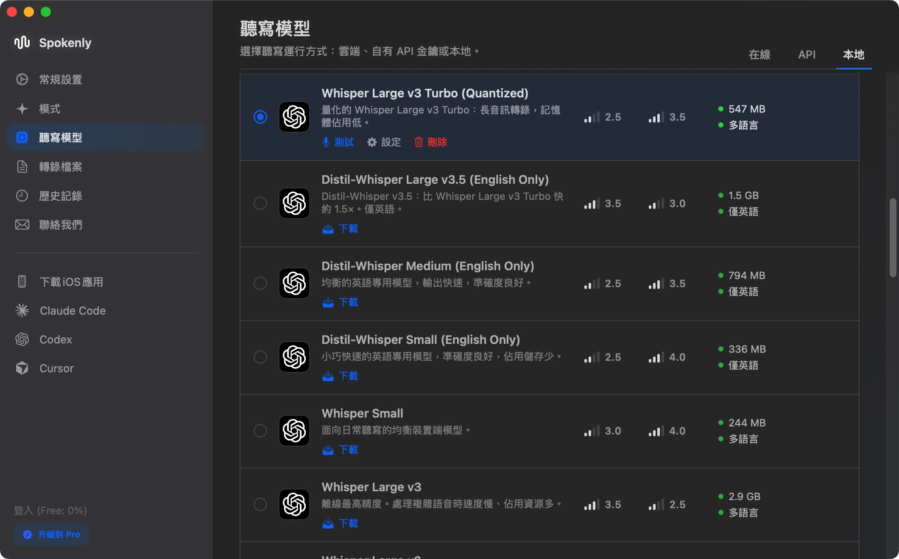
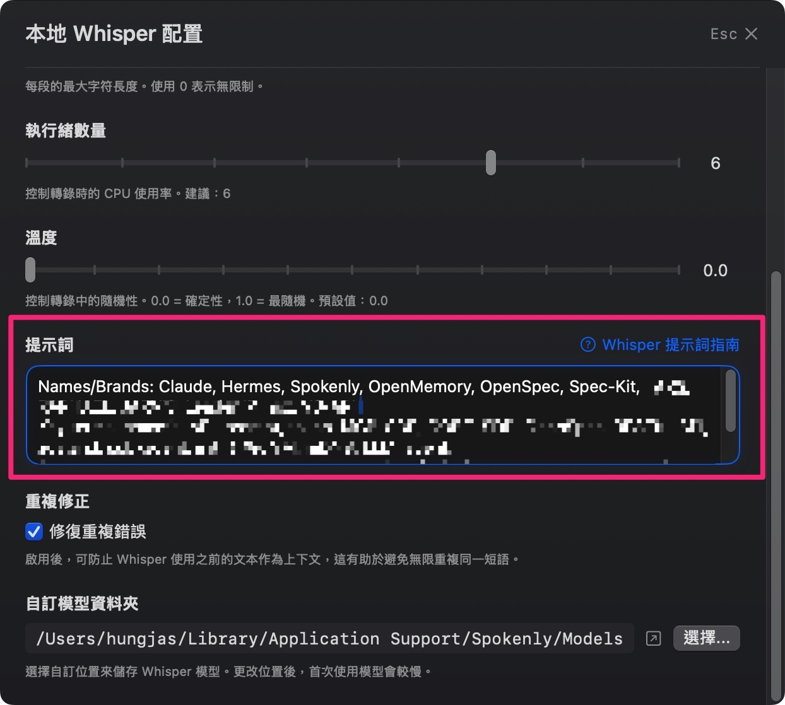
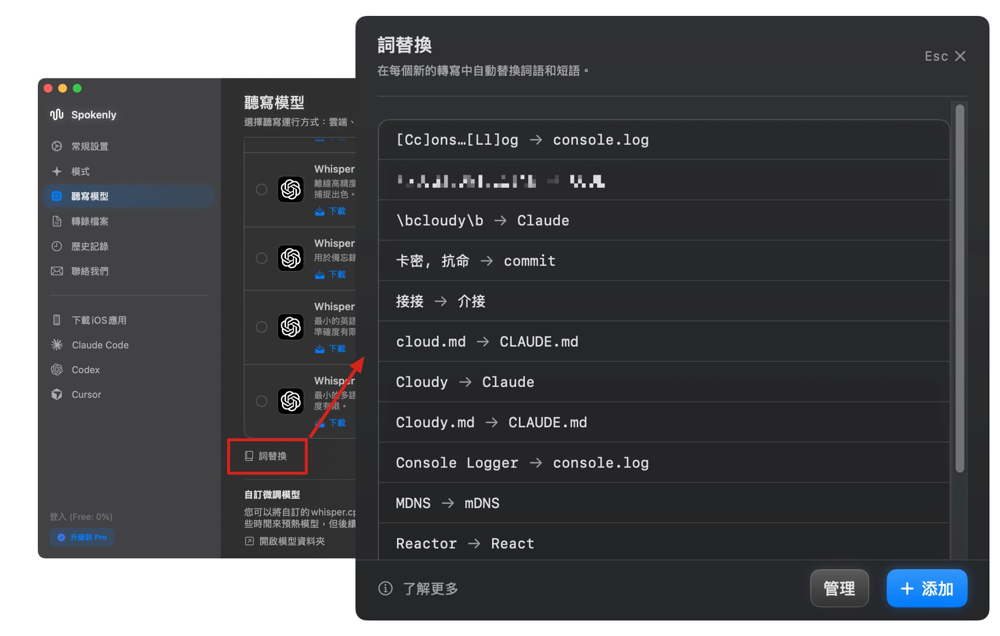

import ChatBubble from '../../../components/ChatBubble.astro';
import ChatTranscript from '../../../components/ChatTranscript.astro';

前一篇把 Typeless 的訂閱換成 Spokenly BYOK 後，我第一次看見語音輸入的成本長什麼樣子：STT 是大宗，LLM Prompt 潤飾則很小。

我本來想做的，是找一個更便宜的雲端供應商。於是我拿著用量問 Gemini：「如果兩層都換成 Gemini，還能省多少？」它先幫我估了一輪，說大概可以少 60%；接著卻丟出一個我沒想過的答案。

<ChatTranscript>
  <ChatBubble side="right">如果把 STT 與 LLM 兩層 API 都換成 Gemini，費用能省多少？</ChatBubble>
  <ChatBubble side="left" who="gemini">大概可以少 60%。</ChatBubble>
  <ChatBubble side="left" who="gemini">但建議 STT 改用本地 Whisper 模型。</ChatBubble>
  <ChatBubble side="right">那 STT 不就免費？</ChatBubble>
  <ChatBubble side="left" who="gemini">是的。</ChatBubble>
</ChatTranscript>

它本來可以繼續幫我比較哪一個 Gemini API 方案更便宜，卻直接叫我把最大宗成本搬離雲端。這種誠實得有點好笑的建議，反而讓我第一次看到更直接的解法。

那一刻才發現，我一直在想辦法把第一層變便宜；但把它搬走，才是更直接的解法。

:::tip
本文所有金額均以美元（USD）計價，後文統一以 `$` 表示。
:::

## 本地模型不等於要買一張 GPU

我一開始也把「本地模型」聯想到很大的 LLM：要有獨立 GPU、很多記憶體，還得自己裝一套複雜環境。但語音聽寫的工作比較單純：按住快捷鍵錄一小段話、放開後把這段音訊轉成文字；它不是在筆電上維持一個大型聊天模型，持續生成長篇內容。

AI 建議我使用 `Whisper Large v3 Turbo (Quantized)`。`Quantized` 的意思是把模型權重壓縮成較低精度，換取較小的檔案與記憶體占用。[Spokenly 的模型尺寸說明](https://spokenly.app/blog/whisper-model-sizes)列出這個多語模型的量化檔約 `547 MB`；設定裡也能直接調整執行緒數量來控制轉錄時的 CPU 使用率。



<p class="image-caption">圖：我選擇的量化 Whisper Large v3 Turbo 是多語模型，下載後可直接在 Mac 上執行。</p>

這不代表每台筆電都有一樣的體感。實際延遲仍取決於 CPU、可用記憶體、模型大小和單次錄音長度；舊機器或較長的口述會慢一些。但以我的 Mac 和短句聽寫場景來說，不需要另外買 GPU，只要在列表中按「下載」就能開始用。

當時我請 AI 一起看模型列表，因為我常講繁中、英文和技術詞混雜的句子，它建議先從這個多語、檔案大小與準確度較平衡的模型開始。這不是一份通用 benchmark，而是我把它當成第一個可用的起點；實際使用後，對我的語料滿意度不錯。

## 不是換更便宜的 API，而是拿掉一段 API

[上一篇](/posts/typeless-to-spokenly-byok/)裡，我把 Spokenly 拆成兩層：STT 把語音轉成原始文字，LLM 再依照 Prompt 整理標點、條列與術語。第一階段的架構是：

```text
語音 → 雲端 STT → LLM Prompt 潤飾 → 最終文字
```

改成本地 Whisper 後，只有第一層換了位置：

```text
語音 → 本地 Whisper → LLM Prompt 潤飾 → 最終文字
```

這個差異看起來很小，成本結構卻完全不同。音檔不再送到雲端 STT API；Mac 上的 Whisper 直接完成語音轉文字，雲端只留下很短的一段文字潤飾。

本地 STT 的雲端 API 邊際成本因此是 `$0`。這不表示整個系統完全沒有成本：電腦、電力與本地模型推論仍然存在；只是我原本每次口說都會產生的雲端 STT 費用，被移除了。

## 裝好本地模型後，多了兩個可以調的地方

成本解掉後，品質很快變成下一個問題。Whisper 對一般中文沒有太大問題，但我的口說裡塞滿 `Claude`、`CLAUDE.md`、`console.log`、`onClick` 這類中英混雜的技術詞。只靠原始轉寫，仍然會得到 `Cloudy`、`Console Logger` 這種很有想像力的答案。

### 本地 Whisper 提示詞：告訴它可能會聽到什麼

安裝本地模型後，Spokenly 會出現 Whisper 的進階設定，其中的「提示詞」不是拿來要求段落格式，而是 vocabulary hints：把常用產品名、縮寫和大小寫寫進去，讓模型更知道我可能會說哪些詞。



<p class="image-caption">圖：本地 Whisper 的提示詞欄位，用來放常用的名稱與技術詞。</p>

[Spokenly 的 Whisper 提示詞指南](https://spokenly.app/docs/whisper-prompting#readytocopy-templates)明確寫著：Whisper 只會讀取最後 224 tokens，約 `900` 個字元；更早的內容會被忽略。因此提示詞要保持簡短、把重要詞放在前面，並使用想保留的正確拼法與大小寫。把 `console.log`、`React` 放進去後，原本的 `Console Logger` 與 `Reactor` 就能被正確辨識。

### Word Replacements：把固定錯字直接換掉

第二個是放在 AI Prompt 之前的字串替換。對於已經確認、而且會反覆出現的誤辨，例如 `Cloudy → Claude`，直接做精確替換比期待 LLM 每次從語境猜對更可靠。



<p class="image-caption">圖：把已知的固定誤辨整理成 Word Replacements，讓 AI 收到前就先修正。</p>

[Word Replacements 文件](https://spokenly.app/docs/word-replacements)也區分了 Before AI 與 After AI。我的固定音譯錯誤放在 Before AI，讓後面的 LLM 看到的已經是正確詞；純粹的最後格式調整才適合放在 After AI。於是各層職責更乾淨：Whisper 負責聽懂，字串替換處理固定錯字，LLM 才負責語意與排版。

## 我真正要的，不只是省錢

我繼續把 STT 和 Prompt 分開追蹤。改成 Local Whisper 後，OpenAI 後台連續 11 天的 LLM Prompt 用量合計是 `$0.114`；若以同樣強度線性外推 30 天，約莫 `$0.3／月`。

相較 Typeless 按月訂閱的 `$30／月`，最終每月雲端可變成本降至約 `$0.3／月`，降低約 `99%`。這不是要宣告訂閱制沒有價值；它只是很清楚地回答了我自己的問題：以我的使用量和願意設定的程度，BYOK 加上本地 STT 比較適合。

本地模型的體感確實比雲端慢一點，但換來的是能自己選模型、補術語、修固定錯字的控制權。Spokenly 的模型列表也持續增加；例如 Apple Speech Analyzer 已是 macOS 26+ 的選項。我這次沒有把它當成中英混雜聽寫的答案，還是先留在 Whisper；之後如果有更適合這種語料的本地模型，我很樂意再換一個試試。
