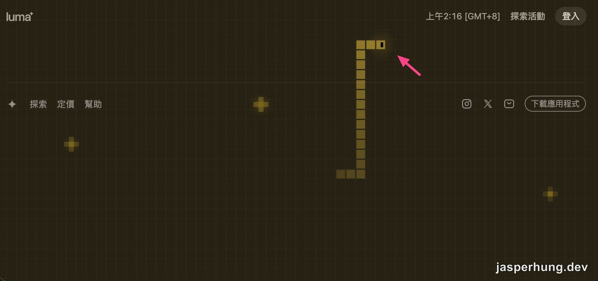
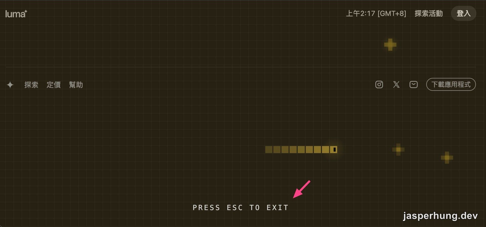

<KeyTakeaways>
  
Luma 活動頁背景那條貪食蛇只是裝飾嗎？從公開的 JavaScript bundle 逆向後發現，它是 Luma 內建主題，Canvas 裡跑著完整的貪食蛇狀態機，按空白鍵還能接手操控；自動駕駛用的是貪婪演算法，不會替未來規劃安全路徑，走進死路就死亡重生。

</KeyTakeaways>

我在一個 Luma 活動頁上看見一條貪食蛇。它沒有停下來：沿著滿版背景移動、追著幾顆發光的點，撞到邊界後又從中央重新開始。第一眼很容易把它當成一段做得很細的裝飾動畫。

但我想知道的是：這條蛇只是演出效果，還是真的有一套遊戲邏輯？於是我從頁面的 DOM 和公開載入的 JavaScript bundle 往下找。找到答案後，原本安靜的背景忽然變得很熱鬧。

看到這條在畫面上移動的貪食蛇背景，感覺很有趣。

## 它是 Luma 的內建主題，不是活動方客製特效

先用 Playwright 檢查頁面，最早露出線索的是一個帶有 `snake` class 的背景容器，裡面放著固定定位的 `<canvas>`。接著把 Next.js 載入的 chunk 列出來，以 `snake` 搜尋 minified 程式碼，找到 `NewThemes` 的主題清單：`grain-dark`、`tamagotchi`、`life`，以及 `snake`。

這讓研究方向立刻收斂。蛇不是這場活動的主辦方額外寫進去的功能，而是 Luma 內建的一個活動頁主題。再往下追動態載入的元件，會找到名為 `SnakeCanvas` 的獨立 chunk；它小到足以直接讀完，整個背景的行為也因此能被還原。

## Canvas 裡跑的是一個完整的貪食蛇狀態機

`SnakeCanvas` 用 fixed 的全螢幕 Canvas 繪製畫面，以 `requestAnimationFrame` 更新，並依 `devicePixelRatio` 做縮放。畫面被切成每格 16px 的網格；蛇一開始有五節、位於中央、朝右移動，食物則固定維持三顆。

食物不是隨便放。程式會避開蛇身與既有食物，最多重試 200 次找空格。蛇吃到食物後增加身體長度；撞牆或咬到自己時，先顯示約 300ms 的閃爍 overlay，再回到中央重生。於是畫面看起來像有一條永遠活著的蛇，實際上是「死亡後立即重新開局」的循環。

視覺層也不是只畫幾個方格。食物透過 `createRadialGradient` 和 `sin` 形成會呼吸的光暈，蛇身從頭到尾逐漸降低透明度，蛇頭還會隨移動方向畫出兩個像素眼睛。這些細節讓一個很簡單的網格遊戲，變成不會搶走活動內容、卻能讓人停下來看的背景。

## 自動駕駛沒有很複雜，卻足夠像在思考

閒置時，蛇每約 80ms 選一次方向。它先以曼哈頓距離找到最近食物，再篩掉會出界、反向折返，或撞上自己身體的走法；尾巴那一格因為下一步會移開，則被保留為可走的例外。剩下的方向按「走完後離目標多近」排序，選最好的那一個。

這是一個貪婪演算法，不會替未來規劃很長的安全路徑；完全沒有安全方向時，它就照原本方向走，然後死亡重生。這個限制沒有被藏起來，反而很適合背景：它成本低、行為容易預測，也會持續帶來「蛇正在追東西」的生命感。看起來很聰明，不代表需要一個很重的 AI 系統。

## 裝飾模式隨時可以交給訪客

最讓我意外的程式碼不在繪圖，而在鍵盤事件。按下空白鍵，頁面會提示 `PRESS SPACE TO PLAY`；接著方向鍵或 WASD 可以接手操控，按 Esc 則交還給自動駕駛。它也會在焦點落到 input、textarea、按鈕或 dialog 時退出手動模式，避免使用者填寫報名表時不小心讓蛇轉彎。

AI 爬到的彩蛋：按空白鍵可以接管互動控制，按 Esc 回到自動駕駛。

這讓「背景」有了很清楚的層次：沒有人互動時，它是低干擾的展示；有人發現彩蛋時，它就是一個可玩的遊戲。互動存在，但不要求任何人注意它，更不會妨礙活動頁最重要的報名流程。

## 從頁面產物反推互動系統

這次的路徑很值得保留下來：先從 DOM 的 class 和 Canvas 找到可疑元件，再從前端載入的 chunk 用關鍵字定位，最後優先讀取體積小、責任單一的動態模組。比起在一大包 minified 程式碼裡漫遊，這樣更容易把視覺效果還原成可理解的狀態、演算法和事件流程。

我原本只是想搞懂一條蛇怎麼一直跑。追到最後才發現，它早就準備好等人把鍵盤搶走；一個背景能做到這裡，已經不只是背景了。
