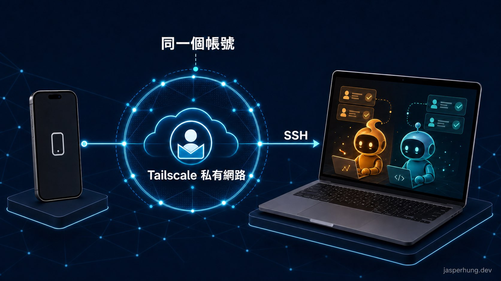

有次人在外面，想從手機回 Mac 看一下正在跑的東西。不是要開遠端桌面，只是想進 terminal 查狀態、跑一個指令。

這件事聽起來很像「開 SSH 就好」，但我很快就卡在另一題：手機到底要連到哪裡？家裡的公網 IP 會變，路由器也沒有替我開 port。最後讓這條路變得簡單的，不是 SSH 本身，而是先裝了 Tailscale。

## 直接 SSH 回家，為什麼沒有想像中簡單？

SSH 很擅長讓人從遠端登入一台電腦；問題是，多數家用 Mac 都在路由器後面。若想直接從外面連回來，通常得查公網 IP、設定 port forwarding，還要自己承擔把 SSH port 暴露到網際網路的安全性問題。

我把這個擔心拿去跟 AI 討論，它推薦我研究 Tailscale。查完才發現，它不是把 SSH port 換一種方式公開出去，而是用登入帳號和裝置身分，把手機與 Mac 放進同一個私有網路；SSH 只在這個網路裡使用。

我想要的比較單純：只有我的手機能找到我的 Mac，兩台裝置不需要因此變成公開服務。

## Tailscale 是什麼？

[Tailscale](https://tailscale.com/) 是把自己的裝置組成私有網路的工具。它以登入身分辨識裝置：Mac 和 iPhone 分別安裝 App、登入同一個帳號後，就會被放進同一個 `tailnet`。

可以把它想成一個只屬於自己的小型網路。加入的裝置會得到可互相使用的 Tailscale 位址，並以 WireGuard 建立加密連線。Tailscale 的[官方說明](https://tailscale.com/docs/concepts/what-is-tailscale)把這種模式稱為 peer-to-peer mesh network；對我來說，最實際的差別是：裝置即使各自在不同網路、隔著 NAT 或防火牆，通常也不必再設定 port forwarding 才能互相找到。

所以 Tailscale 不是 SSH 的替代品，也不是夾在 SSH 中間的一條神祕隧道。它先把「手機能安全找到 Mac」這件事處理好；SSH 才是在這張私有網路上，實際登入 Mac 的方式。

## 先讓 Mac 和手機加入同一個 tailnet



<p class="image-caption">圖：手機與 Mac 以同一個帳號加入 Tailscale 私有網路；SSH 是手機登入 Mac 的方式。</p>

先到 [Tailscale Download](https://tailscale.com/download) 下載 Mac 與 iPhone 的版本。Mac 端也可以依[官方 macOS 安裝文件](https://tailscale.com/docs/install/mac)選擇適合自己的安裝方式。

兩端安裝後，用同一個登入身分登入。完成時，Tailscale 管理頁與 App 都會看到兩台裝置；如果你使用 CLI，也可以在 Mac 上確認：

```bash
tailscale status
```

輸出會列出已加入 tailnet 的裝置與位址。這個位址不是家裡的公網 IP，而是只在自己的 Tailscale 網路內使用的位址。記下 Mac 的那一個，下一步 SSH 會用到。

:::tip
先別急著把 Mac 的 `22` port 開到路由器。這篇的連線只走 Tailscale 私有網路，不需要把 SSH 暴露給整個網際網路。
:::

## 開啟 Mac 的遠端登入

網路已經通了，還要讓 Mac 接受 SSH 登入。

在 macOS 的路徑是：**系統設定 → 一般 → 共享 → 遠端登入**。打開後，確認要允許登入的使用者帳號。

也可以在 Mac 上用指令開啟並驗證：

```bash
sudo systemsetup -setremotelogin on
sudo systemsetup -getremotelogin
# Remote Login: On
```

接著在手機的 SSH App 新增連線：

- Host：Mac 的 Tailscale 位址
- Port：`22`
- User：Mac 使用者名稱

螢幕鎖定或進入螢幕保護程式不會讓 SSH 中斷；真正會讓連線消失的是系統睡眠。如果 Mac 需要長時間等著被連回，睡眠設定仍要另外處理。

## 設好後，SSH 才終於變成一條真的能用的路

從安裝 Tailscale 到手機看到 Mac，大部分時間都花在理解「原來 SSH 前面還有網路這一層」。一旦兩台裝置已經在同一個 tailnet，後面的 SSH 設定反而很直白。

現在出門時，我知道手機有一條不必記公網 IP、也不用回家碰路由器的路能回到自己的 Mac。透過 Tailscale，SSH 終於變成一條安全、真的能用的路。這種設定平常安靜得像沒做過，但真的需要它的時候，就很值得。
