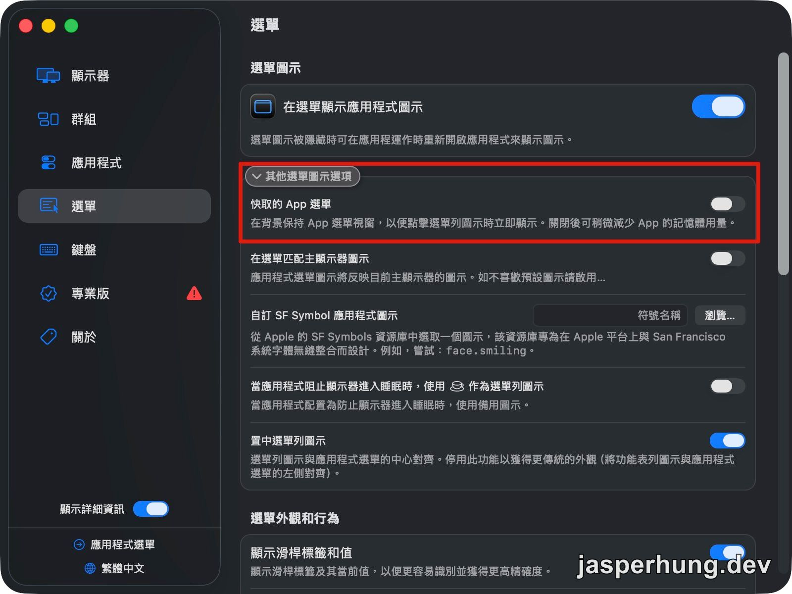

升到 macOS 26 後，Mac 偶爾會莫名發燙。我一開始以為是 Android 模擬器忘了關，畢竟它確實很會吃資源；這一次檢查後，模擬器根本沒有在跑。

於是我請 AI 協助把當下的 CPU 使用率排出來，才發現 BetterDisplay 持續吃了約 43% CPU，累積執行時間也長得不太尋常。這讓人有點意外，因為我平常只是用它讓 2K 外接螢幕上的文字更清楚，幾乎感覺不到它的存在。

## 從 CPU 使用率一路追到 GitHub

43% 並不像短暫調整畫面時的正常負擔，更像有背景程式卡住了。沿著 BetterDisplay、macOS 26 和高 CPU 這幾個線索查下去，找到 BetterDisplay 的 GitHub 討論；作者 @waydabber 直接確認：v4.3.4 在部分 macOS Tahoe 安裝環境中，App menu caching 會造成高 CPU。修正方式是到選單設定裡關掉這個快取；升級到 v5 的預覽版也能避開問題。 [Discussion #2328](https://github.com/waydabber/BetterDisplay/discussions/2328)

| 專案 | GitHub stars |
|---|---:|
| [waydabber/BetterDisplay](https://github.com/waydabber/BetterDisplay) | 32.8k ⭐ |

這個對照很重要，因為它讓我能把「剛好升級 macOS 後開始發燙」和「一定是我的 HiDPI 設定有問題」分開。症狀和版本都對得上，修正方法也剛好是設定裡一個獨立的選項。

## 關掉快取的 App 選單

在 BetterDisplay 裡依序開啟「Settings → Menu → Other Menu Icons」，把「快取的 App 選單」關掉。

BetterDisplay 的「選單 → 其他選單圖示選項」：關閉「快取的 App 選單」後，CPU 使用率立即恢復正常。

設定一關，BetterDisplay 的 CPU 使用率馬上從約 43% 回到 0%。機身溫度也跟著降下來，沒有重設 HiDPI 解析度、也不需要移除 BetterDisplay。

## 同屬 macOS 26 的另一種顯示器問題

GitHub 上還有另一個 macOS 26 的高 CPU 討論：有人開啟多個 BetterDisplay 虛擬螢幕後，看到 `colorsyncd` 和 `colorsync.useragent` 持續吃 CPU。這和本篇不同——我沒有使用虛擬螢幕，這次高 CPU 的程序也是 BetterDisplay 本身。 [ColorSync discussion #5357](https://github.com/waydabber/BetterDisplay/discussions/5357)

不過如果你有使用虛擬螢幕，又在 Activity Monitor 看到這兩個 ColorSync 程序異常忙碌，排查方向就應該改看那篇討論，而不是直接照本篇關閉 App menu caching。兩個問題剛好都在 macOS 26 被回報，修正方向卻不一樣。

## 結語：保留好用的設定，修掉真正的熱源

這次最意外的地方，是 BetterDisplay 同時是我解決外接螢幕閱讀體驗的工具，也是這次需要排查的 CPU 熱源。但把兩件事拆開後，答案就很乾淨：HiDPI 繼續留著，選單快取關掉。

升級大版本後出現發燙，先看哪個程式真的在吃 CPU，比猜是哪個新設定造成問題可靠得多。
