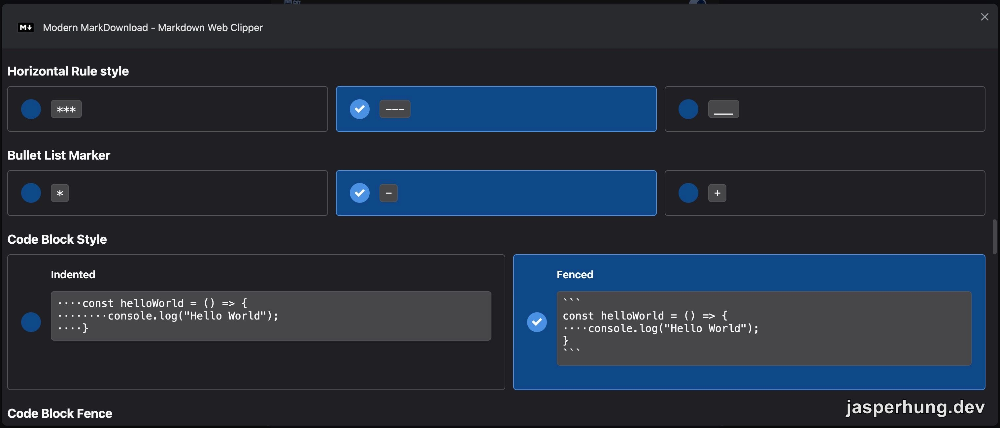
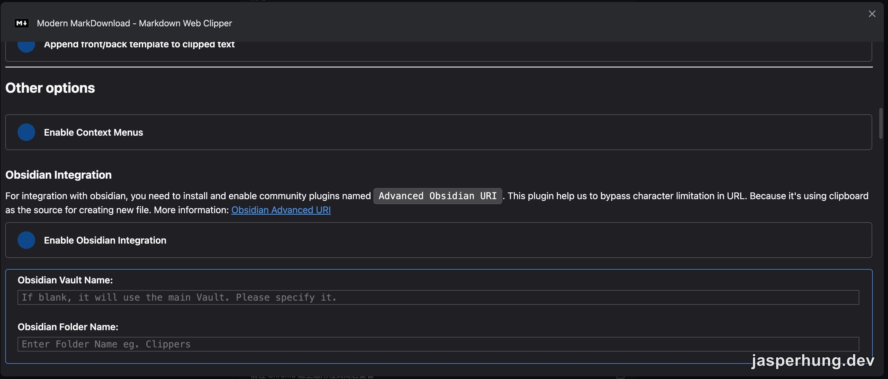

<KeyTakeaways>
  <p>想把 Gemini AI Mode 對話或網頁文章留下來，怎麼少掉全選、複製、建立檔案、貼上、命名與存檔？<a href="https://chromewebstore.google.com/detail/modern-markdownload-markd/lfihmpgmbpingelkgmodjgghdcjeiikk">Modern MarkDownload</a> 能把目前頁面一鍵下載成 Markdown，還能調整下載位置與輸出格式，再交給 Agent 整理成 Obsidian 知識文件。</p>
</KeyTakeaways>

我很常在 Chrome 裡開 Gemini AI Mode 找資料、問問題。Google 搜尋本來就是它的老本行，對話接著搜尋結果往下走也很順；聊到最後，我偶爾會叫它做摘要，卻常常覺得摘要精簡到只剩骨架。

把整段對話留下來比較完整，但手動處理一次就會變成：全選、複製、建立檔案、貼上、存檔，還要另外想一個 file name。五個動作還沒算整理格式。於是我開始問 Gemini：「應該有 Chrome 擴充功能可以一鍵下載內容成 Markdown 吧？」

這篇可以接在 [Session is Knowledge：把 AI 對話保存成自己的知識庫](/posts/session-is-knowledge/)後面。前一篇談為什麼要把 AI 對話留下來，這篇則補上更實際的入口：如何把 web 上的對話或文章快速變成可以交給 Agent 整理的 Markdown。

## AI 先列了三個方向

AI 當時整理出三類工具。這份名單比較像搜尋起點，不是我逐一安裝後的完整評測；我最後只挑最直接的那一個。

| 方向 | AI 當時的解釋 | 我最後的判斷 |
|---|---|---|
| MarkDownload | 把整頁或選取內容轉成 Markdown，也能調整輸出模板 | 最符合「按一下就下載」的需求 |
| Roam-Exporter／Send to Obsidian | 偏向直接整理進 Roam Research 或 Obsidian | 和筆記軟體整合是加分，但不是必要條件 |
| Save Page WE／SingleFile／簡悅 SimpRead | 保存完整 HTML、單一頁面，或先進閱讀模式再匯出 | 功能方向比較廣，和我當下的需求不完全一樣 |

這裡我最在意的取捨很簡單：我只想先拿到一份乾淨的文字檔，不想為了下載 Markdown 先和其他軟體、帳號或服務耦合。整合可以是 plus，不能變成使用的前置條件。

## 最後安裝 Modern MarkDownload

我最後安裝的是 Chrome Web Store 上的 [Modern MarkDownload - Markdown Web Clipper](https://chromewebstore.google.com/detail/modern-markdownload-markd/lfihmpgmbpingelkgmodjgghdcjeiikk)。它的定位很直接：把目前瀏覽的文章或頁面轉成 Markdown，預覽後下載成 `.md` 檔案。

安裝與使用流程很短：

1. 在一般 Chrome 視窗開啟上面的 Chrome Web Store 連結，按下 **Add to Chrome**。
2. 把擴充功能釘選在工具列，之後比較容易找到。
3. 開啟想保存的 Gemini 對話或網頁文章，點擊 Modern MarkDownload。
4. 在預覽畫面確認內容，按下載，得到一份 `.md` 檔案。

Modern MarkDownload 預設會把檔案放進 Downloads，但下載位置可以在設定裡自行調整。這點比我原本想的完整：我可以依自己的 workflow 指定資料夾，不必把 Downloads 永遠當成中繼站；更重要的是，仍然不用手動建立檔案、貼上內容和想檔名。

## Markdown 輸出格式也能照自己的習慣調整

往下看設定後，我才發現它不只負責把頁面轉成 Markdown，連輸出的格式習慣也能調整。像是水平線要使用 `***`、`---` 或 `___`，條列式要使用 `*`、`-` 或 `+`，code block 則能選擇縮排格式或 fenced code block。



<p class="image-caption">Modern MarkDownload 可以調整水平線、條列符號與 code block 的輸出格式。</p>

這些看起來是小設定，但如果 Markdown 之後還要交給 Agent、放進 Git，或直接匯入 Obsidian，統一格式就能少掉後續整理的摩擦。我自己的偏好是使用 `-` 條列與 fenced code block，讀起來比較接近平常寫技術文件的樣子。

如果要處理目前視窗裡的多個頁籤，MarkDownload 的使用說明也列出 `Download All Tabs as Markdown`；只保存一個 Gemini 對話時，我通常直接下載目前頁面就夠了。[MarkDownload User Guide](https://github.com/deathau/markdownload/blob/main/user-guide.md)裡也有 `Download Tab as Markdown`、選取文字下載與 front/back template 等設定說明。

## Markdown 才是接給 Agent 的中間格式

這個工具對我真正有價值的地方，是下載之後還能接回原本的 AI workflow：

```text
Gemini 對話／網頁文章
        ↓
Modern MarkDownload
        ↓
Markdown 檔案
        ↓
Agent 整理、補充與討論
        ↓
Obsidian 知識文件
```

我可以先把對話下載下來，再把檔案交給 Agent，請它讀完後整理成我要的知識文件，最後放進 Obsidian。這樣 Agent 不需要重新 fetch URL、爬頁面、猜哪些內容值得留下來；我也不用把一整段對話再複製到另一個對話視窗。

:::tip
如果目標是接著跟 Agent 討論，下載完成後先看一下檔案大小。Google AI Mode 的來源卡片可能把圖片以 `data:image/...;base64` 形式塞進 Markdown，文字不多，檔案卻可能突然變得很肥。這時先清掉圖片資料或只保留文字，通常比直接把整份檔案丟進 context 更實際。
:::

## Obsidian Integration 先放在下一階段

Modern MarkDownload 的設定裡還有 **Obsidian Integration**。畫面上寫得很清楚：要先在 Obsidian 安裝並啟用 community plugin `Advanced Obsidian URI`，再開啟整合功能，填入 Obsidian Vault Name 與 Folder Name。



<p class="image-caption">Modern MarkDownload 內建的 Obsidian Integration 設定。</p>

照它的設計，設定完成後可以從擴充功能的右鍵選單使用 `Send Tab to Obsidian`，讓內容直接建立成 Vault 裡的新檔案。這個做法確實比手動搬檔案更近一步，但我目前還沒有把它完整接進日常流程，所以先把它當成待測試的延伸功能，而不是文章裡宣稱已經驗證完成的主流程。

我現在比較確定的路線仍然是：先下載 `.md`，再交給 Agent 整理，最後由我決定要不要放進 Obsidian。中間多一個檔案，也多了一個可以檢查內容的機會。

## 無痕模式要另外允許擴充功能

我平常也會在 Chrome 無痕視窗裡使用 Gemini AI Mode。第一次找不到擴充功能時，容易以為安裝失敗；Chrome 的做法是先在一般視窗安裝，再逐一決定哪些擴充功能可以在無痕模式執行。

到 `chrome://extensions/` 找到 Modern MarkDownload，開啟 **Details**，再把 **Allow in Incognito** 打開即可。Google 的[官方說明](https://support.google.com/chrome/answer/2664769?hl=en)也提醒，擴充功能可能讀取你正在瀏覽的頁面，因此只對自己信任、確實需要的工具開啟這個權限。

## 它只是小工具，卻把入口變短了

Modern MarkDownload 沒有替我建立知識庫，也沒有自動判斷一段對話真正重要的地方。它做的事情很小：把「我想留下來的網頁內容」快速變成一份可以繼續處理的文字檔。

但對我的工作方式來說，省掉的正是最煩的那五個動作，連 file name 都不用每次重新想。之後再交給 Agent 整理，整條路就從「複製貼上存檔」變成「下載，然後繼續討論」。一個很簡單的 web 端工具，剛好把 web 和知識庫中間那段空白補起來。
