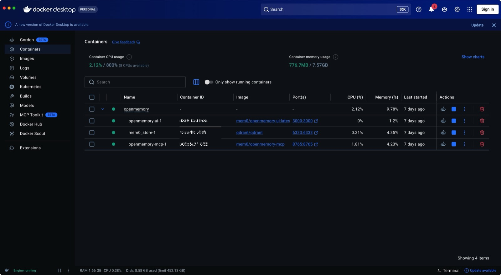
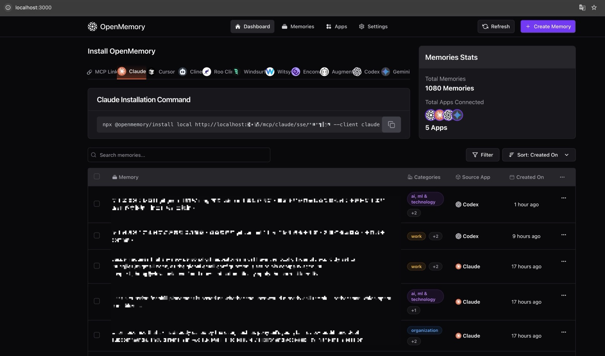
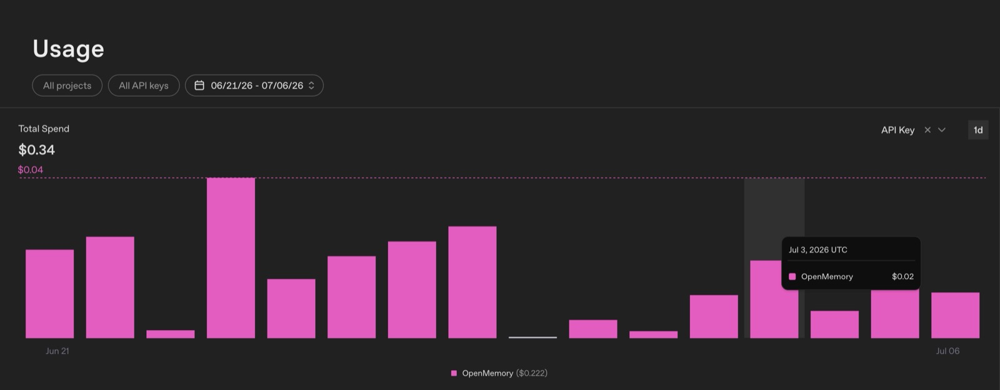
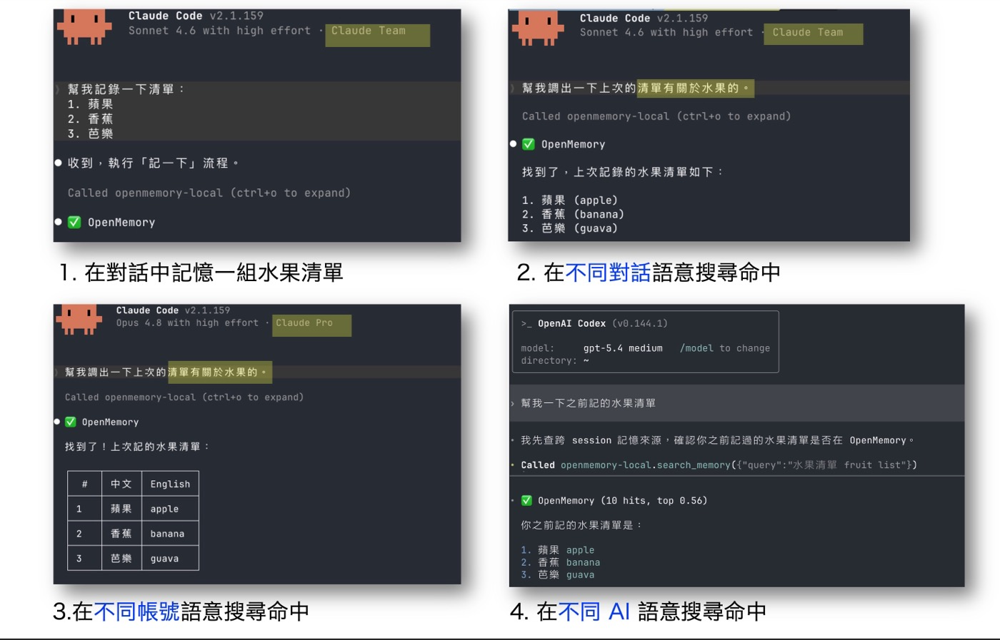

<KeyTakeaways>
  <p>OpenMemory 本地自架要設定哪些東西？用 Docker 啟動 API、Qdrant、Dashboard 三個服務，把 MCP endpoint 加進 Claude Code，再填一把模型 provider 的 API key，最後用水果清單 DEMO 驗證語意搜尋真的通了；自架不等於完全離線，記憶萃取與 Embedding 預設仍呼叫雲端模型。</p>
</KeyTakeaways>

上一篇選定 OpenMemory，是因為我想要一層能跨 session、跨 LLM 共用的記憶服務。接下來就不談比較了，直接把它裝起來。

整個流程表面上只有 Docker、clone repo、填 API key 三件事；真正讓我停下來想的，反而是最後一件。既然服務都跑在本機，為什麼還需要一把雲端 API key？

## 先讓 OpenMemory 跑起來

前置條件很少：[Docker Desktop](https://www.docker.com/products/docker-desktop/)、Git，以及一個模型 provider 的 API key。先 clone [mem0ai/mem0](https://github.com/mem0ai/mem0)，再依 repo 的環境變數範本建立 `.env`。

```bash
git clone https://github.com/mem0ai/mem0.git
cd mem0
docker compose up -d
```

`.env` 裡的 API key 不要 commit。它不是拿來登入 Dashboard，而是讓 OpenMemory 在存入與查詢記憶時，能呼叫模型做萃取與 Embedding。

## 接上 AI

服務起來後，Claude Code 還不知道它的存在，要把 MCP endpoint 加進去：

```bash
claude mcp add --transport http openmemory --scope user \
  http://localhost:8765/mcp/claude/http/<user>
```

URL 的 `claude` 是 client name，`<user>` 是 user namespace。我會讓 Claude Code 用 `claude`、Codex 用 `codex`，但共用同一個 user。這樣 Dashboard 仍分得出來源，兩個工具卻能查到同一份長期記憶。

## 啟動後有三個服務

一開始我以為它只是「有一個 UI 的記憶工具」。用 `docker compose ps` 看才比較理解資料流：OpenMemory API、Qdrant 和 Dashboard 是分工合作的三個服務。



<p class="image-caption">圖：Docker Desktop 中，OpenMemory API、Qdrant 與 Dashboard UI 同時運行。</p>

| Service | 容器 | 負責 |
|---|---|---|
| OpenMemory API | `openmemory-mcp` | 應用邏輯、內嵌 SQLite（原文／狀態）與 mem0 記憶萃取邏輯 |
| Qdrant | `mem0_store` | 向量資料庫，負責語意搜尋 |
| Dashboard UI | `openmemory-ui` | 檢查、管理記憶的介面 |



<p class="image-caption">圖：OpenMemory Dashboard 可查看已存記憶，以及資料來自哪一個 AI client。</p>

## API key 才是安裝後的第一個決策

模型 provider 可以換，選擇不只關於價格，也是在決定資料邊界與願意承擔多少維運。我當時使用的預設組合是 `gpt-4o-mini` 做記憶萃取、`text-embedding-3-small` 做向量化。

| 方案 | 模型／用途 | 成本 | 取捨 |
|---|---|---:|---|
| OpenAI API key | `gpt-4o-mini` + `text-embedding-3-small` | 最低儲值 US$5 | 預設組合，需綁定付款方式；OpenAI API 預設不以 inputs／outputs 訓練模型 |
| Gemini Free Tier | `gemini-2.5-flash` | 0 | 有頻率限制；未付費用量的內容可用於改進 Google 產品 |
| 本地模型 | Ollama（llama 等） | 0 API 成本 | 內容不出機器，但模型、硬體、品質與速度都要自己維護 |

我最後先用 OpenAI。不是因為本地模型不能做語意搜尋，而是我不想在剛開始驗證記憶工作流時，同時處理模型下載、runtime、記憶體和換模型後的重新索引。預設設定會用同一把 API key 呼叫兩種模型：寫入時由 `gpt-4o-mini` 把對話萃取成記憶，再由 `text-embedding-3-small` 為每條記憶建立向量；查詢時通常只需要後者把問題轉成向量，再交給 Qdrant 比對。`text-embedding-3-small` 的 input 價格目前是每百萬 tokens US$0.02，對這個使用量來說，比起硬體與維運時間更不像主要成本。[OpenAI 的 API 資料控管](https://platform.openai.com/docs/models/default-usage-policies-by-endpoint)與 [Embedding 模型文件](https://developers.openai.com/api/docs/models/text-embedding-3-small)可供確認條款與價格。

:::tip
以我實際使用的量來看，一天大約只會消耗 US$0.01–0.02；先儲值 US$5，通常已經足夠用接近一年。這是個人記憶工作流的觀察值，批次匯入大量資料或提高寫入頻率時，成本會跟著改變。
:::



<p class="image-caption">圖：OpenAI API Usage 按日顯示 OpenMemory 的累計用量。</p>

這不是把「自架」說成「完全離線」。有敏感內容、離線需求，或已經有本地模型基礎設施時，Ollama 才是比較一致的選擇；Gemini Free Tier 的資料使用條款也要先看清楚。[Google Gemini API Additional Terms](https://ai.google.dev/gemini-api/terms?authuser=31)

## 寫入流程

寫入一段對話時，流程不是把逐字紀錄丟進資料庫：

```text
原始對話
  ↓ LLM 萃取：壓縮成事實句，必要時去重或更新
  ↓ Embedding：將事實句轉成向量
  ↓ Qdrant：保存語意索引
  ↓ SQLite：保存精煉記憶與狀態
```

container 在本機，但理解文字與產生向量的模型可以在雲端。這就是 API key 在整條寫入流程中的位置。

## 查詢流程

```text
你問問題
  ↓ Agent 判斷是否需要查記憶
  ↓ search_memory("相關查詢")
  ↓ OpenMemory 回傳相關記憶片段
  ↓ Agent 帶著記憶回答
```

查詢本身也會先轉成 Embedding，再從 Qdrant 找出語意接近的候選記憶。它不是關鍵字比對，而是把「我大概記得有這件事」這種模糊線索交給向量搜尋。

## Demo

安裝成功不只等於 container 顯示 running。我用下面幾個地方交叉確認，才知道整條路真的通了。

| 檢查點 | 要確認的事 |
|---|---|
| Docker | 三個服務都正常啟動 |
| Dashboard | 寫入的記憶與來源 client 出現 |
| OpenAI API Usage | 寫入後有很小的模型用量 |
| MCP | Claude Code 能呼叫存取與搜尋工具 |
| 語意搜尋 | 不靠原句關鍵字，也能找回相關記憶 |

最後一項我用水果清單測。寫入時，我只說「幫我記憶一個清單」，內容是蘋果、香蕉、芭樂；沒有日期、沒有標題，也沒有說這是一份水果清單。隔一段時間後，我只憑著模糊印象問「我記得有一個清單裡面有水果」，OpenMemory 仍能正確找回這段記憶。

這很像人怎麼回想事情：常常只記得大概的輪廓，卻記不起原本的用字。語意搜尋能把這種模糊描述和記憶內容對上，才是我覺得它特別好用的地方。這個 DEMO 不只證明它這次找對了，更確認 Docker、MCP、模型與向量資料庫都串起來了。



<p class="image-caption">圖：水果清單先被寫入，再在不同對話、不同帳號與不同 AI 中以語意搜尋找回。</p>

## 心得

OpenMemory 本身只負責存與查；每個 prompt 要不要查、哪些話值得記，仍要由接上的 AI 依 instructions 判斷。當規則設計得夠清楚，專案裡曾經用過的套件、工具或設計模式，就算我只記得一個模糊的印象，AI 也能透過語意搜尋命中關鍵片段，再找回當時的對話摘要與決策脈絡。

有些值得留下的東西，不會長得像正式規格。可能只是討論時說了一句「這個蠻有趣的」、「這很酷」，或是明確交代「幫我記一下，之後要查」。AI 可以把這些語氣當成候選訊號，但不是看到就一律記錄；真正的取捨仍要落在自己的[記憶策略](/posts/openmemory-memory-strategy/)裡。

偏好也是同一類記憶。像是「我喜歡哪一種設計方式」、「文章想用什麼語氣」，或「希望 AI 怎麼和我討論」，只要記憶規則把它們視為長期偏好，就可以存進 OpenMemory。之後持續使用時，AI 不必每次重新問起，卻仍能依這些背景調整合作方式。

後來最有驚喜感的時刻，是在另一個 session 裡隨口提到某個情境，AI 卻找回我們很久以前聊過的東西。越用越會感覺 AI 越懂你；它不是憑空變得更聰明，而是有了可以一起回頭看的共同記憶。那種熟悉感，才真的像多了一位一路合作過的夥伴。

更重要的是，這顆記憶引擎不綁定單一 LLM 或帳號。之後換了不同的模型、不同的 AI 工具，甚至不同帳號，只要接到同一個 OpenMemory，就能持續共用這些共同記憶。對想把 AI 當成長期協作夥伴的人，我會推薦從這種小小的本地自架開始試看看。
