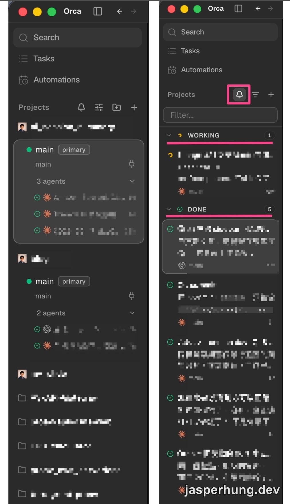
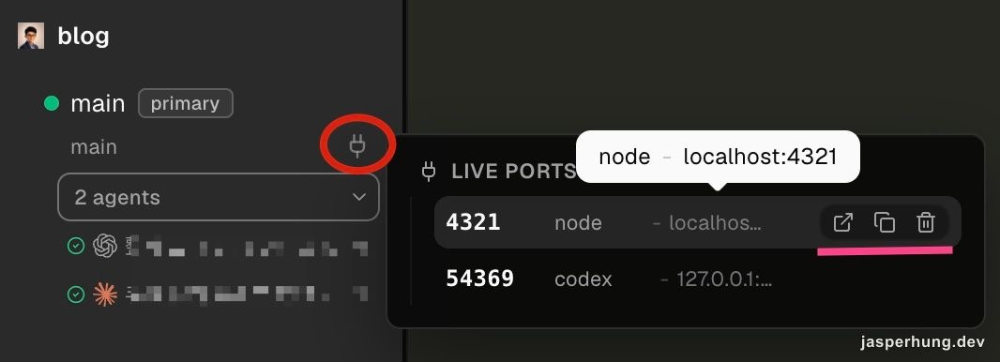
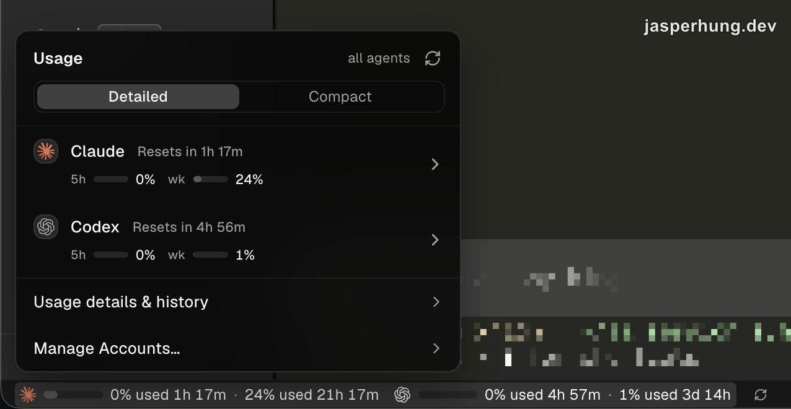
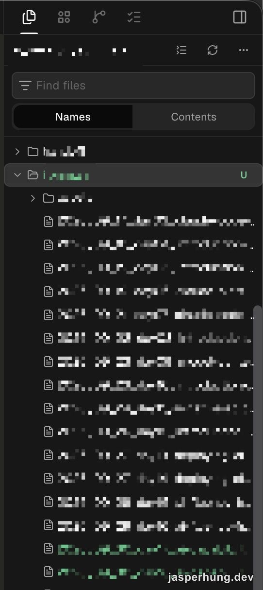
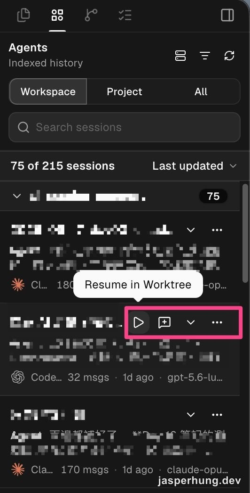
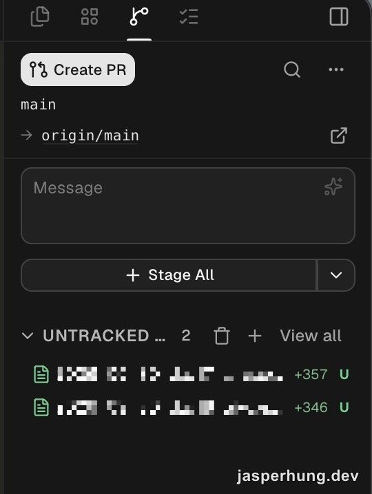
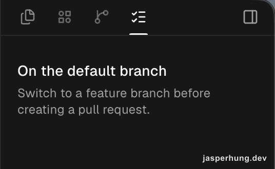
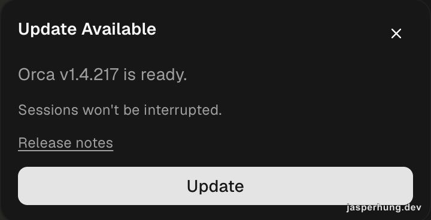

<KeyTakeaways>
  
Orca ADE 是什麼？它是一個以 Agent 為核心、整合 IDE、Git worktree、Agent 開發控制台與 remote control 的開發環境，適合需要平行執行多個 Agent，並從手機或 iPad 接續桌面工作的開發者；這是我從 cmux 轉用 Orca ADE 一個月後的實際觀察。

</KeyTakeaways>

我原本一直用 cmux 來管理 Claude Code、Codex 這些 Agent。它已經足夠好用，尤其適合把幾個 terminal 排在一起，同時看不同專案的工作進度。

不過當我看到 Orca ADE 後，還是決定實際裝起來試試看。

[Orca 官方網站](https://www.onorca.dev/)｜[GitHub repository](https://github.com/stablyai/orca)

## 左側 Sidebar

左側 sidebar 可以按 Project 整理，每個 Project 底下展開正在執行的 Agent；也可以關掉分組，只看目前還在跑的工作。同時開著好幾個專案時，哪個專案手上有幾個 Agent、是 WORKING 還是 DONE，掃一眼就知道。

### Project 與 Agent 狀態

圖：左側 sidebar 可以依 Project 顯示 Agent，也能切換成只看目前執行中的工作，並區分 WORKING 與 DONE 狀態。

### Live Ports 管理本地伺服器

Project 卡片旁邊是 Live Ports。Agent 開啟本地開發伺服器後，Orca 會列出目前使用的 port、啟動它的工具，以及對應的 localhost 位址。從這裡可以直接開啟、複製連結或停止伺服器，不用再回 terminal 找是哪個程序佔用了哪個 port。

圖：Live Ports 直接列出 Agent 開啟的本地伺服器，並提供操作按鈕。

### Agent Usage bar

左下角那條是 Agent Usage bar，上面是 Claude、Codex 等帳號目前的使用量、重置時間和週期額度，點開還有 usage history 和帳號管理。同時掛著三個帳號，額度在哪裡見底就變成要常看的事。

圖：左下角的 Agent Usage bar，可以快速查看不同 Agent 的使用量。

## 右側 Sidebar

右側 sidebar 是我每天來回最多次的地方。

### Explorer：看 Agent 改了哪些檔案

Explorer 顯示目前 Project 的資料夾路徑和檔案樹。修改過的檔案是橘色、新增的是綠色，和 VS Code 同一套習慣，所以 Agent 動完哪些檔案，掃一眼就知道。我從這裡打開來確認，或接著自己改幾行。

圖：Explorer 顯示目前專案的資料夾路徑與檔案結構。

### Agents：找回專案裡曾經的對話

這個專案過去建立過的 Agent session 都留在 Agents 裡。它比較像一個可以搜尋的 resume 入口：找到之前的對話，直接回到原本的 worktree 接著做，而不是重新描述一次背景。

圖：Agents 會保留專案內曾經使用過的 Agent 對話，方便重新接續。

### Source Control：從 Git 狀態一路做到 Create PR

這裡可以查看目前 branch、檔案變更、stage 或 unstage，commit 完也能直接建立 Pull Request。Agent 改完一輪之後，從看 diff 到開 PR 都在同一個視窗裡。

圖：Source Control 可以查看 Git 狀態、管理變更，並直接 Create PR。

### Checks：把外部工作流程帶回 Project

Checks 是集中查看 Pull Request、CI 和其他工作流程狀態的入口。我還沒把它接上任何帳號，不過官方文件已經列出 GitHub、GitLab、Bitbucket、Azure DevOps 和 Gitea 的 hosted review / checks 支援，也提供 Jira 整合來瀏覽 issue、建立 worktree 和回連任務。

圖：Checks sidebar 目前顯示與 Project 相關的檢查與整合入口。

這表示「從任務建立 worktree、讓 Agent 實作、查看 checks、建立 PR」有機會串成同一條流程。完整程度要接上帳號才知道。

## 更新速度快到每天都會看到通知

這張畫面顯示的是 v1.4.217，更新訊息特別寫著 Sessions won't be interrupted，至少代表更新時有把正在執行的 Agent 工作狀態當成一回事。

圖：Orca 幾乎每天都會收到更新，且更新提示會標示不會中斷現有 session。

## 帳號與 Agent 的使用方式

Orca 可以掛上本機已經登入的 Agent 帳號，官方也支援 Claude Code、Codex 等多種 CLI Agent。我的使用情境是同時使用兩個 Claude 帳號和一個 Codex 帳號，再依照不同專案切換。

這裡有一個需要先理解的限制：一個 Agent session 綁定一個帳號。如果想在同一個 Agent 裡切換另一個帳號，不能期待它自動混用；通常要透過 Orca 的 account switcher，或另外用指令開啟一個新的 Agent session。常用的指令也可以設定成 keyboard shortcut，久了之後切換速度很快。

這種設計反而讓帳號邊界變得清楚：哪個 workspace 在用哪個帳號、哪個 Agent 在吃哪一組額度，追起來不會混。官方文件也把 usage 和 rate-limit tracking 列為內建功能。

## Orca ADE 跟一般 terminal 最大的差別

Orca 把自己定位成 ADE，也就是 Agent Development Environment。官方的做法不是重新做一個只能使用自家模型的 AI IDE，而是讓 Claude Code、Codex、OpenCode 等原本就在 terminal 裡工作的 Agent，直接使用你已經訂閱和登入好的帳號。

在同一個 Orca workspace 裡，我可以開不同的 worktree、terminal 和 Agent。每個 worktree 都有自己的 branch 和檔案目錄，因此可以讓 Claude Code、Codex 或其他 Agent 分別處理不同任務，互不覆蓋地平行開發。這也是 Orca 強調的 [worktree-native 開發方式](https://www.onorca.dev/docs/model/worktrees)：不是把多個 Agent 擠在同一個資料夾，而是讓每個任務都有自己的隔離工作區。

Orca 也會把每個 Agent 的狀態、工作中的分頁與 terminal 輸出留在同一個環境裡。官方文件提到，Orca 的 worktree 可以在本機、SSH 主機或 Remote Orca Server 上執行；這個設計讓「我正在用哪一台電腦」和「工作實際跑在哪裡」開始分開。

它的 terminal 也不是單純把 shell 嵌進視窗而已。Orca 會替 Agent 顯示 working、waiting for input、completed 等狀態，terminal tab 的內容在重新開啟後也能接續。

## 我最常用的功能：遠端接管整台開發環境

我之前寫過一篇[透過 Tailscale 遠端連線到 Mac 開發環境](/posts/tailscale-dev-server-access)，當時的核心是先讓設備之間建立一條安全、穩定的私人網路。Orca 把這個概念再往前推了一步：遠端連線的不只是 SSH 或某一個 terminal，而是整個 Orca runtime。

官方文件把 Remote Orca Server 說得很清楚：Server 電腦負責保存專案、worktree、terminal、provider account 和 Agent session，Client 電腦則提供操作介面。只要 Server 保持開機，Agent 就可以繼續工作；筆電睡眠或暫時斷線後，重新連線仍會回到原本的 workspace 和分頁狀態。對我來說，這就是 Orca 最值得換過來的地方。

實際使用時，我可以讓家裡的 Mac 繼續跑 Claude Code 或 Codex，自己則用另一台電腦、手機或 iPad 查看進度。Agent 需要回答問題時，我不必重新登入電腦，也不必重新建立對話，只要從遠端回覆就能讓工作繼續。這種感覺比較像是把整台開發電腦放進口袋裡，而不是單純把 terminal 畫面投影到手機上。

## Orca ADE 是 Agent 開發的控制中心

Orca ADE 用了一個月下來體驗真的很好，功能也進步得很快。它天生就是一個把 IDE、Agent 開發控制台、Git 與 remote control 組合在一起的工作環境：想瀏覽檔案，可以直接從 Explorer 找；想知道 Agent 做了什麼，可以從 Agents 回到歷史對話；想看 Git 狀態或建立 PR，也不需要離開 Orca。

更重要的是，遠端和桌面看到的是同一個畫面，接管起來很直接。不過光是 sidebar、Project、Agent、Git 和 checks 就已經寫了不少，遠端控制值得獨立一篇。下一篇我會專門整理 Orca 的遠端連線方式，以及手機或 iPad 接管之後實際看到的工作畫面和操作流程。
