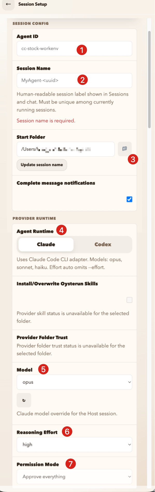
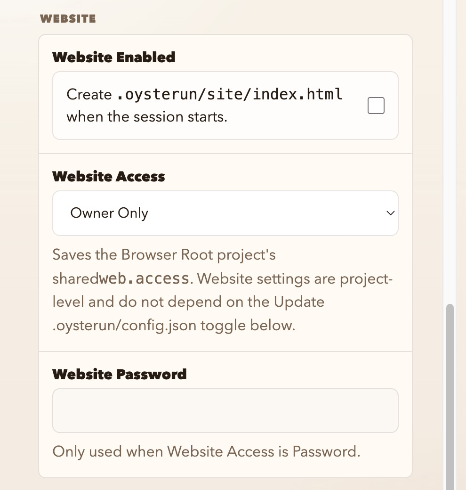
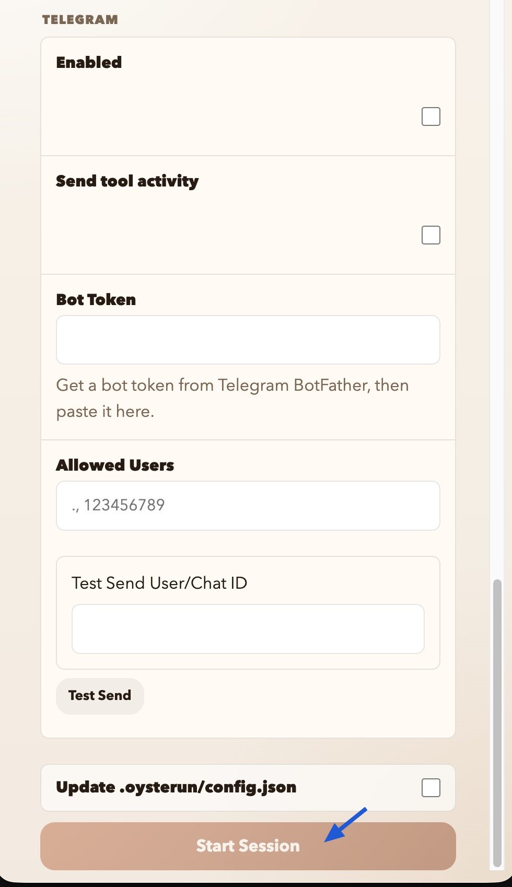

Claude Code 與 Codex 都有自己的遠端方案，但我有一個帳號無法直接用 Claude 的內建 Remote Control。於是我開始找另一條路，最後碰到 Oysterun。

一開始我以為它只是「把手機接回 terminal」的工具；實際裝起來後才發現不對。它不是 SSH、也不是 Telegram、Slack 或 Discord 的轉接 bot。Oysterun 是一套自己做了手機對話窗的 AI Host：手機對它說話，它在本機啟動 Claude Code 或 Codex，再把工作進度、檔案、通知和報告交回手機。

## 它把手機接到本機 Host，不是接到模型

Oysterun 由 iOS App 與裝在 Mac 或 Linux 的 Host 組成。Claude Code 或 Codex 仍然在自己的電腦上、用自己的登入帳號執行；Oysterun 不提供模型算力，只提供手機與本機 agent 之間的控制層。[官方說明](https://oysterun.com/)也強調，對話、檔案與 agent 訊息不會經過 Oysterun Cloud；手機會直接和自己的 Host 溝通，Cloud 只處理配對資料與 push notification。

它的 App 不是簡化版 terminal，而是自己的工作桌。除了聊天，還能建立或接續 Oysterun 管理的 session、瀏覽本機檔案、查看 HTML／Markdown 報告、收到核准與完成通知，甚至排程工作。這正是它和單純 SSH 連線的分水嶺。

## Tailscale 只負責讓兩台裝置找得到彼此

本機 Host 啟動後，手機必須能連回它。人在同一個區網時，可以直接用區網位址；但我希望不管手機在哪裡都能用，所以沿用前面那條 [Tailscale 私有網路](/posts/mac-ssh-tailscale-setup/)。

Mac 與 iPhone 加入同一個 tailnet 後，手機便能用 Mac 的 Tailscale IP 連到 Oysterun Host。這裡 Tailscale 做的事情很單純：安全地打通兩台裝置，不替我處理對話、不代管 AI，也不改變 Claude Code 或 Codex 的帳號與訂閱。

Oysterun 官方目前也把 Tailscale 列為沒有 public IP 時的建議做法；它自己的 Tunnel Service 還在 roadmap 上。[Oysterun FAQ](https://oysterun.com/) 

## 完整設定時，每一題其實在問什麼

第一次執行 `oysterun` 時，Host setup 會依序問名稱、port、手機要連回哪個 URL、檔案瀏覽根目錄、密碼與 telemetry。下面是我的實際流程，但 Host 名稱、Tailnet IP、Host ID、帳號路徑和 provider 執行檔都已替換；重點是第 3 步要手動填入 Tailscale 位址，而不是選區網 IP 或 `localhost`。

```text
Oysterun Host runs on this Mac.
Your iPhone connects to this Host to chat with local agents.

[1/7] Host name
? Name this Host [oysterun-your-mac]:

[2/7] Host port
? Host port [8802]:

[3/7] iPhone connection URL
  1. Local network Wi-Fi/LAN: http://192.168.x.x:8802
  2. This Mac only: http://localhost:8802
? Choose Host URL [1] or paste a different URL: http://100.x.x.x:8802

Default Browse Root [/Users/you/OysterunAgents]:
```

### 第三步才是這篇的關鍵：填 Tailscale URL

同一個 Wi-Fi 時，區網 IP 已經夠用；想讓手機離開家或辦公室後仍能連線，就填 Mac 的 Tailscale IP。`localhost` 只代表 Mac 自己，手機永遠連不到它。

```text

[4/7] Host password
? Create Host password: ******
? Confirm Host password: ******

[5/7] Help improve Oysterun?
? Enable daily telemetry? (Y/n) N

✓ Direct-IP Cloud Host registration complete
  Host ID: [redacted]
  Direct Host URL: http://100.x.x.x:8802
  Default Browse Root: /Users/you/OysterunAgents
  Detected providers:
  Claude: /path/to/stable/claude
  Codex: /path/to/stable/codex

[6/7] Phone app
? Show phone app download link and QR code? (y/N)

[7/7] Start Host
? Start Oysterun Host now? (Y/n)

✓ Oysterun Host is running at http://100.x.x.x:8802

Direct Host connection QR
（本文 QR 改為 jasperhung.dev，非實際 Host 配對碼）

                                     
                                     
    █▀▀▀▀▀█ ▀█ ▄█  █████  █▀▀▀▀▀█    
    █ ███ █ ▀▄ ▀▀▄ ▀▀▄ █▀ █ ███ █    
    █ ▀▀▀ █ ▀█ █▄ ▀ █ ▄▀█ █ ▀▀▀ █    
    ▀▀▀▀▀▀▀ █ ▀ █ █ █ ▀ ▀ ▀▀▀▀▀▀▀    
      ▄ ▄▀▀▄▄ ▀▄▀ ██▄▄▀ ▄ ▀ █ █▄▀    
    ▄▀█▀▄█▀██▀█▄█▀▀▄███▄▄▀██▄▄▀      
     ▄▀▄▀█▀▄▀▄   ▀▄ ▀▀▄██▀█ ▄█ █▄    
     ▄ ▀█▀▀▀▄▀█▄ ▀▄█▄██▄▄ ▀▀▄▄▄▄▄    
    ▄██ ▄█▀▀▀▄▀ █▄▄ ▀▄▀██ ▄▄▄▀█ ▄    
    █▀▀▄▀█▀▀▄▀ ▄▄  █ ▀ ▀▄▄▄█ █▀ █    
    ▀    ▀▀▀▄  ▀ ▀▀ ██  █▀▀▀███      
    █▀▀▀▀▀█ ▄ ▀▄▀███▄  ██ ▀ █▄       
    █ ███ █  █▄▀█▄▄   ▀██▀▀█▀▄ █     
    █ ▀▀▀ █   █   ▄▀█▄▀▀▀██▀██▄▀▄    
    ▀▀▀▀▀▀▀   ▀ ▀▀    ▀▀ ▀  ▀ ▀      
                                     

  Host ID: [redacted]
  Direct Host URL: http://100.x.x.x:8802
  iPhone: scan the QR above.
```

## 建立 session 時，工作目錄可以再選一次

手機連進來的畫面，和 Mac 上開啟 Oysterun Web 的畫面是一模一樣的；它不是另一套被簡化的手機管理介面。因此手機上也能直接建立 session、選工作目錄與調整 agent runtime。

Setup 裡的 `Default Browse Root` 只是 Explorer 打開時的預設起點，不是每一個 agent 的工作目錄。真正建立 session 時，仍可以在 `Start Folder` 重新挑本機任何一個工作資料夾；所以我可以把 OysterunAgents 當作好找的預設入口，實際工作仍在原本的 repo 裡進行。



<p class="image-caption">建立 session 時，重新選工作資料夾、Claude／Codex runtime、模型、reasoning effort 與 permission mode。</p>

這個畫面裡，我會在意的順序是：

1. `Agent ID` 是這個 agent 設定的識別值；`Session Name` 則是之後在 Sessions 和聊天畫面看到的人類可讀名稱。
2. `Start Folder` 可以重選，所以不用被 setup 時填的 Browse Root 綁住。
3. `Agent Runtime` 目前只有 Claude Code 與 Codex 兩種。它辨識的是 provider 執行檔，不是帳號 profile；即使同一個 provider 有兩個帳號，也不會在這裡變成第三、第四個可選 runtime。
4. 選定 runtime 後，Oysterun 會帶出該 provider 可用的模型；接著可挑 `Reasoning Effort` 和 `Permission Mode`，最後才按 Start Session。

### Website 與 Telegram 是選配，不是基本設定

`Website Enabled` 會在 session 開始時建立 `.oysterun/site/index.html`，讓 agent 可以把成果做成一個可直接在 Oysterun 裡開啟的網站或互動報告。`Website Access` 控制這個 project 網站的存取範圍：預設 `Owner Only`；若真的要分享才需要調成 password 等其他模式。一般只是讓 agent 寫 code、回報文字或產出單一 HTML／Markdown 檔時，不必開它；Oysterun 原本就有 File Preview，Website 比較像給完整成果頁的輸出面。官方也把它定位成 agent-published websites，而不是遠端桌面的必要功能。[Oysterun 官方說明](https://oysterun.com/)



<p class="image-caption">Website 是 project-level 設定；只有要讓 agent 建立完整成果網站時才需要開啟。</p>

Telegram 則是另一條通知／操作入口：填入 Bot Token、限制 Allowed Users，選擇是否送出 tool activity，再用 Test Send 驗證。這次我沒有實測，所以不把它當成建議流程；有既有 Telegram 工作流的人可以自行研究，但它不是 Oysterun 手機 App 的必要條件。



<p class="image-caption">Telegram 整合可設定 Bot Token、允許使用者和測試通知；本文未實測。</p>

## 它能接續的，是 Oysterun 自己開的工作

這是最需要先理解的取捨。Oysterun 能 resume session，但不是把我平常 terminal 裡所有既有的 Claude Code／Codex 對話都自動收進來。

我實測與讀實作後確認：它會用自己的 Host 工作流開出 provider session，再由自己的 App 介面管理。之前在 terminal 手動開、不是 Oysterun 建立的 session，不會自動出現在手機裡，也不能從 Oysterun 直接接上。

所以它不是替既有工作多拉一條手機線，而是換一套開始工作的方式。之後若想從手機接回同一段工作，最好一開始就從 Oysterun 的 session 開始；代價是我不再待在熟悉的 Claude Code interactive terminal，而是把主要互動交給 Oysterun 的 chat UI。

## 安裝時踩到的三個現實問題

官方安裝指令是 `npm install -g oysterun@latest`。我一開始照平常習慣，改用 pnpm 做全域安裝；結果它找不到自己的 Claude ACP runner，改回 npm 才能正常 materialize。這不是通用的「npm 比 pnpm 好」，而是 Oysterun 當時的啟動檢查假設了 npm 的 node_modules 結構。

後面還踩到兩個環境問題：cmux 的臨時 shim 被 Host 當成真正的 `claude`／`codex` 執行檔；以及 launchd 還記著舊的 pnpm 安裝路徑。前者要把設定改回穩定的實體執行檔，後者得移除舊 service 再重新註冊。它們都不是手機端問題，卻剛好提醒我：這類「在本機替 agent 加一層 Host」的工具，真正難的常常是本機環境。

## 它不是替代品，而是另一個工作桌

Oysterun 最吸引我的地方，是它沒有要求我把工作搬到 Slack、Telegram 或另一個聊天平台；它從一開始就提供自己的手機工作桌，專門處理 coding agent 的對話、檔案與成果。

不過它也很明確地交換了東西：Claude Code Remote Control 適合接手一條已在 terminal 裡工作的 live session；Codex Remote 適合從 host 的 project/history 找回工作；Oysterun 則適合願意從它的 Host 開始一條新工作，換取一套自己的手機控制面板。

對我來說，這不是「又一個 Remote Control」。它是一條以 Tailscale 為網路底座、以自己的 chat UI 為工作入口的第三條路。
