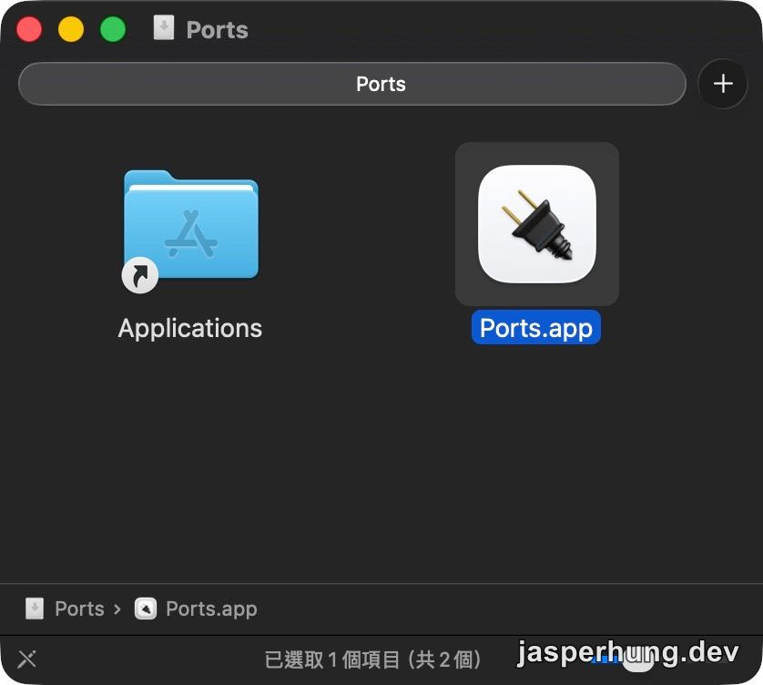
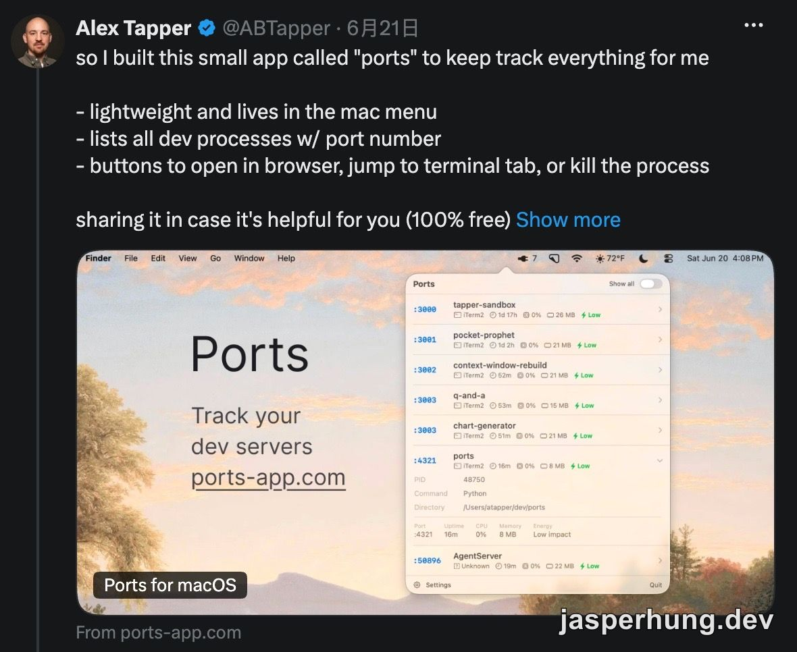

import KeyTakeaways from '../../../components/KeyTakeaways.astro';

<KeyTakeaways>
  
Ports 是一個免費的 macOS menu bar 工具，會列出 localhost 上正在執行的 dev server，顯示 port、uptime 與資源狀態，並讓你快速開啟瀏覽器、跳回 terminal 或結束不需要的 process。

</KeyTakeaways>

最近用 AI Agent 幫忙測試一個功能時，我突然想到：它是不是又在某個 terminal 裡啟動了一個 dev server？

這不是 Agent 做錯什麼。測試時需要先啟動服務、用 Playwright 開瀏覽器驗證，本來就是合理的做法；只是測試結束後，如果我沒有明確要求它清理，這個服務就可能繼續留在背景。等到我自己要開另一個專案，才發現熟悉的 port 已經被占用了。

## 最麻煩的是找不到那個 process

以前遇到這種情況，我通常要先回想：是哪一個 terminal？是哪一次讓 Agent 幫忙測試？接著可能要逐個分頁找，或再問 Agent 有沒有開過什麼 port、能不能幫我關掉。

這個過程最浪費的不是執行 `kill` 的時間，而是重新建立上下文的時間。要找 terminal、描述問題、等 Agent 查詢，再確認它關掉的是不是正確的服務；如果直接交給 Agent 操作，也會多消耗一輪 token。

## Ports 把查找成本縮成一個下拉選單

我是在 Threads 上偶然看到 Ports，下載後才發現它的做法非常直接：打開 menu bar 裡的 Ports，就能看到目前 localhost 上有哪些 dev server，以及它們使用的 port。

官方網站列出的資訊包含服務名稱、port、uptime、CPU 與 memory，還有類似 Activity Monitor 的 energy badge；每個項目也能直接在瀏覽器開啟、跳到擁有它的 terminal，或結束對應的 process。[官方網站](https://www.ports-app.com/)目前標示支援 macOS 14+、Apple Silicon 與 Intel，而且免費提供下載。

第一次安裝 Ports 時，直接把 Ports.app 拖到 Applications 資料夾即可。

我實際用起來最有感的地方，是不用再猜「到底是哪一個 Agent 開的」。看到不需要的服務，就自己點掉；需要確認內容時，也可以先從 menu bar 直接開啟瀏覽器。整個操作比回頭翻 terminal 快很多。

## 原作者自己也遇到同一個問題

後來我找到原作者 Alex Tapper 在 X 上分享 Ports 的貼文。他把這個工具描述成一個輕量、住在 macOS menu bar 裡的小工具：列出所有 dev process 與 port number，並提供開啟瀏覽器、跳到 terminal tab、結束 process 的按鈕。[Alex Tapper 的原始 X 貼文](https://x.com/ABTapper/status/2068587240670843083)

原作者 Alex Tapper 的貼文；他做這個工具的起點，和我現在遇到的問題幾乎一樣。

這也是我覺得它特別剛好的地方。它沒有試著替 Agent 增加更多自動化，而是把「現在到底有哪些服務在跑」這件事攤在眼前。Agent 可以繼續幫我啟動服務、跑測試；測試結束後，清理工作則回到一個我自己看得懂、按得下去的介面。

對我來說，Ports 最有價值的地方，是不用先找到 Agent 在哪個 terminal 裡。看一下 menu bar，就能知道哪些服務還在跑，直接關掉不需要的 process。這種小工具沒有什麼複雜功能，但剛好把 AI-assisted development 裡一個很瑣碎、很常發生的問題處理掉了。
