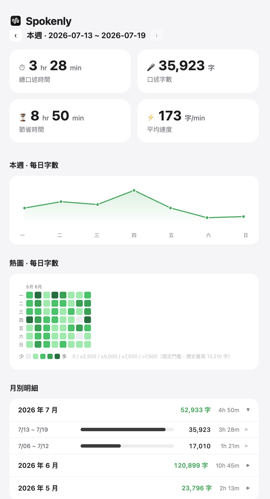
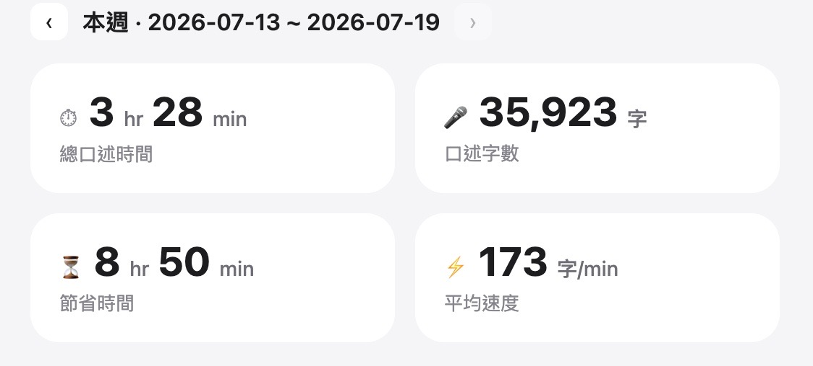
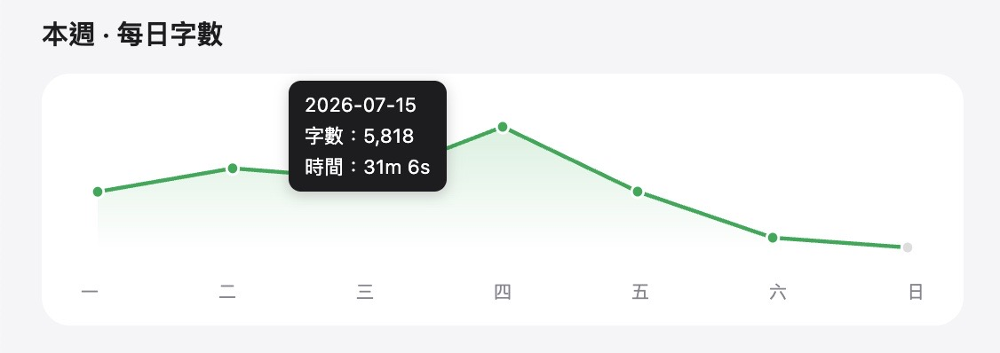
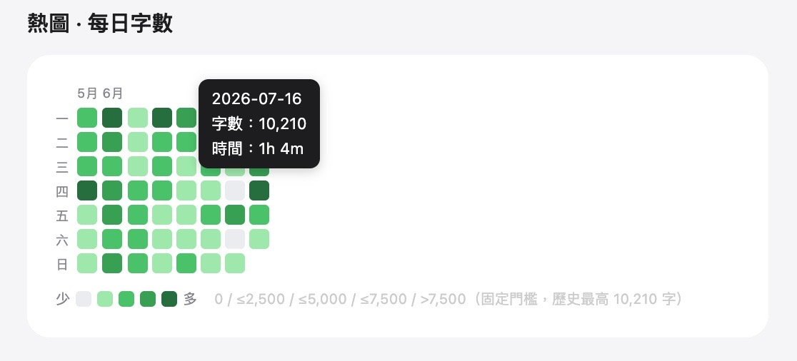
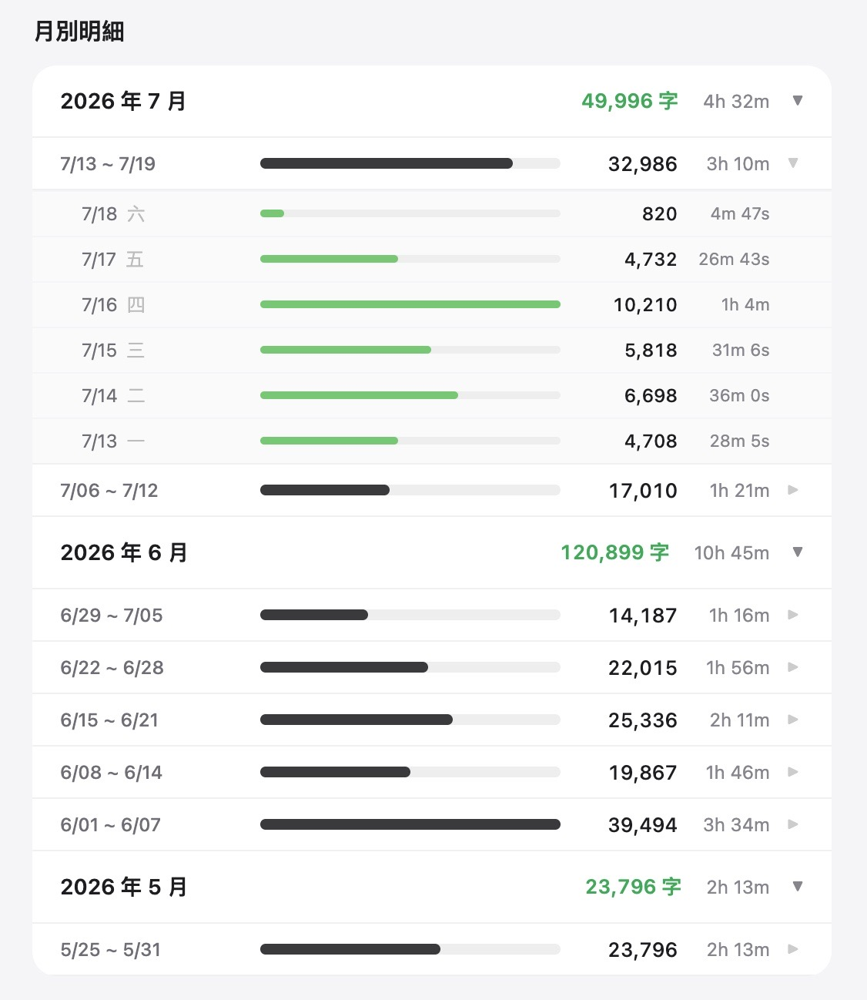

<KeyTakeaways>
  
Spokenly 的聽寫歷史紀錄除了拿來調校指令，還能做什麼？我用一支 Python 程式把每天的口述時間與字數加總，輸出成單一 HTML 靜態 Dashboard，含核心指標、週趨勢、GitHub 風格熱圖與月別明細；其中「節省時間」是用可調打字速度基準推算的估算值，不是真的多出來的時間。

</KeyTakeaways>

上一篇，我把 Spokenly 的歷史紀錄當成調校 AI 指令的材料：從原始轉錄和最終文字的差異裡，找出固定誤辨，再決定該調哪一個旋鈕。

Spokenly App 裡會保留每一次聽寫的歷史紀錄，可以回看原始轉寫、最終文字和音檔。當時和 AI 分析這些 log 時，我忽然想到：既然每筆歷史紀錄都已經躺在我的電腦裡，為什麼不乾脆把它做成一個 Dashboard？

我先參考 Typeless 的儀表板。它的口述時間、字數、節省時間和平均速度四個指標很直覺；接著再和 AI 討論，能不能加上 GitHub 風格的熱圖，以及可以一路展開到每天統計資料的月別明細。

## 歷史紀錄，就是資料來源

Spokenly 每次聽寫都會留下 JSON：日期、音檔長度、原始轉寫和最終輸出都在裡面。這原本是我用來找固定誤辨、調校 Word Replacements 和 AI 指令的材料；換個角度看，它也是一份完整的使用紀錄。

我用一個小小的 Python 程式把每一天的口述時間、字數和次數加總，再輸出成單一 HTML 檔。沒有資料庫、沒有登入頁面，也沒有常駐伺服器；需要更新時跑一次程式，然後直接開檔案即可。

## My Spokenly Dashboard

Dashboard 最上面只有四張卡片：本週總口述時間、口述字數、估算節省時間，以及每分鐘字數。下面再放最近七天的趨勢、GitHub 風格的熱圖和按月展開的明細。

圖：Dashboard 全貌，從本週指標一路看到長期的月別明細。

### 「節省時間」怎麼算？

其中「節省時間」不是 Spokenly 原生提供的數字，而是用一個可調整的打字速度基準，對照實際口述時間得出的估算。它的目的不是宣告我真的多出幾小時，而是讓我在每週使用量之間有一個一致的比較方式。

圖：四張數據卡片把本週口述量、平均速度和估算結果放在同一個畫面。

這不是憑空多出一個工作天，而是一個很具體的對照：同樣這些文字，若全部改由鍵盤輸入，估計還要多花多少時間。

這些數字做成畫面後，比我預期有趣很多。回頭看某一天特別低，通常不是突然沒有想法，而是排滿會議、請假，或根本沒有打開電腦；反過來也有幾個週末數字高得很誇張。明明是假日，我卻還在和 AI 討論，滑手機的時間反而少了 XD。

折線圖和熱圖也都能在滑過時顯示當天的字數與口述時間，方便查看精確數字。

圖：週統計讓單日波動可以一起看；游標滑過折線圖會顯示該日的字數與口述時間。

## GitHub 熱圖

工程師對 GitHub 的 contribution heatmap 很熟悉：一格一格的顏色，很快就能看出某段時間有沒有持續投入。我把同樣的視覺語言搬到 Spokenly。顏色深淺代表相對使用量，滑過某一天就能看到當天的字數和口述時間；比起一串日期和數字，更容易看出自己在哪一週真的有把口說變成工作習慣。

圖：熱圖保留單日細節，讓總量之外的使用節奏也看得見。

## 月別明細

月別明細則把熱圖攤開來看：從月、到週、再到每天，一層一層展開每段時間的字數、口述時長和相對長條。它不是另一張漂亮的圖，而是讓我在看到某週字數特別高時，能立刻確認：是某一天真的密集口述，還是幾天累積起來的結果。

圖：月別明細可以從總量一路展開到每日，回看數字背後的實際節奏。

## 一個日期 bug，讓我重新切分資料和畫面的工作

第一版把週別和星期名稱交給前端整理。結果畫面上顯示的週期整整偏了一天，星期名稱也跟著錯位。問題不是統計資料，而是前端拿到原始日期後，還必須處理日期解析、週別歸類和顯示名稱；這些修復邏輯一多，畫面就更容易出現看不見的偏差。

後來我把「這筆紀錄屬於哪一週」和要顯示的星期名稱，都在資料產生時先整理好，再交給前端當成渲染條件。前端不再猜日期，只負責把已經定義好的資料畫出來。

這個修正讓我更確定一件事：不要把所有原始資料一股腦丟給前端，再期待它同時整理、判斷和呈現。資料層先把資料整理成畫面真正需要的形狀，畫面層專心渲染；每一段做自己擅長的事，整體的修復邏輯反而更少、更容易驗證。

## Dashboard：把歷史紀錄具現化

前幾篇裡，我把 Spokenly 拆成了本地 Whisper、字串替換和 LLM 整理三層；這個 Dashboard 則補上了第四件事：觀測。

規則調得再多，如果沒有回頭看的方法，很容易只剩下「我覺得最近好像比較順」。現在我可以先看到使用量和節奏，再挑 History 裡的真實案例研究品質。對一個個人 workflow 來說，這樣就夠了：不用做一個產品，只要讓下一次調整有資料可以依據。

事後看，這個小工具最有趣的地方不是畫面本身，而是它把口述這件原本很直覺的事，留成了一條可以繼續玩的回饋迴路。
