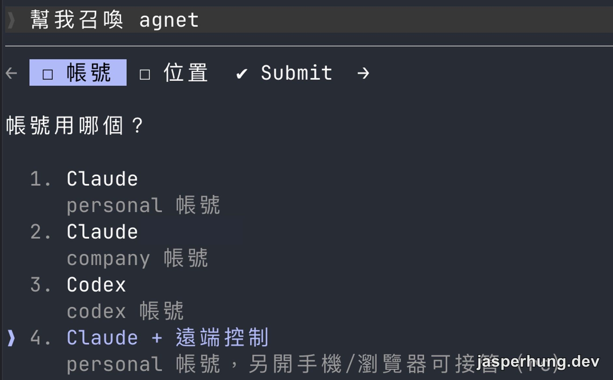

遠端控制用久了，我本來只把它想成「出門後，從手機接手 Mac 上已經在跑的工作」。直到有一天，我在手機上想再叫一個 Agent 幫我處理另一件事，才發現還可以再往前一步：**新 Agent 能不能一出生，就已經能被手機接手？**

答案是可以。而且一旦做完，手機就不只是查看工作進度的地方，而是能直接召喚新工作現場的入口。

## 先 summon，再補 `/rc` 為什麼不順？

最直覺的流程原本是：先用 summon Skill 召喚一個 Agent，再送 `/rc` 給它。看起來只差一個指令，但實際上很脆。

`/rc` 是已經進入 Claude Code 對話後才吃得到的 slash command。新 workspace 還沒真正開機、沒有可互動的 terminal 時，這個補送的訊息根本沒有地方去。

我一開始以為是 Remote Control 不好串，後來才發現問題是流程順序錯了：不該在 Agent 出生後再補開遠端，而是應該把遠端能力放進它的啟動命令。

## 讓 Agent 出生時就帶著 Remote Control

Claude Code 本來就支援在啟動 interactive session 時加上 `--remote-control`，縮寫是 `--rc`。這和進入既有 session 後再輸入 `/remote-control` 不同：前者讓新 session 從一開始就可遠端接手，terminal 也仍然可以本地輸入。[Claude 官方文件](https://code.claude.com/docs/en/remote-control)也把它列為啟動 interactive session 的方式。

所以我把 summon script 的帳號選單多放了一個明確選項：

```text
4) Claude + 遠端控制（personal）
```



<p class="image-caption">第 4 個選項把 personal Claude 與手機／瀏覽器可接管的 Remote Control 綁成一條明確路徑。</p>

最後組出的啟動指令會像這樣：

```sh
claude --agent <agent> --remote-control <agent>
```

這不是刻意少給選項，而是 Remote Control 對我來說只有一條真的能走的路：手機上的 Claude App 登入的是 personal 帳號，所以只有用 personal Claude 啟動的 session 會出現在手機上。company 帳號不在手機裡，自然不需要一個「company + 遠端控制」選項。

## cmux 的小坑：新 workspace 不會立刻啟動

第一次用手機實測時，怎麼召喚都沒有反應。我原本以為是 Remote Control 沒串好；但回到電腦實際觀察，才發現新的 Agent 從頭到尾根本沒有啟動。

以前我把新 Agent 開在同一個 workspace 的右側 pane，新的 terminal 本來就在可見畫面裡，沒有這個問題。後來改成「每位 Agent 一個 workspace」後，新 workspace 只是在左側多了一個 tab；如果它沒有被設為 active，cmux 的 lazy initialization 會把 `--command` 留在 terminal 裡，等人手動切過去才真的送出 Enter。

我點進那個 workspace 時，才看見整串啟動 Claude 的指令卡在 terminal 上。這也解釋了為什麼手機完全找不到遠端 session：Agent 尚未出生，當然沒有 Remote Control 可以連。

解法是在建立 workspace 時加上 `--focus true`。cmux 會先讓新 workspace 成為 active，確實送出啟動命令；之後要不要再切回原本的工作區是介面選擇，但關鍵是新 Agent 已經真的 boot。手機端期待的是「我剛召喚，它就已經在工作」，不是「回到電腦再手動點一下才開始」。

## Codex 不需要這麼麻煩

這個需求其實只出在 Claude。ChatGPT App 裡的 Codex 已經能從手機選擇工作資料夾，直接建立一個新的 Agent 工作；不需要回到電腦先開 terminal，也不需要在啟動後再補一個遠端指令。它就是一個完整的手機端入口，這點非常好用。

Claude 的 Remote Control 比較像接手既有 Claude Code session，因此我才會想用 summon 把「從手機開一個新 Agent」這段補起來。兩者在手機端如何接手工作的差異，我在〈[Codex Remote 為什麼比 Claude Code Remote Control 更順？](/posts/codex-remote-connections-vs-claude-code)〉另外比較過。

## 手機不只接手，還能召喚

最後的流程變得很短：我在手機的 Claude Remote Control 裡說要召喚誰，選擇「Claude + 遠端控制」，新 Agent 啟動時自帶 `--remote-control`，然後我直接從手機接手它。

這件事聽起來只像少打一個 `/rc`，但使用感差很多。Remote Control 原本是把既有工作搬到手機；現在它也能把一個新 Agent 直接生到手機上。對我來說，這才是真正的無摩擦遠端控制。
