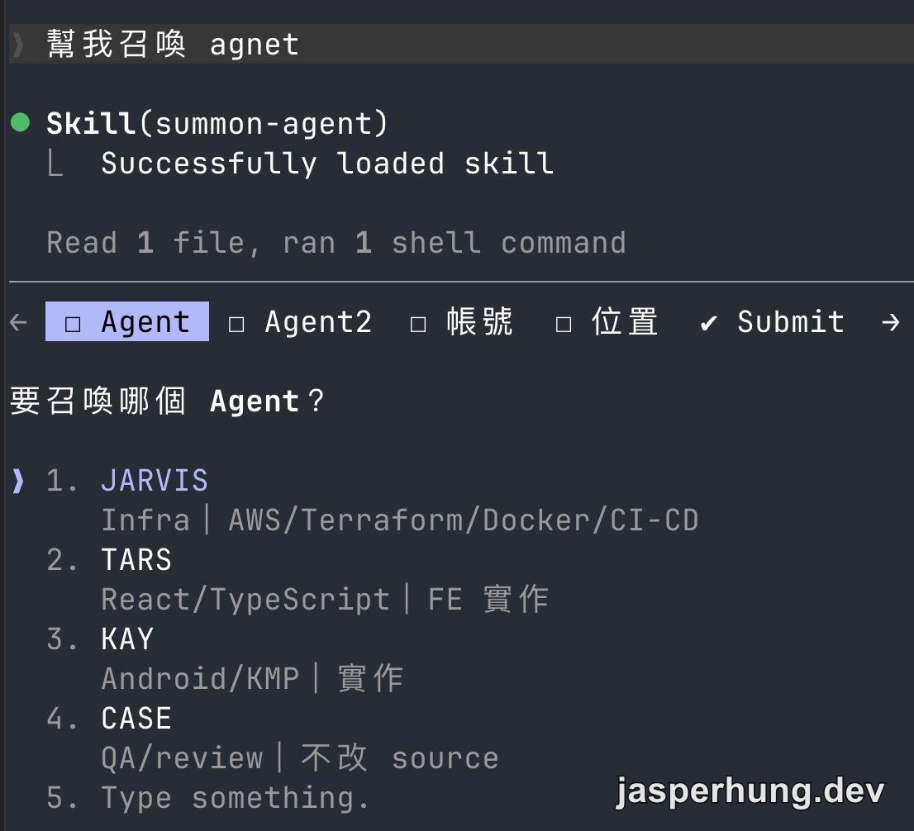
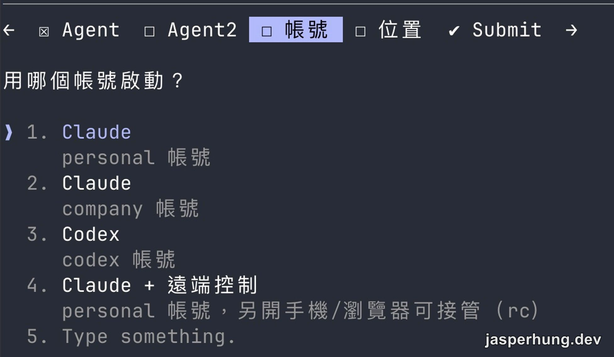
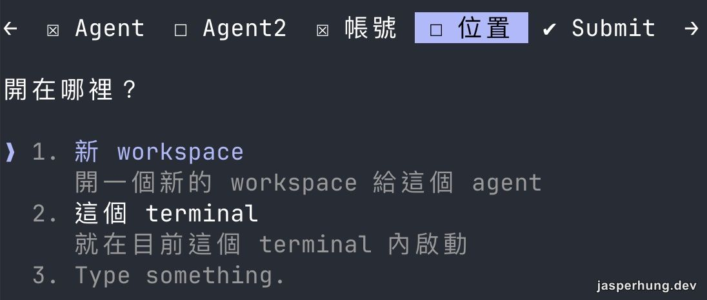

一開始我想解決的不是「怎麼多開一個 AI」，而是怎麼在需要時，叫出一位有明確職責的協作者。

例如我已經在主對話規劃完需求，接下來想交給一位 AI 做 code review，或處理前端實作。直接在原本的對話裡繼續做當然可以，但我更想要的是另一個能獨立工作、完成後再回來交代結果的 LLM 工作現場。

## 為什麼不是 sub-agent？

sub-agent 很適合把一段明確工作交出去：主對話交代任務，讓它在背後完成，再把結果回報回來。但我當時想要的不是這種「交出去、等結果」的關係。

我想保留一個獨立 Agent 的工作現場。它在執行時如果卡住、發現新的問題，或需要我補充判斷，我可以隨時走進那個 terminal 接手，直接跟它討論；我也能一路看見它查了什麼、怎麼推理、在哪個岔路做了選擇。

這特別適合問題還在成形的早期。比起最後只收到「這裡有問題」的回報，我可以跟著 Agent 一起看它找到的線索與思路，必要時把方向拉回來。工作暫停後，那個現場還在；下次要繼續交給同一位 Agent，也不用重新開一個全新的對話、再付一次建立脈絡的成本。

於是我做了 `summon-agent` Skill。

## 召喚不是另開 terminal，而是替 LLM 穿上角色

這裡說的 Agent 不是替 AI 取一個名字，而是一份先定義好的工作角色：它負責什麼、怎麼做事，以及需要時該讀哪些能力。Claude 與 Codex 載入這份角色設定的方式不同，我在前一篇〈[Agent 設計：Claude 與 Codex，同一個角色，兩種載入方式](/posts/agent-settings-single-source-of-truth)〉整理過；summon-agent 要做的，則是把那份設定確實帶進一個新開的工作現場。

手動做這件事，步驟其實不少：開一個 terminal、從正確的工作目錄啟動 Claude Code 或 Codex、套用指定職責的 Agent 設定、再替 cmux workspace 標上名字和顏色。

少任何一步，新開的 LLM 都還是能說話；但它可能只有預設身份，沒有 code review 或前端實作該有的工作方式，也不會在 cmux 裡清楚顯示自己負責什麼。這種「看似有開成功，但其實沒套到角色」的狀況，最麻煩。

summon-agent 把這些操作收成一個意圖：我只要說要召喚負責哪種工作的 Agent，它就會準備一個新的工作現場，啟動對應 runtime，並套上那個角色的設定。

```text
我要召喚一位 Agent 做 code review
        ↓
選工作職責、帳號與啟動位置
        ↓
cmux CLI 建立 terminal／workspace
        ↓
啟動帶 Agent 設定的 LLM
```

實際操作時，Skill 會依序確認三件事：這次要交辦什麼工作、要使用哪個帳號或模型，以及新 Agent 要在哪裡啟動。



<p class="image-caption">先選擇這次要交辦的 Agent 與工作職責。</p>



<p class="image-caption">再決定要使用的帳號與 LLM；遠端控制是 personal Claude 的啟動選項。</p>



<p class="image-caption">最後決定另開 workspace，或直接在目前的 terminal 繼續。</p>

## LLM 在這裡是 router，cmux 才是執行者

這個 Skill 的工作不是自己寫 code，也不是替我猜該派誰。它的角色比較像 router：理解「我要叫一位新的協作者」這個意圖，確認必要選項，再把 cmux CLI 指令組好。

cmux 是整個流程的底座。它能建立 workspace、開 terminal，再送出啟動指令。

Agent 設定負責決定這位 AI 的工作角色；顏色與標籤則交給 cmux CLI 的 `set-status`，明確寫進 workspace 的 sidebar pill。這顆彩色標籤同時標示 Agent 與帳號，讓我不必依賴 runtime 畫面是否剛好帶出顏色，也能在工作桌上一眼辨認每個工作現場。

這也是為什麼 summon 不能只是一段 prompt。它必須真的操作本機的工作桌，讓新的 LLM 有自己的 terminal、自己的工作目錄，以及可回去接手的現場。

## Agent 與帳號要分開選

這套設計中，我刻意把「找誰做事」和「用哪個帳號啟動」拆開。

Agent 是角色與工作能力；帳號則是當下要使用的登入身分、模型與額度。這套設計最有意思的地方，是同一位 Agent 可以指定要燒哪個帳號的額度，也能換成 Claude 或 Codex 這種不同的模型大腦。做 code review 的 Agent 不會因為某個帳號額度用完就失去 review 能力，前端實作 Agent 也不該被永久綁在某一個帳號；切換的是可用資源，不是它負責的工作。

原始 Skill 因此會輪詢這些必要選項：先選要交辦的工作，再選帳號，最後選要另開 workspace，還是放在目前的 terminal。對還在想「該怎麼派工」的時候，這種引導很合理；它讓每一個新 LLM 都從正確的身份與位置開始。

## 一個能長駐的 AI，才算真的被召喚出來

我喜歡這套 Skill 的地方，是它把「叫 AI 幫忙」變成一個看得見的工作行為。Agent 不再只是主對話裡的一句描述，而是 cmux 裡一個會持續工作的 workspace；我能看見它在做什麼，也能隨時回到那裡接手。

後來我才發現，這套輪詢式設計雖然清楚，對已經知道所有選項的情境還是太多步了。於是下一步不是推翻 summon-agent，而是把它裡面那些機械操作拆出去，讓它保留判斷，執行交給更直接的入口。
