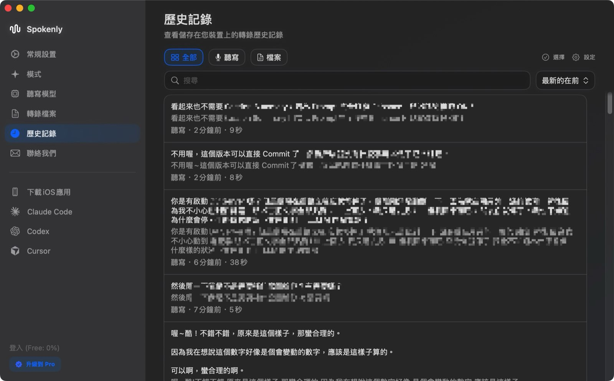
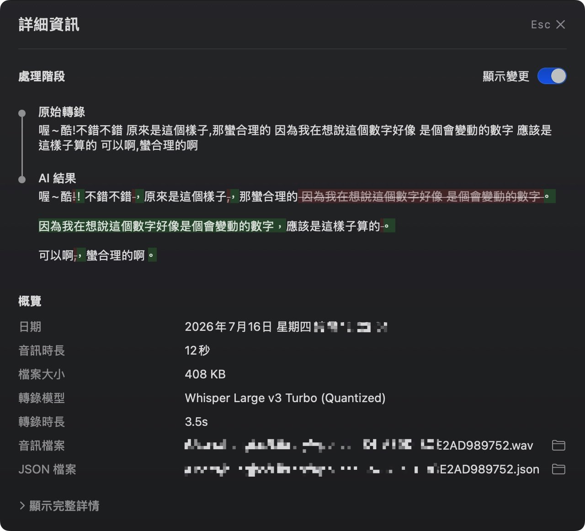
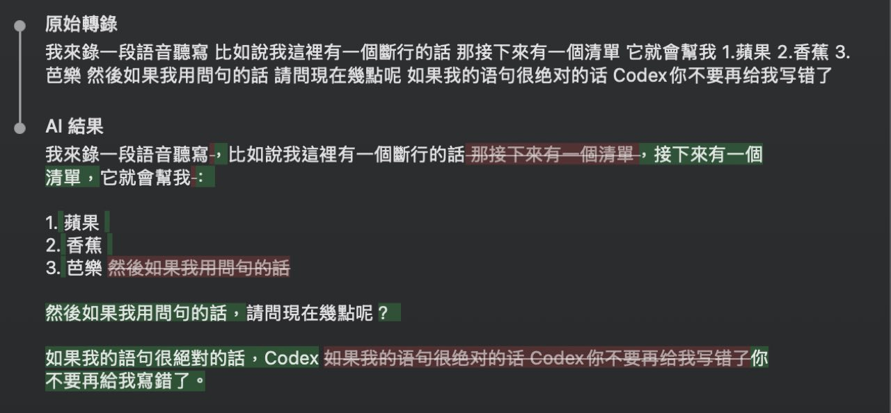

把 STT 搬到本地後，成本問題差不多解掉了。但真正用了一陣子，我發現「聽得懂」和「文字好讀」是兩件事。

我想追的不是每個字都零錯誤，而是口述一長段想法之後，文字能不能自然地留下空間、整理好問題，也保留我原本想說的節奏。這件事本來很難講清楚，直到我回去用了一次 Typeless。

## 我想複製的不是辨識率，而是文字的空氣感

Typeless 最讓我在意的地方，不只是中英混雜比較準。它會在適合的地方留空行；連續問題會整理成有節奏的問句；說「第一個、第二個、第三個」時，會變成條列；句號、問號和逗號也會跟著語氣補上。

文字不是只被轉成「正確」，而是從一整坨口語裡長出一點空氣。讀的時候比較舒服，也更像一份可以直接拿去繼續和 AI 討論的草稿。

我當時想做的，不是偷看 Typeless 的內部 AI 指令，而是把這些效果拆開：到底哪些是術語辨識、哪些是固定錯字，哪些又是段落和標點的整理？拆得出來，才有機會搬回 Spokenly。

## Spokenly 已經替我留下了對照紀錄

後來我才發現，Spokenly 的 History 不只存最後貼出去的文字。它把每次聽寫都保存在本機：歷史列表能回看內容與音訊長度，點進詳細資訊後，還可以直接看到「原始轉錄」和「AI 結果」之間改了什麼；音檔、JSON 和處理時間也都留著。



<p class="image-caption">圖：Spokenly 的 History 會保留每一次聽寫紀錄，讓我能回頭挑出值得研究的案例。</p>



<p class="image-caption">圖：一筆紀錄同時保留原始轉錄和 AI 結果，還能用類似 git diff 的方式看出改了什麼。</p>

這代表我不需要憑印象說「它好像常把 Claude 聽成別的東西」。我可以把歷史紀錄交給 LLM 分析，請它從大量的原始文字與最終文字差異裡，找出重複出現、值得檢查的候選詞。

當時我爬了 18 天、1,717 筆紀錄；其中 1,625 筆有對應的 AI 結果，1,429 筆可以看到明顯差異。LLM 幫我整理出像 `Cloudy → Claude`、`Reactor → React` 這類固定誤辨，也讓我分辨出：有些看似錯誤的字，不一定是模型理解錯，而是我的發音本來就沒有咬得很準 XD。

:::tip
History log 能找出候選規則，不能自動決定規則。每一組差異都還是要回頭看語境；不然很容易把原本正確的用詞「修正」成錯的東西。
:::

## 把結果各自放進三個旋鈕

分析完之後，我不再把所有問題塞進同一段 AI 指令，而是把調校拆成三個旋鈕。看到問題時，也比較知道該往哪裡改。

```text
本地 Whisper Prompt
  → Word Replacements（Before AI）
    → LLM Prompt
      → 最終文字
```

### 1. 本地 Whisper Prompt：讓模型先認識我常說的詞

這一層適合放產品名稱、縮寫和技術詞，例如 `CLAUDE.md`、`console.log`、`React`、`onClick`。它不是排版規則，而是在先告訴 Whisper：「我很可能會說這些詞。」

如果術語本來就容易被聽錯，先在這裡提高它第一次被辨識正確的機率，後面自然少一件事要補救。

### 2. Word Replacements：把已知的固定錯誤直接換掉

有些錯誤已經夠固定，不必每次交給 LLM 靠前後文猜。例如 `Cloudy → Claude`、`Rest for API → RESTful API`，放在 Before AI 的字串替換會比較穩：下一層收到文字之前，錯字就已經被修掉。

這一層只放「已確認、而且反覆發生」的機械修正。中英之間要不要空格、某句話該不該換段，這種需要理解語意的事情不適合塞進來。

### 3. LLM Prompt：把一次口述整理成像 Typeless 那樣的文字

最後一層才交給 LLM。這一層不是拿來補錯字，而是處理我真正喜歡 Typeless 的那種閱讀感：我一次把一大段想法講完，它能自己判斷哪裡該分行、哪裡該分段，依語氣補上句號、問號、逗號，遇到條列時也整理成真正的清單。

如果口述裡出現「第一個是蘋果、第二個是香蕉、第三個是芭樂」，我希望它變成條列；如果中間有明顯的停頓或話題轉換，我希望它留一點空白，而不是把所有字擠成同一段。這些空行看起來很小，卻讓輸出的文字有空氣感，也更漂亮。



<p class="image-caption">圖：這段話是一次講完的；清單、分段和問號都由 AI 結果自動整理。</p>

上面 History 詳細資訊裡的原始轉錄和 AI 結果，就是一次講完後的實際前後對照；AI 結果出現的分行、分段和標點，都是它自己整理的，我沒有再手動調格式。

為了讓它不要把每一句都切開，我最後把 AI 指令寫得更具體：

```text
只有話題或問題類型真的改變時才留空行。
相關的追問留在同一段，每一題各自一行。
不要把每一句都切成獨立段落。
```

第一次只寫「幫我分段」時，模型很認真地把每一句都切成一段，反而比 Typeless 更破碎。連範例裡的縮排都要小心，因為模型會連我不小心示範的格式一起學走。這也是為什麼我現在不只說「整理好看一點」，而是直接拿真實的輸出結果和 LLM 討論：要從這段原始口述走到那個結果，AI 指令還缺什麼。

## 當我想追近 Typeless，歷史紀錄就變成參考答案

Spokenly 的 log 讓我知道自己的輸出在哪裡出了問題；Typeless 則讓我知道，我想追的是什麼樣的結果。

我後來去看 Typeless 在本機留下的歷史資料。SQLite database 裡有最終文字和對應的 OGG 音檔路徑；我原本還期待能直接讀到它的原始 STT，但那部分是加密資料，本機沒有私鑰。

不過音檔和最終文字都還在。於是我換了一個測試方法：挑一筆 Typeless 的歷史紀錄，把它保存的 OGG 音檔當成唯一輸入，讓 Spokenly 的三層處理重新跑一次；然後把 Spokenly 的成品，和 Typeless 當初對同一段語音產生的最終文字放在一起比較。

換句話說，我不是拿兩段不同的口述比誰比較好，而是讓兩套流程回答同一題：**同一段話，最後能不能整理出接近的閱讀感？**

```text
同一段 OGG 音檔
  ├─ Typeless 當時產生的最終文字
  └─ 重跑 Spokenly：Whisper → Word Replacements → LLM Prompt

比較兩份最終文字 → 找出差異屬於哪個旋鈕 → 調整後用同一段音檔重跑
```

我們設計了一個簡單的 Python 程式，模擬 Spokenly 從同一段音檔一路處理到最終文字的整個過程，再和 Typeless 對同一段話產生的結果比對。每次看到差異，就和 Claude 討論三個旋鈕該怎麼調，再用同一段音檔重跑確認是否更接近。

這個過程最好玩的地方，是原本很感性的要求——「我想要文字更有空氣感」——終於能變成一個能實驗的問題。我不必只靠描述，也不必憑感覺亂改；我有真實的歷史案例、有想追的結果，也有每次調整後可以回頭驗證的方式。

現在的結果我很滿意，但真正留下來的不是一份完美設定，而是一套能一直玩的流程：新的口頭習慣出現，就從 History 找案例；新的錯誤出現，就交給 LLM 分析；想要新的文字風格，就拿實際輸出來討論，再把規則放回最適合的那個旋鈕。
