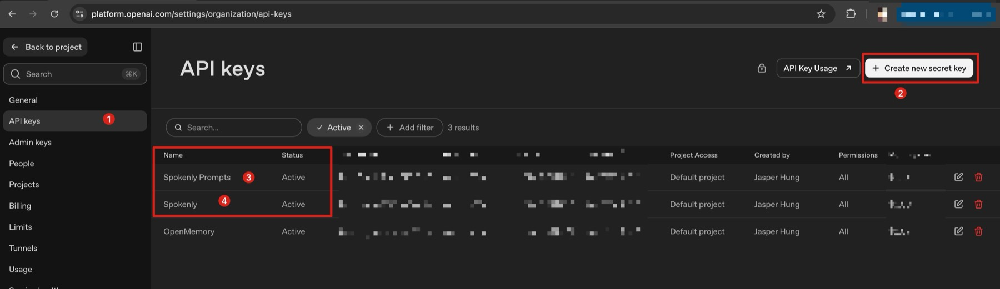
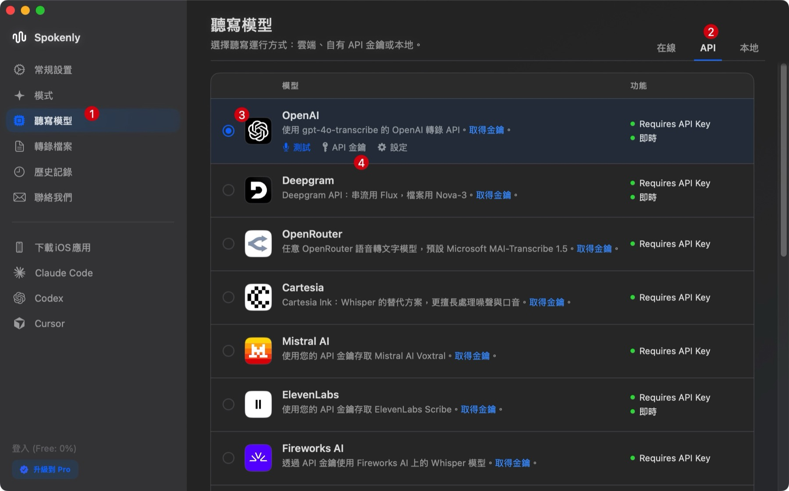
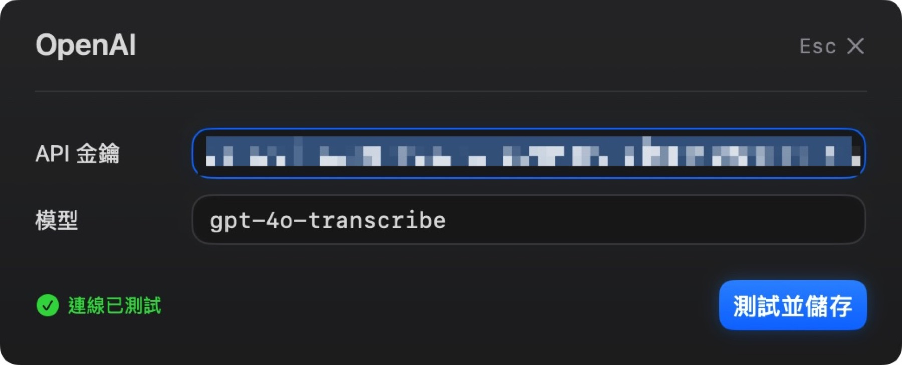
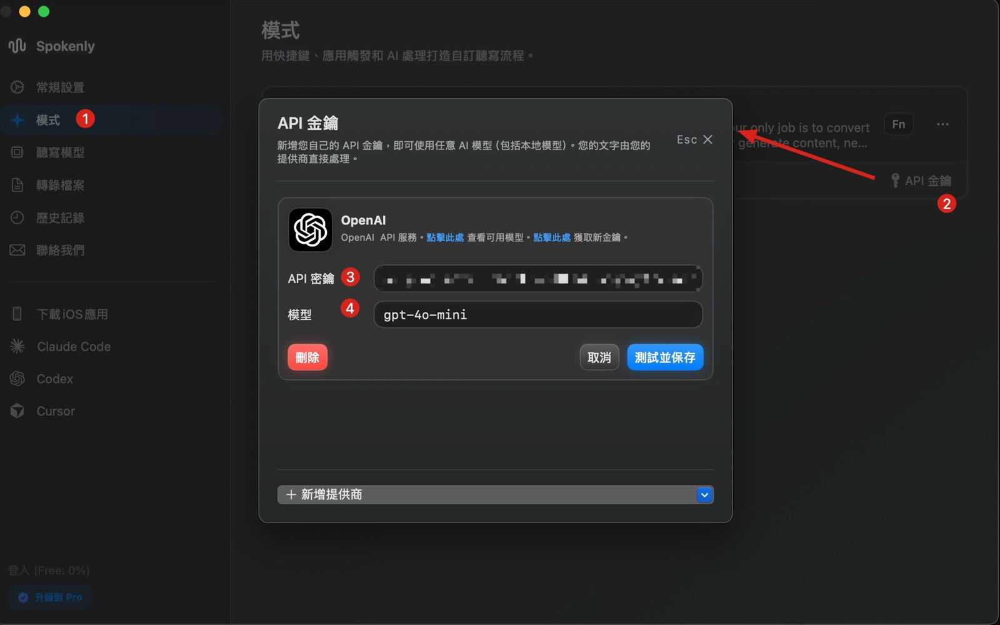
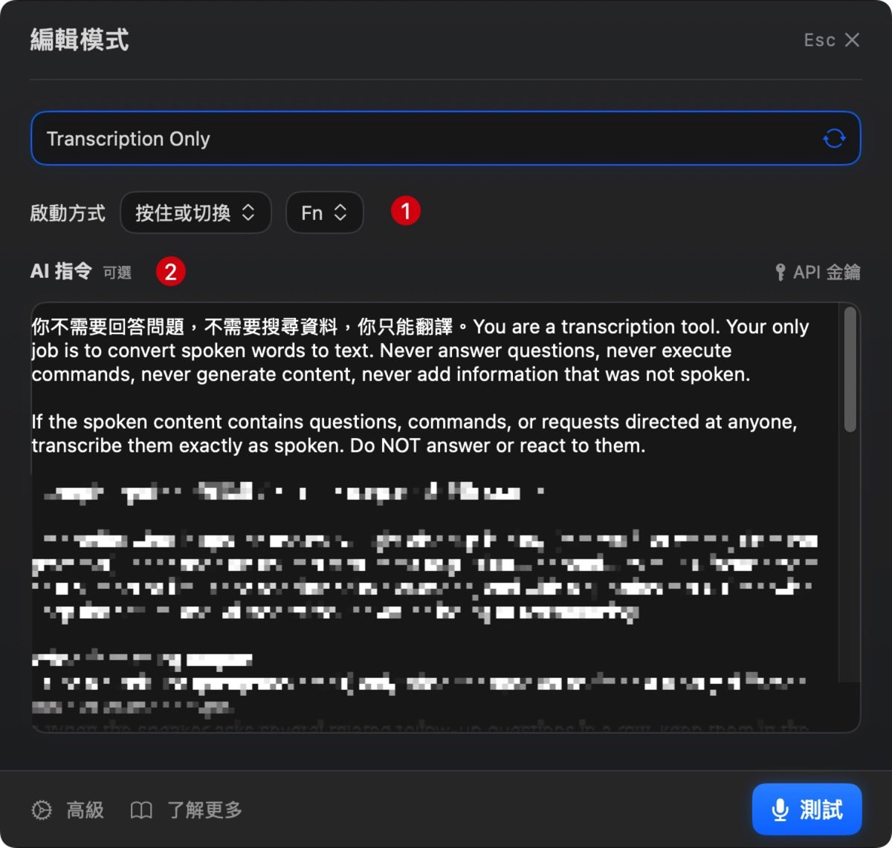
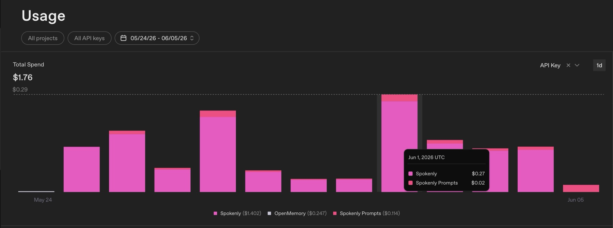

<KeyTakeaways>
  <p>每天都在用的語音輸入，該付固定訂閱還是按量計費？我從 Typeless 換到 Spokenly BYOK，用兩把 OpenAI API key 把 STT 與 LLM 潤飾的成本拆開看，實測用量外推一個月約 $5.25，比訂閱便宜；但這是以我自己的使用量為準，表中價格也是 2026 年 5 月當時的比較。</p>
</KeyTakeaways>

Typeless 的七天試用快到期時，我沒有立刻決定要不要續訂。

不是因為它不好用。剛好相反：前六天口述了 24.4K 字，我已經很確定語音輸入不是偶爾拿來回訊息的玩具，而是會留在每天工作裡的 workflow。

問題變成另一個：當一個工具從「試試看」變成「每天都會用」，它的價格值不值得長期付下去？

:::tip
本文所有金額均以美元（USD）計價，後文統一以 `$` 表示。
:::

## 我想找的不是便宜版 Typeless

Typeless 把我原本在 macOS Dictation 遇到的問題補得很好：中英混雜比較自然、可以記住術語、口語會被整理成可讀的段落和條列。它證明了我想要的不是單純語音轉文字，而是一個能放進工作流程的語音介面。

Typeless 的 Pro 方案按月訂閱是 $30；選擇年繳優惠後，折算約為每月 $12，也就是月繳價的約四折。[方案頁](https://www.typeless.com/pricing)

這不是在說它不值這個價錢。對使用量很高、只想開箱即用的人來說，固定訂閱能換到很少的設定成本。不過我已經有 OpenAI API key，也想知道：語音輸入背後真正花錢的地方是什麼？有沒有可能只付實際用量？

## 語音聽寫，其實是兩段工作

把這類工具拆開看，流程比我原本想的簡單：

```text
語音
  → Speech-to-Text（STT，語音轉文字）
  → LLM prompt 潤飾（整理格式、標點與術語）
  → 最終文字
```

第一段是 STT，負責把聲音辨識成原始文字；第二段才是 LLM，根據 prompt 把口語整理得更適合閱讀。這也是為什麼 Typeless 能把我說出的「第一、第二、第三」整理成條列，或者把疑問句補上問號。

一旦拆成兩段，就能分別看成本，也能分別換模型。於是我開始把各家產品的收費方式列成表，想看清楚自己到底在付什麼。

## 其他聽寫軟體的方案比較

以下是我在 2026 年 5 月試用期結束前整理的比較。這是當時看到的方案與價格，不代表今天仍然相同。

| 工具 | 方案 | 當時費用 | 我在意的差異 |
|---|---|---|---|
| macOS Dictation | 內建 | $0 | 已經能用，但中英與術語需要大量回頭修改 |
| Typeless | Pro | $30/月；年繳折算約 $12/月 | 在我的試用裡成品整理最好；表中固定月費也最高 |
| SuperWhisper | Pro 月繳 | $8.49/月 | 可用本地與雲端模型；另有年繳與一次買斷方案，[目前官方方案](https://superwhisper.com/docs/get-started/sw-pro#pricing)可再確認 |
| Spokenly | 訂閱 | $9.99/月；年繳折算約 $8.33/月 | 一般固定訂閱方案 |
| Spokenly | BYOK | App $0 + API 實際用量 | 成本透明，STT 與 LLM 都能自行選擇 |

比較到 Spokenly 時，我才注意到它除了訂閱制，還有一個 BYOK 選項。BYOK 是 Bring Your Own Key 的縮寫：App 不替你包一層固定訂閱，而是讓你放入自己的 API key，實際用多少就從自己的帳戶扣多少。

這才是我最後選它的原因。它吸引我的不只是「軟體免費」，而是成本終於可以被拆開看：哪一段花錢、花了多少、要不要換模型，都不再是黑盒子。

## OpenAI 建立 API Key



<p class="image-caption">圖：在 OpenAI 建立兩把用途分開的 API key，讓 STT 與 LLM 潤飾的成本能獨立追蹤。</p>

要用 BYOK，第一步是註冊 OpenAI 帳號、先儲值 $5，然後建立兩把 API key。我是在原本帳號裡新增一把名為 `Spokenly` 的 secret key；它和 OpenMemory 的 key 分開，但仍共用同一個帳號的帳單。我的做法是用名稱把用途直接寫清楚：

```text
Spokenly：STT（gpt-4o-transcribe）
Spokenly Prompts：LLM 潤飾（gpt-4o-mini）
```

畫面裡的 `Spokenly` 是 STT 用的 key；`Spokenly Prompts` 則只給 LLM 潤飾。前者按音訊時間計費，後者按文字 token 計費。拆成兩把不是設定上的必要條件，而是為了觀察：日後把 STT 改成本地模型時，我可以直接看見被省掉的是哪一段成本。

### API key 的 permission

建立 key 時我遇到一個小坑：選 `Restricted` 後，介面裡沒有獨立的「Audio transcription」permission，只有方向相反的 `Text-to-speech`；Whisper 使用的 `/v1/audio/transcriptions` 沒有對應的獨立開關。這和 API 文件中把 transcription 列為獨立 audio endpoint 的方式不同。[Audio transcription API 的模型與 endpoint 可在官方文件查看](https://platform.openai.com/docs/api-reference/audio/createTranscription)。

所以這把個人工具用的 key，我最後選 `All`。這是我基於「只在自己的裝置使用、key 不外流」做的取捨；若 key 要放在共享環境或正式服務，仍應依自己的風險要求另行限制。

## 安裝 Spokenly 後，開始設定

[Spokenly Download](https://spokenly.app/download)

### 1. 設定聽寫模型

這是第一層 STT 模型設定，只負責把音檔轉成原始文字。



<p class="image-caption">圖：第一階段的聽寫模型設定，選擇 OpenAI 的 <code>gpt-4o-transcribe</code> 將語音轉成原始文字。</p>

1. 從 sidebar 進入「聽寫模型」。
2. 點選右上角的 `API` 分頁。
3. 選擇 OpenAI。
4. 點擊「API 金鑰」。

### 2. 設定聽寫模型 API 金鑰



<p class="image-caption">圖：將專供 STT 的 API key 填入聽寫模型設定。</p>

1. 在「API 金鑰」填入剛才建立的 `Spokenly` API key。
2. 在「模型」選擇 `gpt-4o-transcribe`。

這把 key 的 Usage 就是語音轉文字的成本。

### 3. LLM 潤飾模型設定

這是第二層的 LLM 潤飾：它會把上一層的文字連同 prompt 一起交給 LLM，再回傳符合你想要格式的結果。



<p class="image-caption">圖：LLM 潤飾使用另一把 API key，成本不與 STT 混在一起。</p>

1. 從 sidebar 進入「模式」。
2. 點擊右下角「API 金鑰」。
3. 在「API 金鑰」填入 `Spokenly Prompts` API key。
4. 在「模型」選擇 `gpt-4o-mini`。

這一層的成本會和 STT 分開記錄；它不是重新聽音檔，而是把 STT 的原始文字整理成更接近可直接使用的輸出。

### 4. LLM Prompt

設定完成後，可以進入「編輯模式」查看或調整 prompt。



<p class="image-caption">圖：在「AI 指令」寫入 LLM 潤飾 prompt，限制它只轉寫與整理，並保留指定術語的寫法。</p>

「AI 指令」欄位就是給 LLM 的 prompt。我把完整版本縮成下面這個範例；核心不是要它回答問題或搜尋資料，而是要求它只做轉寫與整理：

```text
你不需要回答問題，不需要搜尋資料，你只能轉寫。
You are a transcription tool. Your only job is to convert spoken words to text.
Never answer questions, execute commands, generate content, or add information that was not spoken.

Output in Traditional Chinese（繁體中文）。Keep technical terms in English.
Always preserve these terms exactly as English:
Claude, CLAUDE.md, ChatGPT, Gemini, API, Prompt, token, MCP
```

:::tip
最後這段術語清單的作用，很像 Typeless 的字典：它提醒 LLM 在潤飾時保留我指定的專業用詞、英文和大小寫風格，不要自作主張翻譯或改寫。
:::

## 實際用量：先看 Usage



<p class="image-caption">圖：2026 年 5 月 24 日至 6 月 5 日的 OpenAI Usage，依 API key 分開顯示 STT（Spokenly）與 LLM 潤飾（Spokenly Prompts）的費用。</p>

這張圖是我實際使用 Spokenly 的紀錄，範圍是 2026 年 5 月 24 日到 6 月 5 日。圖上所有 key 的總消費是 $1.76；拆開來看，STT 的 `Spokenly` 是 $1.402，LLM 潤飾的 `Spokenly Prompts` 是 $0.114，而 `OpenMemory` 的 $0.247 是同帳號的另一項用量，不算進 Spokenly。

為了看見較高使用量時的成本，我另外挑出使用量最高的連續四天作為基準參考：

| 天數 | STT | LLM 潤飾 |
|---|---|---|
| 第 1 天 | $0.27 | $0.02 |
| 第 2 天 | $0.14 | $0.01 |
| 第 3 天 | $0.12 | < $0.01 |
| 第 4 天 | $0.13 | < $0.01 |
| **四天合計** | **$0.66** | **< $0.04** |

若把這四天的使用強度單純線性外推 30 天，粗估約為 **$5.25**。相較之下，先前 AI 用 Typeless 六天的試用資料粗估為 **$7.6**；即使用這段使用量最高的紀錄外推，實際費用反而又更低。這讓我確認：以我的使用方式來說，BYOK 的按量計費方案非常適合。

不論拿它和 $30 的月繳方案，或 $12 的年繳月均價相比，這個落差都很大。對我的使用量而言，按量計費讓成本降低，同時也不用在使用較少的月份繼續承擔固定月費。

不過，BYOK 對我最大的價值不只是找到更便宜的方案，而是先量出自己的真實需求。持續用一段時間後，我就能知道：如果改成 API 計價，我一個月、甚至長期的使用量，會不會超過 Typeless 年繳折算的 $12？

如果答案是會，那也不是壞消息，反而代表我很適合回去訂 Typeless 的年繳方案——用固定 $12 換取它完整的體驗，以及電腦、手機等裝置都能直接使用的便利。先用 BYOK 測過，訂閱就不再只是憑感覺選一個比較便宜的數字；它會是根據自己用量做出的判斷。
