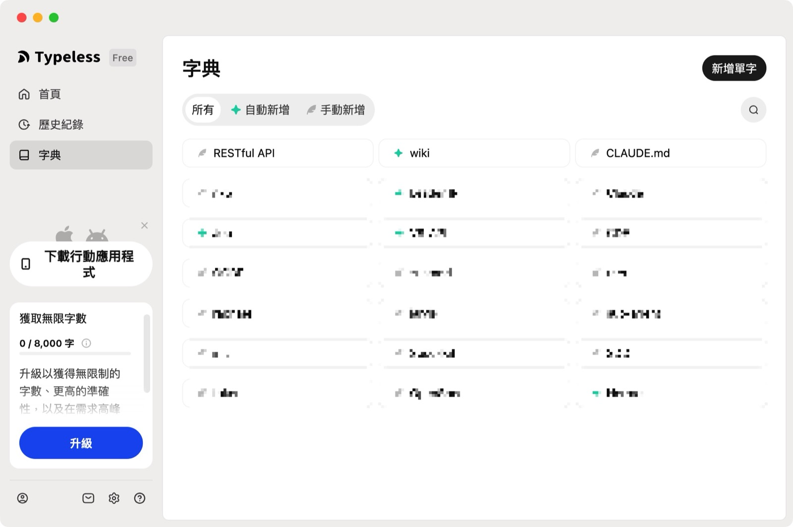
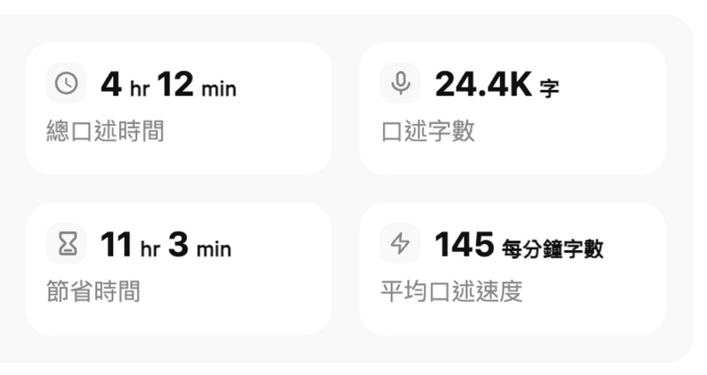

開始長時間和 AI 討論之後，我慢慢發現，打字的速度常常跟不上腦中想解釋的速度。

不是只有「幫我寫一個功能」這種需求而已。更多時候，我得先講清楚目前的架構、真正卡住的地方、試過哪些方法、哪些方向不想走，然後再和 AI 來回釐清。

於是我開始想：如果改用口說，能不能少花一點時間打字，也把原本會省略掉的意圖，一起交給 AI？

## Vibe Coding 不是一句話叫 AI 把東西做完

我這裡說的 Vibe Coding，不是丟一句模糊需求後等 AI 自己把產品做完，而是用自然語言和 AI 一起把問題講清楚、拆開，再一路修正。

你給 AI 的不只是「幫我做一個按鈕」，還包括目前的架構、真正卡住的地方、已經試過什麼、你不想要什麼，甚至一句「我覺得這樣怪怪的，但說不上來哪裡怪」。這些內容會讓 AI 知道你真正想解的是什麼，而不是只猜一個看起來合理的答案。

以前我會先想辦法把 prompt 寫得精確，才交給 AI。現在我更在意的是，在收斂之前，先把還沒整理好的意圖講完整。

精確依然重要，只是不必在一開始就靠自己把所有脈絡刪成一句話。

打字當然可以做到，只是我很容易因為不想多打幾行而把意圖壓縮掉。口說時反而比較自然：想到什麼就接著講，補充條件也不覺得麻煩。AI 拿到的不是精簡過的需求，而是比較接近我當下真正的思考過程。

對我來說，口說不是取代精確，而是先把沒整理好的想法攤開，再和 AI 一起收斂。Vibe Coding 的瓶頸，有時候不是模型能力，而是輸入的頻寬。

速度是這個感覺最容易被看見的部分。Stanford 的一項手機短訊輸入研究發現，在它的實驗條件下，英文語音輸入約是鍵盤的 3 倍，中文約為 2.8 倍。[研究結果](https://hci.stanford.edu/research/speech/)不代表每一台電腦、每一種工作都會得到同樣倍率，但它很貼近我的直覺：說話本來就是一條比手指更寬的輸入管道。

## macOS Dictation：先證明口說真的比較快

第一步沒有裝任何 App。我直接用 macOS 內建 Dictation；有麥克風鍵的 Mac 可以從功能鍵啟動，也能自行設定快捷鍵。[Apple 官方說明](https://support.apple.com/guide/mac-help/use-dictation-mh40584/26/mac/26)

它已經比我慢慢打字快不少。尤其在要把一個還在腦中打轉的問題丟給 AI 時，我可以一口氣把前因後果講完，再回頭整理。

但很快就碰到問題：中英文一混，技術名詞很容易失真。像是產品名稱、程式裡的變數、縮寫，常常需要一個一個回去修。講得越多，修得越多；有時候修正的時間甚至開始抵消輸入時省下來的時間。

我需要的不只是一個把聲音轉成文字的功能，而是一個能理解我平常怎麼說話、怎麼混用中英文、又怎麼整理想法的工作介面。

## Typeless 讓我第一次覺得這件事真的可用

後來我在 YouTube 和社群上一直看到 Typeless，於是用它的免費額度試了一週。

它打中我的地方，不是單純辨識得比較準，而是會把口語變成可以直接送出的文字。中英文切換比較自然；我可以從 UI 加入自己的關鍵字；一段零散的口述，也會被整理成條列、換行和問句。它甚至能把中文轉成英文，或直接用口說問一個問題。

Typeless 的字典功能，讓我能補上像 RESTful API、CLAUDE.md 這類容易被聽錯的術語。

Typeless 對自己的定位很直接：讓人少碰鍵盤，以語音完成訊息、文件與其他文字工作；官網也主打它能把自然口語即時整理成可直接使用的文字。[Typeless](https://www.typeless.com/)

我本來有點懷疑，這類產品是不是只適合偶爾回訊息。結果六天內，我口述了 **24.4K 字**，總口述時間 **4 小時 12 分**，Typeless 估算我省下 **11 小時 3 分**。看到數字時我自己也愣了一下：原來不是我偶爾覺得口說方便，而是我已經開始把它當成思考和工作的預設入口。

六天試用期的使用數據；這些數字讓我確認自己不是偶爾用用，而是真的會把口說放進日常 workflow。

那段時間，AI 對話也變得不一樣。我不再只丟一個壓縮過的問題，而是先把完整背景說出來，再讓 AI 幫我整理、反問或提出下一步。這不保證每次都會得到更好的答案，但少了鍵盤造成的阻力後，我比較願意把真正想問的事講完整。

## 口說不是取代打字，而是少一層自我刪減

我現在還是會打字。寫程式、改一個精確字詞、安靜地整理文章時，鍵盤依然很適合。

但當事情還很混亂、我需要跟 AI 來回討論，或只是想先把腦中的脈絡倒出來時，口說變成一個更自然的起點。它省下來的不只是手指移動的時間，也少了一層「這段要不要打」的自我審查。

Typeless 讓我確認這個 workflow 很值得留下來。不過，當它從新鮮的試用變成每天都會使用的工具，下一個問題也跟著出現：這份便利，到底值不值得每個月付訂閱費？
